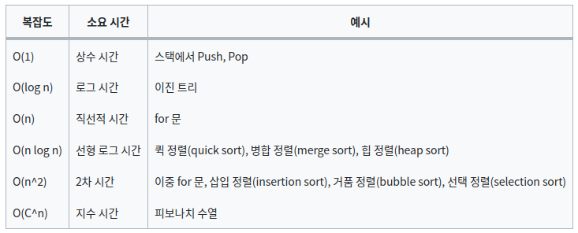
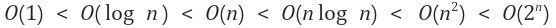
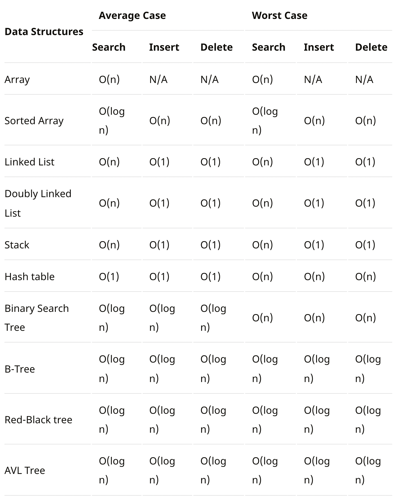
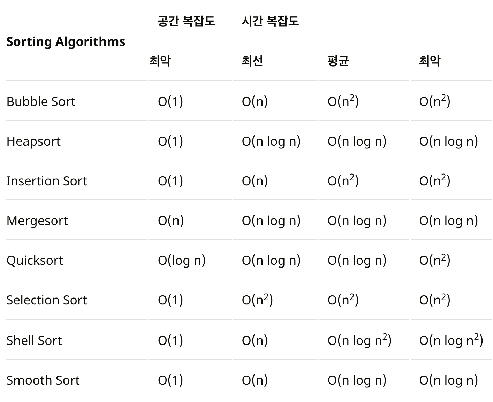
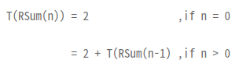
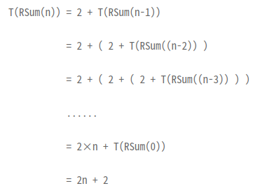

# 시간복잡도 & 공간복잡도
--- 
## 시간복잡도 





> #### 시간복잡도를 구하는 요령
> - 하나의 루프를 사용해 단일 요소 집합을 반복하는 경우 : 0(n)
> - 컬렉션의 절반 이상을 반복하는 경우 : 0(n/2) &rarr; 0(n)
> - 두 개의 다른 루프를 사용해 개별 콜렉션을 반복하는 경우 : 0(n+m) &rarr; 0(n)
> - 두 개의 중첩 루프를 사용해 단일 콜렉션을 반복하는 경우 : 0(n<sup>2</sup>)
> - 두 개의 중첩 루프를 사용해 다른 콜렉션을 반복하는 경우 : 0(n*m) &rarr; 0(n<sup>2</sup>)
> - 컬렉션 정렬을 사용하는 경우 : 0(n*log(n))

&rarr; 최악의 경우에 대한 시간복잡도 계산
> - n의 범위가 500인 경우 시간 복잡도가 0(n<sup>3</sup>) 알고리즘 설계 시 문제 해결 가능
> - n의 범위가 2000인 경우 시간 복잡도가 0(n<sup>2</sup>) 알고리즘 설계 시 문제 해결 가능
> - n의 범위가 100,000인 경우 시간 복잡도가 0(nlog n) 알고리즘 설계 시 문제 해결 가능
> - n의 범위가 10,000,000인 경우 시간 복잡도가 0(n) 알고리즘 설계 시 문제 해결 가능





### 예제
```c++
float sum(float a[], int n){
  float s = 0.0;
  for (int i = 1; i <= n; i++)
      s += a[i];
  return s;
}
```
&rarr; 명령어 총 실행 횟수 = 2n + 3, 시간 복잡도 = 0(n)

```c++
float rsum(float a[], int n){
  if (n <= 0)
      return (0.0);
  else
      return (rsum(a, n-1) + a[n]);
}
```
&rarr; 명령어 총 실행 횟수 = 2n + 2, 시간 복잡도 = 0(n)





---
## 공간복잡도

### 예제
```c++
float abc(float a, float b, float c){
  return(a + b + b*c + (a + b - c)/(a + b) + 4.0);
}
```
&rarr; 공간 복잡도 = 0
- 변수 a,b,c는 전달되는 인자로서 함수 abc 내에서 해결하고자 하는 문제와 무관하므로 공간 복잡도는 0임

```c++
float sum(float a[], int n){
  float s = 0.0;
  for (int i = 1; i <= n; i++)
      s += a[i];
  return s;
}
```
&rarr; 공간 복잡도 = n + 3
- 변수 a[]의 경우 합을 구하기 위해 반복문 내에서 n개의 원소가 모두 참조됨
- 변수 n은 for문을 벗어나기 위한 한계값으로 사용됨
- a[]를 저장하기 위한 공간 + 변수 s, n, i를 위한 공간 = n + 3

```c++
float rsum(float a[], int n){
  if (n <= 0)
      return (0.0);
  else
      return (rsum(a, n-1) + a[n]);
}
```
&rarr; 공간 복잡도 = 3(n + 1)
- 변수 n은 if문 안의 한계값으로 사용됨 / a[]는 합을 구하기 위해 사용하며 n번째 원소만 필요로 함
      - a[]의 n번째 원소를 위한 공간 + n을 위한 공간 = 1 + 1
- 순환 기법이 사용되었으므로 depth of ecursion을 계산해야 하며, 순환을 위해 필요한 복귀 주소를 저장할 공간도 계산해야 함
- depth of recursion * (a[n], n, 복귀 주소를 위한 공간) = (n+1) * 3
