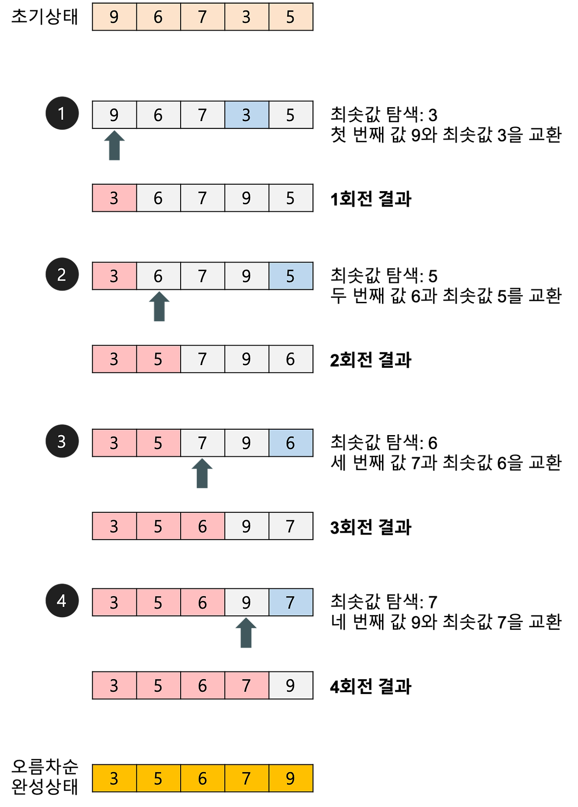
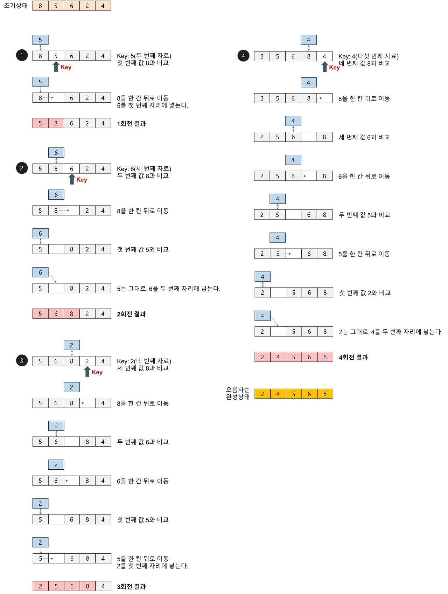
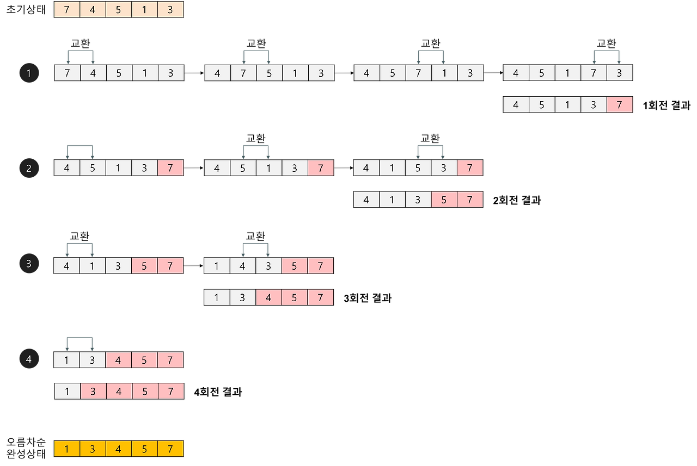
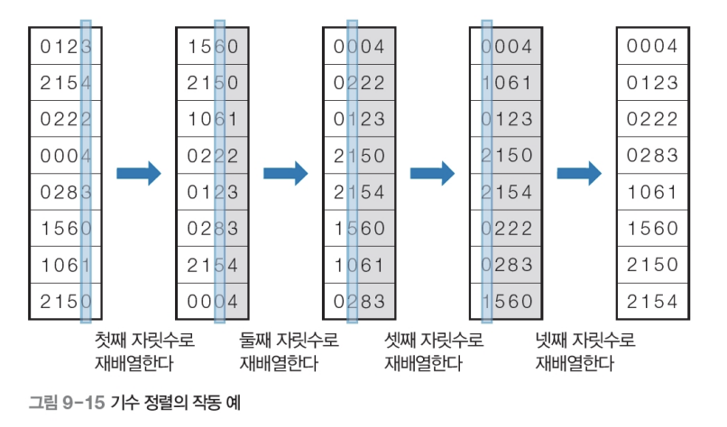
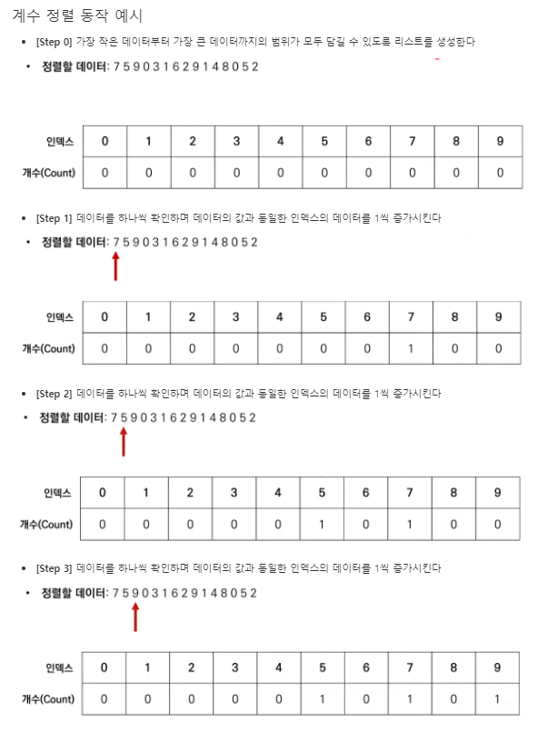

# Sorting 

## 선택 정렬
```c++
void selectionSort(int a[], int n){
  for (int i = 0; i < n-1; i++){
      int least = i;
      for (int j = i + 1; j < n; j++){
          if (a[j] < a[least])
              least = j;
      swap(a[i], a[least]);
        }
    }
}
```
> 1. 정렬 되지 않은 인덱스의 맨 앞부터, 이를 포함한 그 이후 배열값 중 가장 작은 값을 찾음
> 2. 가장 작은 값을 찾으면, 그 값을 현재 인덱스 값과 바꿈
> 3. 다음 인덱스에서 위 과정 반복



---
## 삽입 정렬
```c++
void insertionSort(int a[], int n){
  for (int i = 1; i < n; i++){
      int key = a[i];
      for (int j = i - 1; j >= 0 && a[j] > key; j--){
          a[j + 1] = a[j];
      a[j + 1] = key;
  }
}
```
> 1. 두번째 인덱스부터 시작. 현 인덱스는 별도의 변수에 저장하고, 비교 인덱스를 현재 인덱스 -1로 잡음
> 2. 별도로 저장해 둔 삽입을 위한 변수와, 비교 인덱스의 배열 값 비교
> 3. 삽입 변수 값이 더 작으면 현재 인덱스로 비교 인덱스 값 저장, 비교 인덱스를 -1해 비교 반복
> 4. 만약 삽입 변수가 더 크면 비교인덱스 +1에 삽입 변수 저장



---
## 버블 정렬

```c++
void bubbleSort(int a[], int num){
  for (int len = num - 1; len > 0; len--){
      for (int i = 0; i < len; i++){
          if (a[i] > a[i + 1])
              swap(a[i], a[i + 1]);
      }
  }
}
```
> 1. 두번째 인덱스부터 시작. 현 인덱스 값과, 이전 인덱스 값 비교
> 2. 만약 이전 인덱스 값이 더 크면, 현재 인덱스와 교환
> 3. 현재 인덱스가 더 크면, 교환하지 않고 다음 두 연속된 배열값 비교
> 4. 이를 (전체 배열의 크기 - 현재까지 순환한 바퀴 수)만큼 반복



---
## 합병 정렬

```c++
static void merge(int a[], int left, int mid, int right){
    int i, j, k = left, l;
    static int sorted[max_size];

    for (i = left, j = mid + 1; i <= mid && j <= right;)
        sorted[k++] = (a[i] <= a[j]) ? a[i++] : a[j++];

    if (i > mid)
        for (l = j; l <= right; l++, k++)
            sorted[k] = a[l];
    else
        for (l = i; l <= mid; l++, k++)
            sorted[k] = a[l];
    for (l = left; l <= right; l++)
        a[l] = sorted[l];
}

void mergeSort(int a[], int left, int right){
    if (left < right){
        int mid = (left + right) / 2;
        mergeSort(a, left, mid);
        mergeSort(a, mid + 1, right);
        merge(a, left, mid, right);
    }
}
```
> 분할
> 1. 현재 배열을 반으로 쪼갬. 배열 시작위치, 종료위치를 입력받아 둘을 더한 후 2로 나눠 그 위치를 기준으로 삼음
> 2. 이를 쪼갠 배열의 크기가 0 또는 1일때까지 반복
>
> 합병
> 1. 두 배열 a, b의 크기 비교. 각 배열의 현 인덱스를 i, j로 가정
> 2. i에 a배열의 시작 인덱스 저장, j에 b배열의 시작 주소저장
> 3. a[i]와 b[j] 비교. 오름차순의 경우 이중 작은 값을 새 배열 c에 저장
>    a[i]가 더 크다면 a[i] 값을 배열 c에 저장하고 i값을 하나 증가시킴
> 4. 이를 i, j 둘 중 하나가 각자 배열 끝에 도달할 때 까지 반복
> 5. 끝까지 저장하지 못한 배열 값을 순서대로 c에 저장
> 6. c배열을 원래 배열에 저장


---
## 퀵 정렬

```c++
static int partition(int a[], int left, int right){
    int low = left;
    int high = right + 1;
    int pivot = a[left];
    do{
        do{
            low++;
        } while (low <= right && a[low] < pivot);
        do {
            high--;
        } while (high >= left && a[high] > pivot);
        if (low < high)
            swap(a[low], a[high]);
    } while (low < high);

    swap(a[left], a[high]);
    return high;
}

void quickSort(int a[], int left, int right){
    if (left < right) {
        int q = partition(a, left, right);
        quickSort(a, left, q-1);
        quickSort(a, q+1, right);
    }
}
```
> 1. 두번째 인덱스부터 시작. 현 인덱스 값과, 이전 인덱스 값 비교
> 2. 만약 이전 인덱스 값이 더 크면, 현재 인덱스와 교환
> 3. 현재 인덱스가 더 크면, 교환하지 않고 다음 두 연속된 배열값 비교
> 4. 이를 (전체 배열의 크기 - 현재까지 순환한 바퀴 수)만큼 반복


---
## 힙 정렬

```c++
vector<int> heapSort(vector<int> L){
    make_heap(L.begin(), L.end());
    for (auto last = L.end(); last != L.begin(); last--){
        pop_heap(L.begin(), last);
    }
    return L;
}
```
```python
def heapSort(array, index, heap_size):
    parent = index
    left_child = 2 * parent + 1
    right_child = 2 * parent + 2

    if left_child < heap_size and array[left_child] > array[parent]:
        parent = left_child
    if right_child < heap_size and array[right_child] > array[parent]:
        parent = right_child
    if parent != index:
        array[parent], array[index] = array[index], array[parent]
        make_heap(array, parent, heap_size)

for root in range((n - 1) // 2, -1, -1):
    make_heap(array, i, heap_size)

for i in range(n - 1, 0, -1):
    array[0], array[i] = array[i], array[0]
    heapSort(array, 0, i - 1)
```
> 버블 정렬과 비슷하게 1등을 뽑아내고 나머지 원소에서 등을 계속 뽑아가며 정렬
> 힙을 이용해, 1등을 뽑은 뒤, 나머지 원소에서 1등을 뽑을 때 다시 비교할 필요 없이 2등이 자동으로 1등이 됨
> 1. 정렬해야 할 n개의 요소들로 최대 힙(완전 이진 트리 형태)를 만듦 &rarr; 내림차순 기준 정렬
> 2. 한번에 하나씩 요소를 힙에서 꺼내 배열의 뒤부터 저장
> 3. 삭제되는 요소들(최댓값부터 삭제)은 값이 감소되는 순서로 정렬


---
## 기수 정렬

```c++
void radixSort(int list[], int n){
    queue<int> queue[buckets];
    int factor = 1;
    for (int d = 0; d < digits; d++){
        for (int i = 0; i < n; i++)
            queue[(list[i] / factor) % 10].push(list[i]);
        for (int b = 0, i = 0; b < buckets; b++){
            while (!queue[b].empty()){
                list[i++] = queue[b].front();
                queue[b].pop()
            }
        }
        factor *= 10;
    }
}
```
> 1. 두번째 인덱스부터 시작. 현 인덱스 값과, 이전 인덱스 값 비교
> 2. 만약 이전 인덱스 값이 더 크면, 현재 인덱스와 교환
> 3. 현재 인덱스가 더 크면, 교환하지 않고 다음 두 연속된 배열값 비교
> 4. 이를 (전체 배열의 크기 - 현재까지 순환한 바퀴 수)만큼 반복



---
## 계수 정렬

```c++
vector<int> countSort(vector<int> L){
    int max = *max_element(begin(L), end(L));
    int min = *min_element(begin(L), end(L));
    vector<int> count(max+1, 0);
    vector<int> countSum(max + 1, 0);
    vector<int> target(L.size(), 0);
    for (auto l : L){
        count[l]++;
    }

    for (int i = min; i < max + 1; i++){
        if (i < 1){
            countSum[i] = 0;
        }
        countSum[i] = countSum[i - 1] + count[i - 1];
    }
    for (auto l : L){
        target[countSum[l]] = l;
        countSum[l]++;
    }
    return target;
} 
```
> 1. 인덱스 k를 참조할 수 있는 k+1크기의 countArr배열을 선언하고 모든 인덱스 값을 0으로 초기화
> 2. 원본 배열의 첫 인덱스부터 순회하며, 원본 배열의 데이터와 동일한 countArr배열의 인덱스 값을 1씩 증가
> 3. 원본 배열의 마지막 인덱스까지 순회하면, countArr배열에는 원본배열의 등장 횟수가 담김
> 4. countArr배열의 인덱스를 순회하며, 인덱스 값이 0이 될때까지 출력


