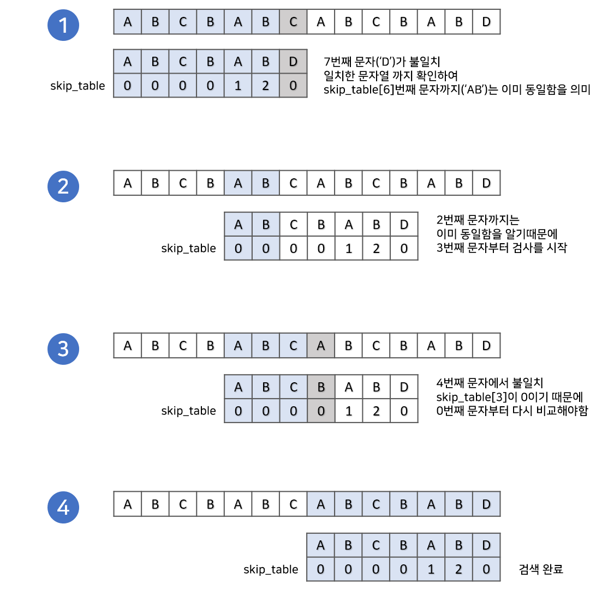
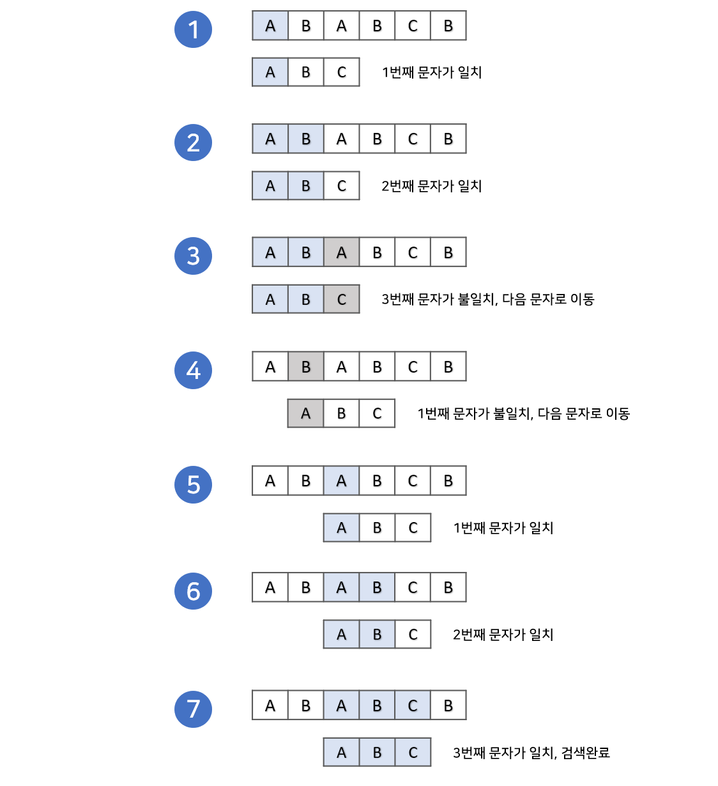

# Algorithm
- 알고리즘은 완전탐색(모든 경우의 수를 탐색)에서 시쟉됨 &rarr; 모든 경우의 수를 고려하지만 최대 시간 복잡도를 가짐
- 순차적(concatenation)구조 : 코드가 위 아래 순차적으로 실행되는 구조
- 선택적(selection)구조 : 조건에 따른 결과에 따라 프로그램 실행 흐름을 변경하는 구조
- 성능평가 Case
     - 최선의 경우 (best case) : 최적의 입력 상태에서 작업을 완료하는데 가장 연산 횟수가 적은 경우
     - 최악의 경우 (worst case) : 최악의 입려 상태에서 작업을 완료하는데 가장 연산 횟수가 많은 경우
    
    &rarr; 알고리즘 분석 시 **최악의 경우 & 시간 복잡도**로 성능을 파악함

- **좋은 코드 구성을 위해 고려할 점**
  1. 문제를 파악하고 구체적 계획 및 알고리즘 생각
  2. 공간복잡도와 시간복잡도를 계산해 제약 조건 내에 수행될 수 있는 알고리즘인지 판단

<details>
<summary>Table of Contents</summary>

- [Complexity](#시간복잡도--공간복잡도)
- [Brute-Force (DFS & BFS)](#완전탐색-brute-force)
- [Permutation, Combination, PowerSet](#순열--조합--부분집합)
- [Backtracking](#백트래킹-backtracking)
     - [N-Queen](#
- [Sorting](#정렬-알고리즘-sorting)
- [Divide & Conquer](#분할-정복법-divide--conquer)
- [Greedy](#탐욕-알고리즘-greedy)
- [Dynamic Programming](#동적-계획법-dynamic-programming)
- [Shortest path](#최단-경로-shortest-path--가중치-있는-그래프)
- [MST (Union-Find, Kruskal)](#mst--minimum-spanning-tree)
- [Two pointer](#two-pointer)
- [KMP](#kmp-knuth-morris-pratt--문자열-매칭-알고리즘)

</details>

---
## 시간복잡도 / 공간복잡도
- **알고리즘의 성능 및 효율성을 나타내는 척도** &rarr; 보통 수행 시간과 메모리 사용량을 기준으로 함
- 각 알고리즘이 주어진 특정 크기 입력(n)을 기준으로 수행시간(연산) or 사용 공간이 얼마나 되는지 객관적으로 비교하는 기준
- 점금 표기법 : O(빅오), Ω(오메가), Θ(세타)...

### 시간복잡도 (Time Complexity)
- 특정 크기 입력(n)을 기준으로 할 때 필요한 연산 횟수
- 알고리즘을 구성하는 명령어들이 몇번이나 실행되는지 센 결과에 각 명령어의 실행시간을 곱한 합계
- why 실행 시간이 아닌 연산횟수로 계산?
     &rarr; 모든 OS, IDE, platform에서 동일한 결과가 나오지 x, 실행 시간 측정을 위한 다른 방법이 필요함

### 공간복잡도 (Space Complexity)
- 프로그램 실행과 완료에 얼마나 많은 공간(**메모리**)가 필요한지
- 알고리즘 실행을 위한 공간
  1. 고정 공간 : 코드가 저장되는 공간, 알고리즘 실행을 위해 시스템이 필요로 하는 공간 (알고리즘과 무관)
  2. **가변 공간** : 변수 저장, recursion stack 등 (알고리즘과 밀접)
 
[complexity_detail](./Complexity.md)

---
## 완전탐색 (Brute-Force)

### DFS (Depth First Search, 깊이 우선 탐색)
- 그래프에서 깊은 부분을 우선적으로 탐색
- stack, 재귀함수를 이용해 구현
- 유의할 점 : stack overflow
- 활용 예 : 백트래킹, 단절선/단절점 찾기, 위상정렬, 사이클 찾기 등

> #### 구현 방법
> 1. 탐색 시작 노드를 스택에 삽입하고 방문 처리
> 2. 스택 최상단 노드에 방문하지 않은 인접 노드가 있으면 해당 인접 노드를 스택에 넣고 방문 처리. 방문하지 않은 인접노드가 없으면 스택에서 최상단 노드를 꺼냄
> 3. 2번 과정을 더 수행할 수 없을 때까지 반복

## BFS (Breadth First Search, 너비 우선 탐색)
- 그래프에서 가까운 노드부터 탐색
- queue를 이용해 구현
- 유의할 점 : 메모리 초과 (방문체크 반드시 하기)
- 활용 예 : 최단경로 찾기, 위상정렬 등

> #### 구현 방법
> 1. 탐색 시작 노드를 큐에 삽입하고 방문 처리
> 2. 큐에서 노드를 꺼내 해당 노드의 인접 노드 중 방문하지 않은 노드를 모두 큐에 삽입하고 방문 처리
> 3. 2번 과정을 더 수행할 수 없을 때까지 반복

--- 
## 순열 / 조합 / 부분집합

### 순열 
- **n개의 원소에서 순서를 생각하며 r개의 원소를 선택하는 방법**
- 뽑은 원소의 구성이 같아도 순서가 다르게 뽑혔으면 다른 경우의 수가 됨
- 'nPr = n * (n-1) * (n-2) * ... * (n-r+1)' / 'nPn = n!' &rarr; 10!이상의 계산은 위험함
- **재귀함수, 비트마스크, next permutation**으로 구현

### 조합
- n개의 원소에서 r개의 원소를 선택하지만 **원소를 뽑는 순서는 고려하지 않음**
- 뽑는 순서는 고려하지 않으므로 해당 원소를 뽑는지만 생각하면 됨
- 무조건 r개를 뽑아야 함
- 'nCr = n! / (n-r)!r!'
- **재귀함수, next permutation**으로 구현

### 부분집합 (Power set)
- 집합의 원소 일부로 이루어진 집합으로, 자기 자신 & 공집합도 부분집합에 해당
- 각각의 원소를 선택하는 경우, 선택하지 않는 경우 두 경우로 나뉘며 전체 Big-O는 0(2<sup>n</sup>)이 됨
- **재귀함수, 바이너리 카운팅**으로 구현

---
## 백트래킹 (Backtracking)
- **DFS 방식을 기반**으로, **불필요한 경우를 배제하며 원하는 해답에 도달할때까지 탐색**하는 전략
     - DFS 문제에서 모든 노드를 탐색할 필요가 없을 경우 적용
- **스택**을 이용해 퇴각하며 다음 탐색을 진행함

> #### 알고리즘
> - 유망하다(promising) : 어떤 노드 방문 시 그 노드를 포함한 경로가 해답이 될 수 있음
> - 가지치기(pruning) : 유망하지 않은 노드가 포함된 경로는 더 이상 고려하지 않음
> 1. 상태 공간 트리의 DFS를 시행
> 2. 각 노드가 유망한지 검사
> 3. 만약 해당 노드가 유망하지 않으면, 그 노드의 부모로 되돌아가 다음 자식 노드로 검색 진행
&rarr; 대표적으로 **N-Queen 문제**가 백트래킹의 예시임

## N-Queen
- nxn 체스판에 n개의 퀸을 서로 충돌하지 않게 놓는 방법을 구하는 문제
- n개의 퀸을 놓을 수 있는 모든 경우의 수를 시도하는 경우(완전탐색 방식) 매우 큰 시간복잡도를 가짐 &rarr; 효율적으로 해결하기 위해 Backtracking 알고리즘을 사용
- Backtracking을 적용해 상태공간 트리를 만들고 유망한 노드들의 자식만 검사함으로써 경우의 수를 줄임

### Backtracking 문제를 풀기 위해 결정되어야 할 사항
1. 상태공간트리의 구조를 결정
2. 유망한지 아닌지 따질 조건 결정 &rarr; 유망함의 기준 설정 (promising function)

#### sketch idea
> 1. 첫번째 queen을 임의로 둠
> 2. 그 다음 queen을 safe palces에 둠
> 3. 이 과정 반복
>      - 위치에 둬야 할 queen이 더 이상 없을 경우 (모든 queen이 자리잡을 때 까지)
>      - no safe place is left
>  4. 이때 3과정에서 no safe place is left일 경우, 그 이전 자리를 둔 queen의 자리를 다시 바꿈 = backtracking
>
> **Queen의 특성**
> 1. 퀸은 수직선상에 있는 말을 공격할 수 있음
> 2. 퀸은 수평선상에 있는 말을 공격할 수 있음
> 3. 퀸은 대각선상에 있는 말을 공격할 수 있음
>
> &rarr; 퀸을 놓을 수 없는 자리에 대한 판단 = (유망성 판단 & 가지치기)
> 1. 퀸은 한 row에 하나만 둘 수 있음
> 2. 퀸은 한 column에 하나만 둘 수 있음
> 3. 대각선에 퀸이 있다면 둘 수 없음

[N-Queen](./code/n_queen.cpp)

---
## 정렬 알고리즘 (Sorting)

### 선택 정렬 (Selection sort)
- 현재 위치에 들어갈 값을 찾아 정렬하는 배열
- 최소 선택정렬 : 오름차순 / 최대 선택정렬 : 내림차순
- 정렬되지 않은 배열에서 가장 작은 숫자를 찾기에 n-1 비교를 함
- 전체 비교를 진행하므로 **시간복잡도 = 0(n<sup>2</sup>)** / 하나의 배열에서 진행하므로 **공간복잡도 = 0(n)**

### 삽입 정렬 (Insertion sort)
- 현재 위치에서, 그 이하 배열들을 비교해 자신이 들어갈 위치를 찾아 삽입하는 배열
- **최악의 경우 시간복잡도 = 0(n<sup>2</sup>)** / 이미 **정렬된 경우 시간복잡도 = 0(n)** &rarr; Big-0는 상한 기준이므로 0(n<sup>2</sup>)임
- 하나의 배열에서 진행하므로 **공간복잡도 = 0(n)**
&rarr; 선택정렬보다 빠른 연산 / 레코드 크기가 클 경우 비효율적

### 버블 정렬 (Bubble sort)
- 매번 연속된 두 인덱스를 비교해, 정한 기준의 값을 뒤로 넘겨 정렬하는 배열
- 오름차순 정렬 시, 비교마다 큰 값이 뒤로 이동해 가장 큰 값이 맨 뒤에 저장됨
- **전체 배열의 크기 - 현재까지 순환한 바퀴 수**만큼만 반복
- 전체 비교를 진행하므로 **시간복잡도 = 0(n<sup>2</sup>)** / 하나의 배열에서 진행하므로 **공간복잡도 = 0(n)**

### 합병 정렬 (Merge sort)
- 분할 정복 방식으로 설계된 알고리즘 &rarr; **분할 과정과 합병 과정이 나뉨**
- 입력으로 하나의 배열을 받고 연산 중 두개의 배열로 계속 쪼개나간 뒤 합치면서 최후에 하나의 정렬을 출력
- **합병 과정의 시간복잡도 = 0(n)** / **분할 과정의 시간복잡도 = 0(log n)** &rarr; 분할별로 합병을 진행하므로 **시간복잡도 = 0(nlog n)**
- 정렬을 위한 배열을 하나 더 생성하므로 **공간복잡도 = 0(2n)**

### 퀵 정렬 (Quick sort)
- 분할 정복 방식으로 설계된 알고리즘 &rarr; **pivot point**를 설정해 이를 기준으로 작은 값은 왼쪽, 큰 값은 오른쪽으로 옮기는 방식
- 분할과 동시에 정렬을 진행하므로 총 비교횟수는 nlog n, **시간복잡도 = 0(nlog n)**
- **배열이 이미 정렬된 경우가 최악의 경우임**. 이 경우 분할이 n만큼 발생해 시간복잡도가 0(n<sup>2</sup>)임
- 일반적으로 퀵정렬이 합병정렬보다 20% 이상 빠름

### 힙 정렬 (Heap sort)
- 정렬한 배열을 최소 힙으로 변환한 다음, 가장 작은 원소부터 차례대로 추출해 정렬
- **시간복잡도 = 0(nlog n)**
- 리스트 중 **일부만 정렬할 필요가 있는 경우** 유용
- 내림차순 정렬 시 최대 힙 / 오름차순 정렬 시 최소 힙

### 기수 정렬 (Radix sort)
- 어떠한 비교 연산도 실행하지 않는 독특한 정렬 기법 &rarr; LSD(least significant digit) : 가장 낮은 자릿수 / MSD(most significant digit) : 가장 높은 자릿수
       - 각 자릿수가 0~9범위라는 점에 착안해 **10개의 bucket**을 만들어 입력 데이터를 값에 따라 상자에 넣음
       - 이후 출력리스트를 만들 때 순차적으로 bucket에서 읽어옴
       - 2자리 이상의 숫자는 1의 자릿수와 10의 자릿수를 따로 사용해 정렬함
- **시간복잡도 = 0(kn), k는 4이하**
- 추가적인 메모리를 필요로 하지만 다른 방식들보다 빠름

### 계수 정렬 (Count sort)
- 데이터 크기 범위가 **제한되어 정수 형태로 표현할 수 있을 때** 사용
- **시간복잡도 = 0(n + k) &rarr; n이 k보다 클 경우 0(n)의 시간복잡도
- 정렬할 배열의 원소와 숫자를 counting해 누적시킨 후 그 값들을 정렬된 배열의 인덱스로 사용
- 가장 큰 숫자에 영향을 받으므로 최댓값에 의해 메모리 공간이 낭비될 수 있음

[sorting_detail](./Sorting.md)

---
## 분할 정복법 (Divide & Conquer)
- 전체 문제를 여러 부분 문제로 분할하고, 각 부분문제들을 해결함을 통해 전체 문제의 해답을 도출하는 전략 = Top-down approach
      - Divide : 해결할 문제를 비슷한 유형의 여러 작은 부분으로 나눔
      - Conquer : 나눈 부분 재귀적으로 해결. 문제 규모가 나눌 수 없는 단위가 되면 탈출 조건을 설정하고 해결
      - Combine : 각 부분 문제의 해답을 모아 원래 문제의 해답 도출
&rarr; 대표적으로 정렬 알고리즘 중 **퀵 정렬, 합병 정렬**과 **이진탐색, 선택 문제, 고속 푸리에 변환** 문제들이 있음
&rarr; **재귀 알고리즘을 사용하기에 오버헤드**가 발생할 수 있으며 스택에 다양한 데이터를 보관해야하므로 **스택 오버플로우**를 고려해야함

- 선택 정렬과 삽입 정렬의 최대 실행시간은 0(n<sup>2</sup>)이므로 입력 배열 크기가 크면 오랜 수행시간이 걸림
- 분할정복 알고리즘을 사용하는 합병 정렬의 실행시간은 **모든 경우에 대해 0(nlog n)으로** 비교적 빠른 시간이 걸림

---
## 탐욕 알고리즘 (Greedy)
- **현재 + 최적**이라 생각되는 것을 선택해나가는 방식
- 지역해에 빠질 수 있음 &rarr; 최적해 보장 X, 증명 과정이 필요함
- 중복되지 않는 서브 문제이자 발견법(최선, 최적의 답을 찾기보다 주어진 상황을 빠르게 해결하기 위한 방법론) 중 하나임
- Backtracking과 같이 알고리즘 수행시간이 많이 걸릴 때 사용하는 방법
- 한번 선택된 것은 번복하지 않음

#### 적용 조건
(두 조건이 성립된 문제에 한해 적용 가능)
1. 탐욕 선택 속성 (Greedy Choice Property) &rarr; 지역해 = 최적해인 경우 적용 가능
2. 최적 부분 구조 (Optimal Substructure) &rarr; 부분 최적 해들의 총합 = 전체 최적 해

#### 구현 방법
> 1. 선택 절차 (Selection Procedure) &rarr; 현재 상태에서 최적의 선택 수행
> 2. 적절성 검사 (Feasibility Check) &rarr; 선택된 항목이 문제의 조건을 만족하는지 확인
> 3. 해답 검사 (Solution Check) &rarr; 모든 선택 완료 시, 최종 선택이 문제의 조건을 만족하는지 확인

#### 대표적인 알고리즘
- 프림 알고리즘 : 현재 정점에 연결된 간선들 중 가중치가 작은 간선부터 선택
- 크루스칼 알고리즘 : 각 단계에서 가중치가 작은 간선부터 선택
- 다익스트라 알고리즘 : 현재 정점에서 가장 가까운 정점 선택

---
## 동적 계획법 (Dynamic Programming)
- **특정 범위까지의 값을 구하기 위해 그것과 다른 범위까지의 값을 이용해 효율적으로 값을 구하는 알고리즘**
- 주어진 문제를 여러개의 하위문제로 나누어 푸는 방법
- 답을 여러 번 계산하지 않고 한번만 계산하며 이를 다시 활용하는 **메모이제이션**을 사용 
&rarr; 메모이제이션 : 동일한 계산 반복 수행 시 이전 계산값을 재사용해 동일한 수행을 방지하여 실행 속도를 빠르게 함
&rarr; 일반적인 재귀 사용 시 규모가 큰 계산에서 비효율적이므로 DP를 사용

#### 적용 조건
1. 중복되는 부분 문제 (Overlapping Subproblems) &rarr; 나눠진 부분 문제가 중복되는 경우로 메모이제이션 기법을 통해 중복 계산을 없앰
2. 최적 부분 구조 (Optimal Substructure) &rarr; 전체 문제의 최적해가 부분 문제의 최적해들로 구성됨

#### 분할 정복과의 차이점
- 분할 정복의 경우, 분할된 하위 문제가 동일하게 **중복이 일어나지 않는 경우**에 사용
- 동적계획법의 경우, 분할된 하위 문제가 동일하게 **중복이 일어나는 경우**에 사용

#### DP를 사용하는 경우
1. DP로 풀 수 있는 문제인지 확인 &rarr; 현재 문제가 작은 문제로 쪼개지는지, 하나의 함수로 표현되는지 판단
2. 문제의 변수 파악 &rarr; 문제 내에서 변수의 개수를 알아내는 state 결정
3. 변수 간 관계식(점화식) 세우기 &rarr; 반복/재귀를 통해 문제가 자동으로 해결되도록 구축
4. 메모하기 (Memoization or tabulation) &rarr; 변수의 값에 따른 결과 저장 (배열 이용)
5. 기저 상태 확인 &rarr; 가장 작은 문제의 상태 파악
6. 구현 &rarr; 1. bottom-up (tabulation) 방식 : 반복문 사용 / 2. top-down (memoization) 방식 : 재귀 사용

&rarr; tabulation : 반복을 통해 하나씩 채우는 과정을 table-filing이라 하며, table에 저장된 값에 직접 접근해 재활용함

#### 구현 방법
1. Bottom-up
* 아래부터 위로 계산을 수행하며 누적된 것으로 전체 큰 문제 해결
* memoization을 위한 1차원 dp 배열을 만들었다 가정할 때, dp[0]부터 시작해 반복문을 통해 점화식으로 결과를 도출하여 dp[n]까지 재활용

&rarr; tabulation : 반복을 통해 하나씩 채우는 과정을 table-filing이라 하며, table에 저장된 값에 직접 접근해 재활용함

```python
// 피보나치 수열 bottom-up
def fibonacci_bu(n):
     memo = [0,1]
     for i in range(2, n+1):
          memo.append(memo[i-1] + memo[i-2])
     return memo[-1]
```

2. Top-down
* dp[n]을 찾아내기 위해 위에서 바로 호출 진행
* dp[0]까지 내려간 다음 해당 결과 값을 재귀를 통해 이동해 재활용

&rarr; memoization : 이전에 계산 완료한 경우 단순히 메모리에 저장된 내역을 꺼내 활용하면 되므로 가장 최근 상태값을 메모함 

```python
// 피보나치 수열 top-down with memoization
def fibonacci_td(n):
     if n < 2:
          return n
     if _memo[n] is None:
          _memo[n] = fibonacci_td(n-1) + fibonacci_td(n-2)
     return _memo[n]
```

---
|분류|Greedy Algorithm|Dynamic Programming|
|---|---|---|
|설명|각 단계에서 최적의 선택을 하는 방식으로 문제를 해결하는 방식, 해결할 전체 문제의 갯수를 줄이기 위해 개별적으로 문제를 해결해 나가는 선택|작은 문제의 해를 기억하여 중복 계산을 피하고, 이를 이용해(중복 문제들의 결과를 기반으로) 큰 문제를 해결하는 방식|
|성립 조건|1. 탐욕 선택 속성(Greedy choice property) 2. 최적 부분 구조(Optimal substructure)|1. 중복 부분 문제(Overlapping sub problems) 2. 최적 부분 구조(Optimal substurcture)|
|중복 부분 문제|중복 부분 문제 해결 X|중복 부분 문제 해결|
|상황|모든 상황을 계산하여 최적의 경로를 구할 수 있음. 모든 상황을 계산하므로 시간이 오래 걸림|각 단계의 상황에서 최적을 선택해 최적 경로를 구함. 최적이 아닌 경우가 될 수 있거나 혹은 풀리지 않는 문제가 될 수 있음|

--- 
## 최단 경로 (Shortest path) : 가중치 있는 그래프
- 최단 경로는 주어진 그래프에서 주어진 두 정점을 연결하는 가장 짧은 경로의 길이를 찾는 문제
- **가중치가 없는 그래프**의 최단 경로는 **BFS**사용
- 해당 알고리즘들은 최단 경로의 길이를 찾아주므로 실제 경로를 얻으려면 탐색 과정에서 별도의 정보를 저장하고, 찾아야함

#### 문제 유형
> 단일 출발 (single-source) 최단 경로 : 어떤 하나의 정점에서 출발하여 나머지 모든 정점까지의 최단 경로를 찾음
> 
> 단일 도착 (single-destination) 최단 경로 : 모든 정점에서 출발하여 어떤 하나의 정점까지의 최단 경로를 찾음
> 
> (그래프 내의 간선들을 뒤집으면 단일 출발 최단 경로 문제로 바뀔 수 있음)
> 
> 단일 쌍 (single-pair) 최단 경로 : 어떤 정점 v에서 v'로 가는 최단 경로를 찾음
> 
> 전체 쌍 (all-pair) 최단 경로 : 모든 정점 쌍들 사이의 최단 경로를 찾음

#### 대표적인 알고리즘
> 다익스트라 알고리즘 : 음이 아닌 가중 그래프에서의 단일 출발, 단일 도착, 단일 쌍 최단 경로 문제
> 
> 벨만-포드 알고리즘 : 가중 그래프에서의 단일 출발, 단일 도착, 단일 쌍 최단 경로 문제
> 
> 플로이드-워셜 알고리즘 : 전체 쌍 최단 경로 문제
> 
> BFS : 가중치가 없거나 가중치가 동일한 그래프에서 최단 경로를 찾는 경우 가장 빠름

[shortest_path_deatil](./ShortestPath.md)

---
## MST : Minimum spanning tree
- 최소 신장 트리 = 최소 스패닝 트리
- 주어진 가중치 그래프에서 **사이클 없이** **모든 점들을 연결**시킨 트리 중 선분들의 **가중치 합이 최소**인 트리
(사이클이 없는 트리 = **신장 트리**)

> **주어진 그래프에서 신장 트리를 찾으려면?**
> - 사이클이 없도록 모든 점을 연결
> - 그래프의 노드 수가 n이면, 신장 트리에는 정확히 (n-1)개의 간선
> - 간선이 n개가 되면, 무조건 사이클이 만들어짐

## 분리 집합 (Union Find)
- union find = 합집합 찾기 = 서로소 집합(Disjoint Set) 알고리즘
- **서로 다른 두 노드가 같은 집합에 속하는지 확인**하는 알고리즘
- 여러 개의 노드들이 존재 &rarr; 두 개의 노드 선택 &rarr; 이 두 노드들이 서로 같은 그래프에 속하는지 판별
- 선택한 간선이 사이클을 발생하는지 계속 확인해야함

&rarr; 두 노드를 선택했을 때 최상위 부모가 같으면 사이클 발생, 최상위 부모가 다르면 사이클 발생 X

#### 구현
1. 초기화 : root 배열에 i 원소의 부모 노드 번호 저장, i 원소가 루트 노드면 자기 자신의 번호를 저장

```c++
void initialize() {
    for (int i = 1; i <= N; i++) {
        root[i] = i;
    }
}
```
2. n번 노드의 root 노드 번호 찾기 = find

```c++
int find(int n) {
    if (root[n] == n) return n;
    return root[n] = find(root[n]);
}
```
3. a,b 노드를 같은 집합으로 묶기 = merge, union

```c++
void merge(int a, int b) {
    root[find(b)] = find(a);
}
```
[union-find](./code/MST/union_find.py)

## Kruskal Algorithm &rarr; union find를 활용한 MST 찾기
- 음수 가중치가 없는 무방향 그래프에서 최소 신장 트리(최소 스패닝 트리)를 찾는 알고리즘
1. 간선들을 가중치 순으로 정렬 (오름차순)
2. 가중치가 가장 작은 간선을 꺼냄
3. 사이클을 만들지 않을 때에만 해당 간선 추가 (사이클 확인은 union find 알고리즘 이용)

&rarr; 사이클이 발생하는 경우는 **같은 그래프에 속한 두 노드를 연결**했을 때임
&rarr; 두 노드가 같은 그래프에 속하는지 아닌지는 **Union find** 개념으로 판별


#### 구현
1. (Cost, A, B) 리스트를 만들고 모든 간선들의 정보를 priority queue에 저장 (min heap)
2. priority queue에서 하나씩 pop하며 만약 **A, B가 연결되어 있지 않다면 A와 B를 연결**하고 전체 비용에 Cost를 더함
3. 만일 A,B가 연결되어 있다면 무시 

[kruskal](./code/MST/kruskal.py)

---
## Two pointer
- 문자열 또는 배열 기반의 자료구조에서 **두 개의 포인터를 사용해 탐색 범위를 조절하며 문제를 해결**하는 기법 
- 일반적인 반복문 또는 brute force를 사용하면 타임아웃에 직면하는 경우가 있음 but 투 포인터를 활용하면 시간 복잡도를 낮출 수 있음 : 0(n<sup>k</sup>) &rarr; 0(n<sup>k-1</sup>)
- 시작과 끝을 가리키는 변수를 정의하고, 이를 조절해가며 현재 탐색할 범위 지정 및 원하는 결과를 0(n)의 시간복잡도로 구할 수 있음
- **정렬된** 전체 배열에 대해 **일부 구간**을 잡았을 때 특정 조건을 만족하는 문제를 풀 때 사용
- 포인터가 조건에 따라 다르게 동작하는 것이 기본이므로 주로 while문을 통해 구현 &rarr; 시간복잡도가 항상 0(n)인 것을 보장

- 시간 복잡도 감소, 메모리 효율성(별도의 추가 메모리 없이 인덱스로 해결 가능), 배열 기반 다양한 문제 해결가능
- but 정렬 필수, 적용 가능한 문제 유형이 제한적, 포인터 이동 방식이 문제마다 달라 분석이 필요하다는 단점이 있음

#### 동작 원리 예
- 정렬된 배열 [1, 3, 5, 7, 10, 15]에서 합이 12가 되는 두 수를 찾는 문제
1. 초기 설정
- left 포인터를 배열의 첫 번째 요소(0번째 인덱스)에 위치시킴
- right 포인터를 배열의 마지막 요소(5번째 인덱스)에 위치시킴
2. 두 포인터가 가리키는 값을 더함
- arr[left] + arr[right] = 1 + 15 = 16 (목표보다 크므로 right를 감소)
- arr[left] + arr[right] = 1 + 10 = 11 (목표보다 작으므로 left를 증가)
- arr[left] + arr[right] = 3 + 10 = 13 (목표보다 크므로 right를 감소)
- arr[left] + arr[right] = 3 + 7 = 10 (목표보다 작으므로 left를 증가)
- arr[left] + arr[right] = 5 + 7 = 12 (목표값과 일치)
3. 결과 도출
- 합이 12인 두 수는 5와 7

#### 시간복잡도
- 완전 탐색(brute force) : 0(n<sup>2</sup>)
- 투 포인터 알고리즘 : 0(n)

#### 문제 유형
1. 정렬된 배열에서 특정 합을 찾는 문제 &rarr; 여러 수를 더해 특정 값을 만들어야 하는 문제에서 활용
2. 구간 합 (부분 배열 합) 문제 &rarr; 특정 조건을 만족하는 연속된 부분 배열을 찾는데 사용
3. 문자열 또는 배열 내 특정 패턴 찾기 &rarr; 팰린드롬 검사 등
4. 교차 검증 및 병합 문제 &rarr; 두 개의 정렬된 리스트를 하나의 정렬 리스트로 병합하는 과정에서 사용

#### 구현
- 정렬된 배열에서 두 수의 합 찾기
```c#
include <stdio.h>
void twoSum(int arr[], int size, int target) {
    int left = 0, right = size - 1;
    while (left < right) {
        int sum = arr[left] + arr[right];
        if (sum == target) {
            printf("position of two nums : %d, %d\n", left, right);
            return;
        } else if (sum < target) {
            left++;
        } else {
            right--;
        }
    }
    printf("There are no two nums that satisfy the sum.\n");
}

int main() {
    int arr[] = {1, 2, 3, 5, 7, 10};
    int target = 9;
    int size = sizeof(arr) / sizeof(arr[0]);
    twoSum(arr, size, target);
    return 0;
}
```

---
## KMP (Knuth-Morris-Pratt) = 문자열 매칭 알고리즘
- 특정 글에서 하나의 문자열(패턴)을 찾아내는 알고리즘
- 텍스트 인덱스를 하나씩 움직이며, 패턴 길이만큼 떼어낸 부분 문자열을 비교해 패턴과 동일한지 비교

#### 동작 원리
1. **패턴 내 접두사 접미사 개념 활용**
- 패턴 내에 존재하는 접두사와 접미사가 일치한다면 접미사를 접두사로 다시 바라봄으로써 문자열 탐색을 이어서 진행
2. **동일 접두사-접미사 전처리 테이블 생성**
- 패턴 안에서 접두사와 접미사가 일치하는 경우는 패턴에 따라 여러개가 만들어질 수 있음
- 패턴 내에서 글자를 하나씩 늘려가며 접두사와 접미사가 일치하는 경우를 미리 확인 &rarr; **접두사-접미사가 일치하는 최대 길이 값 저장**
- 접미사와 접두사를 늘려가며 비교하다가 일치하지 않는 경우가 생기면 일치했던 부분까지 되돌아가 다시 검사 하는 방식으로 테이블 구축
3. **KMP 함수 생성**
- 해당 패턴이 몇 번 나타나는지, 그때의 시작 인덱스가 몇인지 리턴

#### 구현
- 검색과정 전에 **건너뛰는 경우를 저장하는 배열(skip_table)을** 만들어야 함
- 배열은 접두사, 접미사의 정보를 이용해 만들며 **접두사와 접미사가 같으면서 제일 긴 경우의 길이를 저장**함




[KMP_python](./code/KMP/kmp.py)
[KMP_C++](./code/KMP/kmp.cpp)

### Brute-force VS KMP
- Brute-force는 모든 경우를 검색하기에 순차적으로 단순비교를 진행하므로 시간복잡도가 0(nm)



- KMP는 반복이 최악의 경우에도 탐색 문자열 크기의 2배를 넘지 않으므로 시간복잡도가 0(n+m)

---


