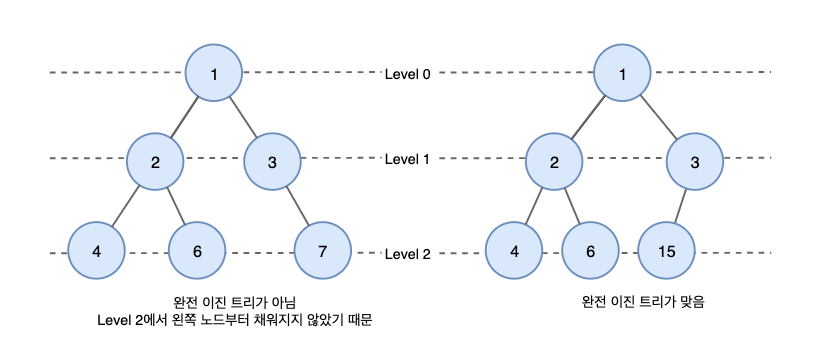
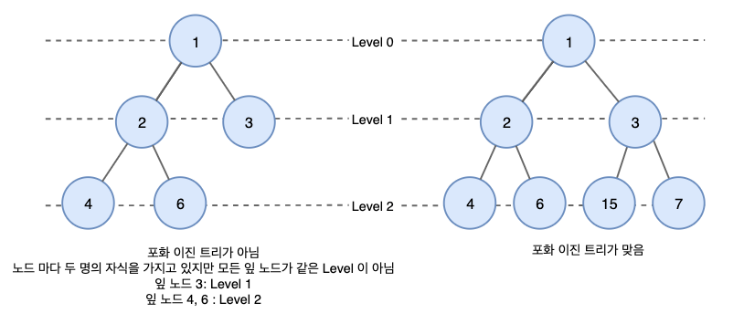
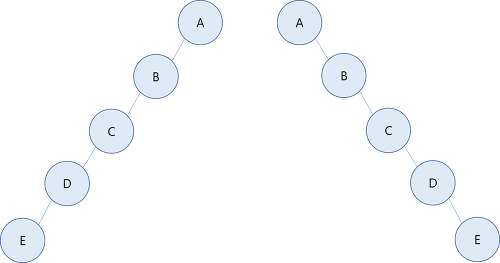
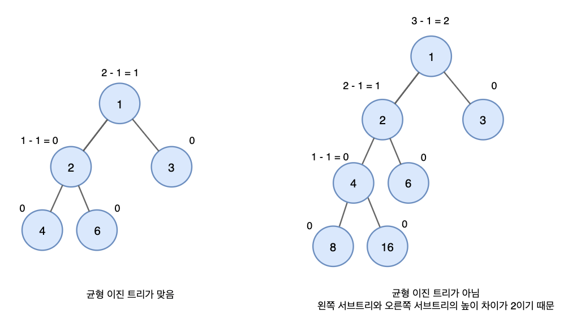
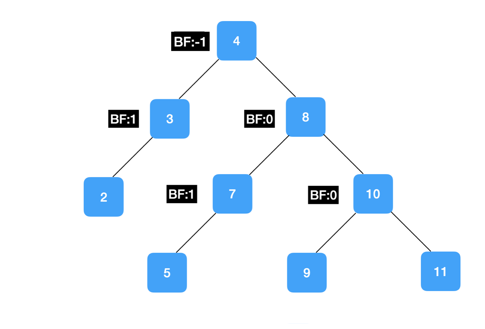
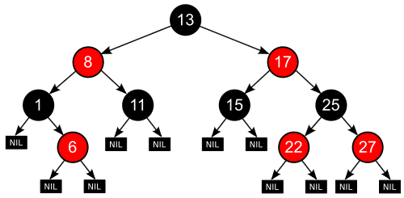

# Binary Tree

## 이진 트리 (Binary tree)
- 모든 노드들이 둘 이하 (0,1,2 개)의 자식을 가진 트리

```python
class Node:
  def __init__(self, item):
    self.item = item
    self.left = None
    self.right = None

n1 = Node(1)
n2 = Node(2)
n3 = Node(3)
n4 = Node(4)
n5 = Node(5)
n6 = Node(6)
n7 = Node(7)
n8 = Node(8)    

class BinaryTree():
  def __init__(self): # 트리 생성
    self.root = None

tree = BinaryTree()
tree.root = n1
n1.left = n2
n1.right = n3
n2.left = n4
n2.right = n5
n3.left = n6
n3.right = n7
n4.left = n8

def depth(self):
  l = self.left.depth() if self.left else 0
  r = self.right.depth() if self.right else 0
  return max(l, r) + 1

```
#### 전위 순회 
- 자신을 먼저 출력하고, 자식 노드 호출 &rarr; 1. 자신 2. 왼쪽 서브트리 3. 오른쪽 서브트리
```python
def preorder(self, n):
  if n!= None:
    print(n.item, '', end='') # 노드 방문
    if n.left:
      self.preodrer(n.left) # 왼쪽 서브 트리 순회
    if n.right:
      self.preodrer(n.right) # 오른쪽 서브 트리 순회

# output : 1 2 4 8 5 3 6 7
```
#### 후위 순회
- 자신을 가장 나중에 출력 &rarr; 1. 왼쪽 서브트리 2. 오른쪽 서브트리 3. 자신
```python
def postorder(self, n):
  if n!= None:
    if n.left:
      self.postorder(n.left)
    if n.right:
      self.postorder(n.right)
    print(n.item, '', end='') # 노드 방문

# output : 8 4 5 2 6 7 3 1
```
#### 중위 순회
- 자신을 중간에 출력 &rarr; 1. 왼쪽 서브트리 2. 자신 3. 오른쪽 서브트리
```python
def inorder(self, n):
  if n!= None:
    if n.left:
      self.inorder(n.left)
    print(n.item, '', end='') # 노드 방문
    if n.right:
      self.inorder(n.right)

# output : 8 4 2 5 1 6 3 7
```
#### 레벨 순회
- 깊이 단위로 출력
```python
def levelorder(self, n):
  q = []
  q.append(n)
  while q:
    t = q.pop(0)
    print(t.item, '', end='')
    if t.left != None:
      q.append(t.left)
    if t.right != None:
      q.append(t.right)

# output : 1 2 3 4 5 6 7 8
```

--- 
## 이진 탐색 트리 (Binary Search Tree)
- 왼쪽 자식은 부모보다 작고 오른쪽 자식은 부모보다 큰 이진 트리
- 반으로 쪼개 조건에 맞는 방향으로 찾아가므로 빠른 탐색이 가능
- 연결리스트의 참조를 이용하므로 좌&rarr;우의 방향성의 가짐

### 재귀함수를 이용한 탐색 구현
```python
def Binary_Search(input_list, value_to_search, how_many_times):
  how_many_times += 1   # 한번 재귀호출 될때마다 탐색 횟수를 카운트한다.
  i =  len(input_list)  
  if i == 1 and input_list[0] == value_to_search: # 배열이 최종적으로 1개 남았을때, 값이 맞으면 
    return  f'{input_list}, {how_many_times}번 만에 탐색 성공' # 결과와 횟수 리턴
  elif i == 0:                                    # 배열이 끝날때까지 없으면
    return '해당 번호가 없음'         # 번호가 없음을 알린다.
  
  mid = i // 2                                    # 배열의 중간값 찾기
  if input_list[mid] == value_to_search:          # 중간값 자체가 탐색값과 일치할 경우
    return f'{input_list[mid]}, {how_many_times}번 만에 탐색 성공!'
  elif input_list[mid] > value_to_search:         # 중간값보다 값이 작은 경우
    return Binary_Search(input_list[:mid], value_to_search, how_many_times)
  elif input_list[mid] < value_to_search:         # 중간값보다 값이 큰 경우
    return Binary_Search(input_list[mid:], value_to_search, how_many_times)
```
&rarr; 이분 탐색을 위해서는 리스트가 정렬되어야 함

### 연결리스트를 이용한 탐색 구현
```python
class Node:
  def __init__(self, value):
    self.value = value
    self.next = None

class Linkedlist:
  def __init__(self, value):
    self.head = Node(value)
  
  def add_node(self, value):
    node = self.head
    while node.next:
        node = node.next
    node.next = Node(value)

  def search_node(self, value):
    how_many_times = 0
    node = self.head
    while node:
      how_many_times += 1
      if node.value == value:
        return f"{value}, {how_many_times}번 만에 탐색 성공!"
      elif node.value == None:
        return f"{value}는 연결리스트에 없다."
      else:
        node = node.next
```
&rarr; head부터 찾아가므로 맨 마지막 숫자를 탐색 대상으로 두면 모든 값을 거쳐야함

### 이진탐색트리를 이용한 탐색 구현
```python
class Node_Tree:
  def __init__(self, value):
    self.value = value
    self.right = None
    self.left = None

    
class Binary_Search_Tree:
  def __init__(self, value):
    self.root = Node_Tree(value)
    
  def add_node(self, value):
    self.node = self.root
    while self.node != None:
      if self.node.value < value:
        if self.node.right ==None:
          self.node.right = Node_Tree(value)
          break
        else: 
          self.node =  self.node.right

      elif self.node.value > value:
        if self.node.left == None:
          self.node.left = Node_Tree(value)
          break
        else:
          self.node = self.node.left

  def search_node(self, value):
    node = self.root
    how_many_times = 0
    while node:
      if node.value < value:
        node = node.right
        how_many_times += 1
      elif node.value > value:
        node = node.left
        how_many_times += 1
      elif node.value == value:
        return f"{value}, {how_many_times}번 만에 탐색 성공!"
    if self.node == None:
      return f"{value}는 트리에 없다."
```

---
## 정 이진트리 (Full Binary Tree)
- 모든 노드가 0개 또는 2개의 자식 노드를 갖는 트리

---
## 완전 이진트리 (Complete Binary Tree)

- 마지막 레벨을 제외하고 모든 레벨이 완전히 채워져 있는 트리 &rarr; 마지막 레벨을 제외하고 노드가 왼쪽에서 오른쪽으로 채워져야함
- 완전이진트리의 개념은 힙과 관련이 있음

---
## 완전 이진 탐색 트리 (Complete Binary Search Tree)
- 완전 이진 트리의 성질을 가지는 이진 탐색 트리
- 편향된 이진 탐색 트리와 다르게 항상 0(log n)의 검색 속도 보장
- 삽입 시 트리 형태 유지를 위해 모양을 바꿔야 하므로 시간이 많이 소요됨
- **삽입이 적고 탐색이 많은 경우 유리** &rarr; 삽입 시 효율성을 보완한 것이 **AVL 트리**

---
## 포화 이진 트리 (Perfect Binary Tree)

- 정 이진 트리이면서 완전 이진 트리
- 모든 리프 노드의 레벨이 동일하며, 모든 레벨이 가득 채워져 있는 트리
- 모든 노드가 두개의 자식 노드를 가지며 모든 잎 노드가 동일한 깊이 또는 레벨을 가짐

--- 
## 편향 이진 트리 (Skewed Binary Tree)

- 같은 높이의 이진 트리 중 최소 개수의 노드 수를 가지면서 왼쪽 호은 오른쪽 서브트리만 가지는 이진트리
- linked list와 성능이 동일함

---
## 균형 이진 트리 (Balanced Binary Tree)

- 높이 균형이 맞춰진 이진트리
- 왼쪽과 오른쪽 트리의 높이 차가 1만큼 나는 트리
- AVL, Red-Black

---
## 높이 균형 이진 탐색 트리 (Adelson-Velsky & Landis, AVL)

- 스스로 균형을 잡는 이진 탐색 트리
- **Balance facto**는 왼쪽과 오른쪽 자식의 높이 차이를 뜻함
- 균형이 잡혔다는 것 = BF가 최대 1까지 차이나는 것 : -1부터 1까지
- **삽입, 삭제, 탐색 모두 평균이든 최악이든 0(log n)임**

[트리 균형을 위한 회전 연산 설명](https://walbatrossw.github.io/data-structure/2018/10/26/ds-avl-tree.html)

--- 
## Red-Black Tree

- 자가 균형 이진 탐색 트리
> 조건
> 1. 모든 노드는 빨간색 혹은 검은색이다.
> 2. 루트 노드는 검은색이다.
> 3. 모든 리프 노드(NIL)들은 검은색이다. (NIL : null leaf, 자료를 갖지 않고 트리의 끝을 나타내는 노드)
> 4. 빨간색 노드의 자식은 검은색이다 == No Double Red(빨간색 노드가 연속으로 나올 수 없다)
> 5. 모든 리프 노드에서 Black Depth는 같다 == 리프노드에서 루트 노드까지 가는 경로에서 만나는 검은색 노드의 개수가 같다.

[RB Tree에 대한 자세한 설명](https://suhwanc.tistory.com/197?category=730826)

&rarr; **AVL 트리는 균형을 엄격히 유지하지만, RedBlack tree는 색상이 추가되어 여유롭게 균형을 유지하므로 삽입 삭제가 비교적 빠름**

#### AVL 트리는 밸런스가 엄격하게 유지되므로 탐색에 유리하고, RB 트리는 밸런싱을 느슨하게 하므로 삭제에 유리함

