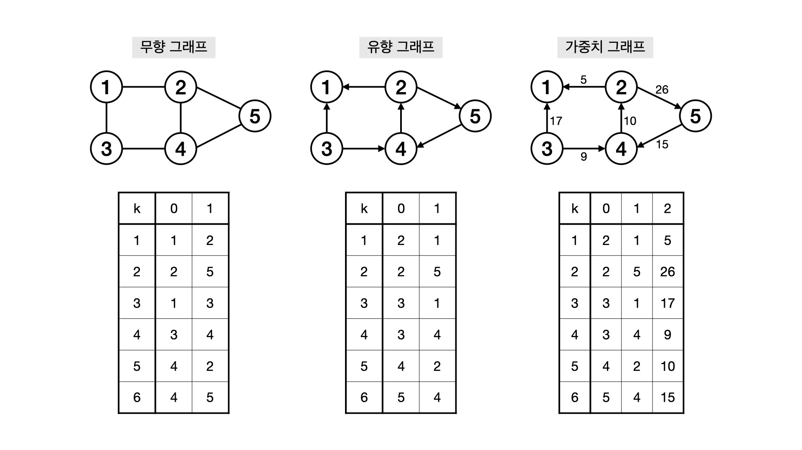
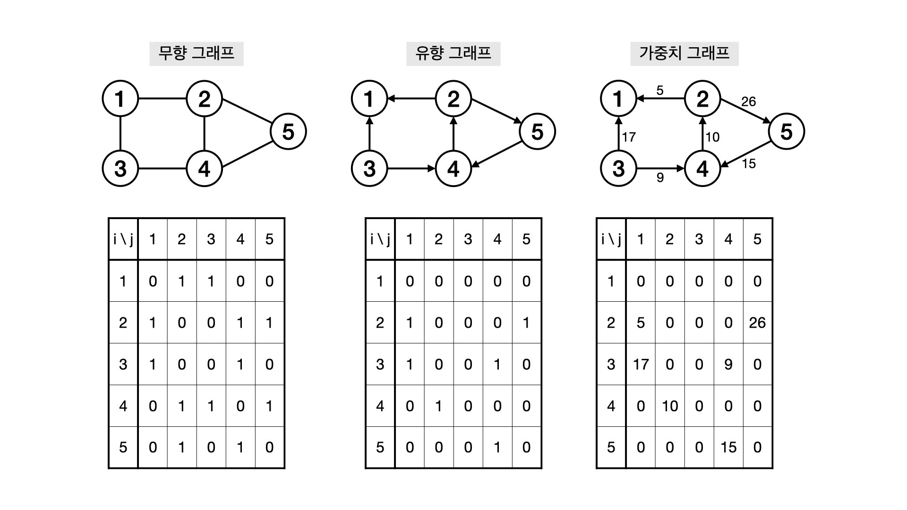
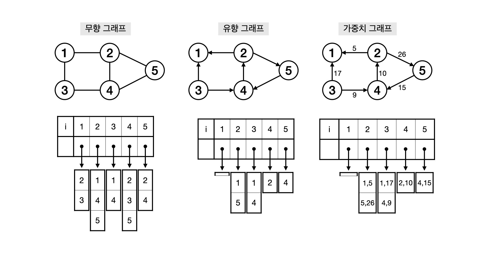

# Graph

## 그래프 용어
- 정점, 노드 (Vertex, Node)
- 간선 (Edge)
     - 무향 간선 (Undirected Edge) : 방향이 존재하지 않는 간선, 양방향
     - 유향 간선 (Directed Edge) : 방향이 존재하는 간선
- 인접 (Adjacent) : (정점 관점) 두 정점 A, B 사이에 간선이 존재한다면 A, B는 인접한다.
- 부속 (Incident) : (간선 관점) 두 정점 A, B 사이에 간선 e가 존재한다면 간선 e는 정점 A, B에 부속한다.
- 차수 (Degree) : 한 정점에 연결된 간선의 수
     - (방향 그래프) in-degree : 정점에 들어오는 간선의 수, out-degree : 나가는 간선의 수
- 자기 간선과 다중 간선
     - 자기 간선 (Self-loop) : 자신으로 다시 돌아오는 간선
     - 다중 간선 (Multiple / Parallel edges) : 두 개 이상의 간선이 똑같은 두 정점에 부속할 때
- 경로 (Path) : 정점 + 간선이 교대로 구성된 sequence
     - 단순 경로 (Simple Path) : 같은 정점을 두 번 이상 가지 않는 경로
- 회로 (Cycle) : A 정점에서 출발했을 때 다시 A 정점으로 돌아오는 경로
     - 단순 회로 (Simple Cycle) : 같은 정점을 두 번 이상 가지 않는 싸이클
- 연결됨 (Connected) : 정점 A에서 정점 B로의 경로가 존재할 때 A와 B는 연결되어 있다.

---
## 그래프 표현

#### 간선 리스트 (Edge List)

- E x 2 (or E x 3) 이차원 배열 A에 정보를 저장
- 두 정점 x,y를 연결하는 간선 k에 대해 A[k][0] = x, A[k][1] = y
- 가중치 그래프의 경우 A[k][2]에 가중치 정보를 저장

#### 인접 행렬 (Adjacency Matrix)

- V x V 이차원 배열(정방 행렬) A에 정보 저장 
- Vi, Vj를 연결하는 간선이 존재한다면 A[i][j] = 1, 존재하지 않는다면 A[i][j] = 0 &rarr; 1,0 대신 boolean 사용 가능
- 가중치 그래프의 경우 1대신 가중치 정보를 저장
- 메모리 복잡도가 V<sup>2</sup>이므로 V의 값이 클 경우 쓰지 않는 것이 좋음(100 이하의 값일 때 사용 권장)
- 밀집 그래프 표현에 적당함
- 두 정점을 연결하는 간선의 존재 여부 M[i][j]를 0(1)안에 알 수 있음
- 정점의 차수는 0(n)안에 알 수 있음 &rarr; 인접 배열의 i번째 행 or 열을 모두 더함
- BUT 그래프에 존재하는 모든 간선의 수는 0(n<sup>2</sup>)안에 알 수 있음

#### 인접 리스트 (Adjacent List)

- 정점의 인접 리스트 이용 &rarr; 모든 정점(노드)의 인접 정점을 리스트로 만듦
     - 배열과 배열의 각 인덱스마다 존재하는 또 다른 리스트 (배열, array list, linked list)를 이용해 인접 리스트 표현
- 무방향 그래프에서는 하나의 간선이 두번씩 저장됨
- V개의 Linked List로 그래프 정보 저장
- 가중치 그래프의 경우 (정점 정보, 가중치 정보)를 함께 저장 (C++ : pair, Java : class)
- 희소 그래프 표현에 적당함 &rarr; 간선의 개수에 따라 필요한 메모리 공간의 크기가 달라지므로
- 그래프에 존재하는 모든 간선의 수를 0(V + E)안에 알 수 있음
- BUT 모든 정점의 인접 리스트를 확인해야 하므로, 정점 간에 연결되어 있는지 확인하는데 오래 걸림

```c++
class Graph {
  public Node[] nodes;
}

class Node {
  public String name;
  public Node[] children;
}
```

---
## 그래프의 탐색

#### DFS
- 그래프 상에 존재하는 루트 노드를 잡고 다음 정점을 탐색하기 전에 해당 점정을 완벽히 탐색 후 다음 정점 탐색
- stack 자료구조 사용
- 시간 복잡도 0(V + E)
- 모든 관계를 다 살표보아야 할 때 사용

#### BFS
- 그래프 상에 존재하는 루트 노드를 잡고 인접한 정점을 먼저 탐색
- queue 자료구조 사용
- 시간 복잡도 0(V + E)
- 루트 노드와의 최단 경로를 구할 때 사용

