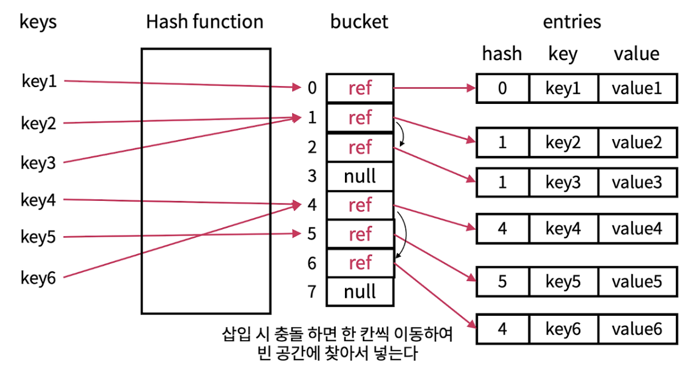
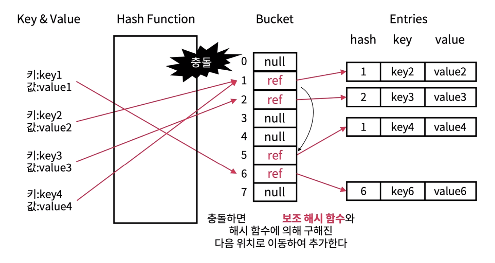
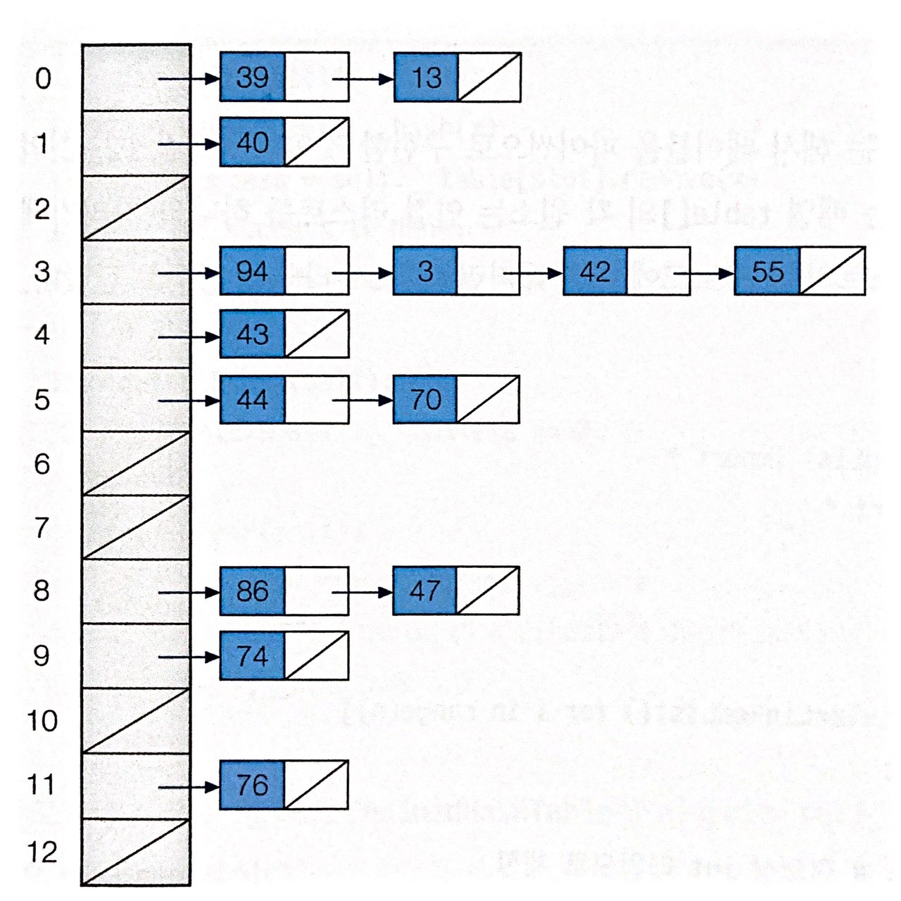

# Hash
- 해시는 빠른 검색 속도를 가지지만 상대적으로 많은 메모리 공간을 차지함

### Hash Function
- 임의의 길이를 지닌 데이터를 고정된 길이의 데이터로 변환하는 단방향 함수
- 해시 함수의 연산방법 = 해시 알고리즘
- 알고리즘 마다 해시 값이 달라지지만 동일 알고리즘에서도 약간의 차이에 전혀 다른 해시값 결과가 나타남
- **무작위 값, 단방향 암호, 데이터 무결성 검증**에 주로 사용됨

---
### Hash Collision
- 해시 값이 같은 경우 (index가 중복되는 경우) 충돌 발생
- 충돌 해결 방법으로 1. Open Addressing 2. Chaining 등이 있음

#### Open Addressing (개방 주소법)
- 충돌이 발생한 버킷의 인덱스가 아닌 다른 인덱스에 데이터를 저장
- 빈자리인 다른 버킷의 인덱스를 찾아보는 과정 = 조사
- 개방 조사법 중 **1. 선형 조사법(linear probing)은** 충돌이 발생한 버킷 인덱스 다음 인덱스부터 순차적으로 살펴봄
- 선형조사법은 단순하지만 해시 충돌이 발생한 인덱스 인근에 충돌이 발생한 여러 데이터가 몰려 저장될 수 있다는 단점 존재 = **군집화**

- **2. 이중 해싱(double hasing)은** 2개의 해시 함수를 사용하여 충돌 발생 시 다른 해시 함수에 대한 해시 값만큼 떨어긴 거리에 위치한 인데스를 찾음
- 충돌이 발생하면 f(key) + g(key)에서 인덱스를 찾고, 여기서 충돌 발생 시 f(key) + g2(key), f(key) + g3(key)... 순서로 인덱스를 찾음

#### Chaining
- 충돌이 발생한 데이터를 연결 리스트로 추가하는 방법
- 서로 다른 키가 같은 위치로 해시 되어도 단순히 연결리스트가 추가될 뿐이라 하나의 테이블 인덱스에 여러 데이터가 연결리스트의 노드로서 존재 가능
- 구현이 단순하지만 충돌이 발생될 때 마다 연결 리스트의 노드가 추가되면 해시 테이블의 장점인 빠른 속도를 살리지 못함
- 극단적으로 n개의 데이터가 모두 해시 충돌이 발생되어 모든 데이터를 연결리스트 형태로 연결하게 되면 연결리스트랑 다를 바가 없음

