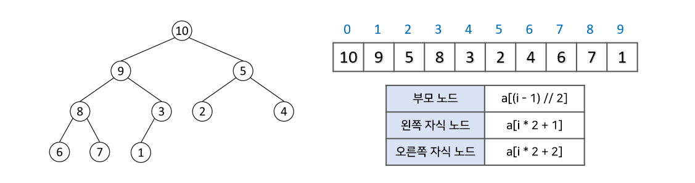
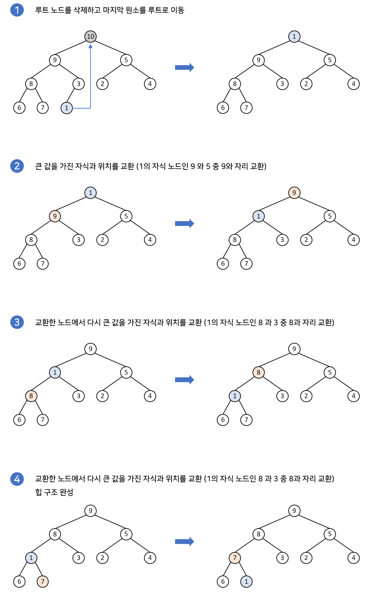

# Heap
- 마지막을 제외한 모든 노드에서 자식들이 채워진 완전 이진트리를 기초로 하는 자료구조
- 최대 또는 최소값을 쉽게 뽑기 위한 자료구조이므로 중복값을 허용함

### 배열로 힙 구현
- 루트노드를 배열의 0번 index에 저장, 각 노드를 기점으로 왼쪽 자식노드는 a[i*2+1], 오른쪽 자식노드는 a[i*2+2]의 index에 저장
- 특정 index의 노드에서 부모노드는 a[(i-1)//2]로 찾음



---
### 삽입과 삭제로 깨진 힙 재구조화 (Heapify)
- 삽입 삭제의 경우 연산 자체는 0(1)로 작동하지만 heapify 과정을 거치므로 **0(log n)의** 시간복잡도를 가짐

##### 삽입 과정 구현


```python
def up_heapify(index, heap):
    child_index = index
    while child_index != 0:
        parent_index = (child_index - 1) // 2
        if heap[parent_index] < heap[child_index]:
            heap[parent_index], heap[child_index] = heap[child_index], heap[parent_index]
            child_index = parent_index
        else:
            return
```

##### 삭제 과정 구현

```python
def find_bigger_child_index(index, heap_size):
    parent = index
    left_child = (parent * 2) + 1
    right_child = (parent * 2) + 2

    if left_child < heap_size and heap[parent] < heap[left_child]:
        parent = left_child
    if right_child < heap_size and heap[parent] < heap[right_child]:
        parent = right_child
    return parent

def down_heapify(index, heap):
    parent_index = index
    bigger_child_index = find_bigger_child_index(parent_index, len(heap))
    while parent_index != bigger_child_index:
        heap[parent_index], heap[bigger_child_index] = heap[bigger_child_index], heap[parent_index]
        parent_index = bigger_child_index
        bigger_child_index = find_bigger_child_index(parent_index, len(heap))
```
```python
# 재귀함수 사용
def down_heapify(array, index, heap_size):
    # 1. 부모노드와 자식노드들의 인덱스 지정
    parent = index
    left_child = 2 * parent + 1
    right_child = 2 * parent + 2

    # 2. 왼쪽 자식노드, 오른쪽 자식노드 중 가장 큰 노드를 선택
    if left_child < heap_size and array[left_child] > array[parent]:
        parent = left_child
    if right_child < heap_size and array[right_child] > array[parent]:
        parent = right_child
        
    # 3. 자식노드 중 가장 큰 노드와 부모 노드를 바꿈(배열의 값 교환)
    if parent != index:
        array[parent], array[index] = array[index], array[parent]
        
        # 4. 바뀐 자식노드의 힙을 재구조화
        make_heap(array, parent, heap_size)
```

---
### 힙이 아닌 배열을 힙으로 만들기 (build heap)
- build heap은 아예 힙의 조건을 만족하지 않는 배열을 힙으로 만드는 과정
- 여러번의 heapify 과정을 거치므로 결과적으로 시간복잡도는 **0(nlog n)**

##### 재귀함수를 이용한 재구조 구현
- 가장 말단의 부모-자식 노드에서부터 시작 &rarr; 부모 노드가 될 수 있는 노드들만 골라 진행


```python
def make_heap(array, index, heap_size):
    parent = index
    left_child = 2 * parent + 1
    right_child = 2 * parent + 2

    if left_child < heap_size and array[left_child] > array[parent]:
        parent = left_child
    if right_child < heap_size and array[right_child] > array[parent]:
        parent = right_child
    if parent != index:
        array[parent], array[index] = array[index], array[parent]
        make_heap(array, parent, heap_size)

# 부모노드가 되는 노드들만을 골라서 뒤에서부터 heapify를 차례로 실행
for i in range((N - 1) // 2, -1, -1):
    make_heap(array, i, heap_size)
```
