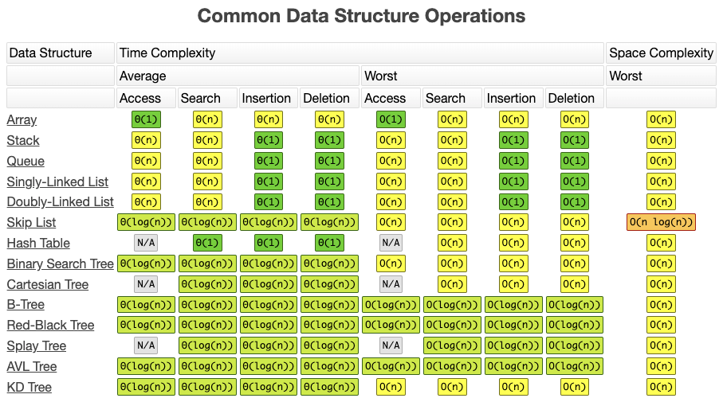
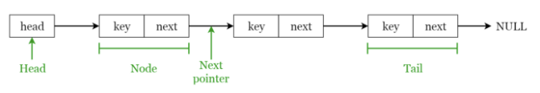
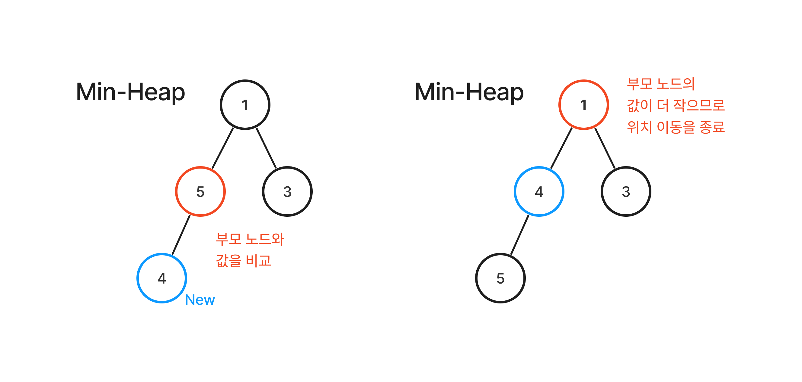

# Data Structure
- 연산에 사용되는 컴퓨터의 메모리 자원은 한정적인데 반해 처리할 데이터는 무수히 많음. 이 메모리 공간을 효율적으로 사용해야 하는데 필요한 것이 자료구조 !
- **자료에 효율적으로 접근하고 수정할 수 있도록 데이터를 구성하고 저장하는 방법** 
- 자료 구조의 선택 -> 효율적인 알고리즘의 선택 => 자료구조 + 알고리즘(+a) = 프로그램
- 저장 형태에 따라 **선형 자료구조** & **비선형 자료구조**로 구분
    - 선형 자료구조 : 데이터가 일렬로 나열됨 (**array, linked list, stack, queue...**)
    - 비선형 자료구조 : 데이터가 특정한 형태를 띔 (**tree, graph...**)

---
## Array (배열)
- 동일한 타입의 데이터들을 저장하며, 고정된 크기를 가짐
- 인덱스 번호로 데이터에 접근 가능 (random access 가능)
- 데이터 삽입 / 삭제가 어려움 (shift 해야함)
  
&rarr; 배열 목록, 힙, 해시 테이블, 벡터 및 행렬과 같은 기타 데이터 구조를 구축하기 위한 빌딩 블록

&rarr; **삽입 정렬, 버블 정렬, 병합 정렬 등 다양한 정렬 알고리즘에 사용**

> #### 시간복잡도 & 공간복잡도
> - 데이터 조회 : 0(1)
> - 데이터 삽입 / 삭제 : 0(n)

---
## Linked List (연결 리스트)
- 각 데이터 시퀀스가 순서를 가지고 연결된 순차적 구조 / 각 노드가 데이터와 포인터를 가짐
- 데이터 접근이 느림 (링크를 타고 찾아야 함)
- 동적인 데이터 추가 / 삭제에 유리 but 포인터를 위한 추가 공간이 필요
- 각 요소 : Node &rarr; Node에는 key와 다음 포인터인 next 포함
- 첫 번째 요소 : Head / 마지막 요소 : Tail

> #### 시간복잡도 & 공간복잡도
> - 데이터 조회 : 0(n)
> - **맨 앞/뒤** 데이터 삽입/삭제 : 0(1) &rarr; SinglyLinkedList의 경우 맨 뒤 데이터 삭제 연산은 0(n)
> - **중간의 원하는 위치** 데이터 삽입 삭제 : 0(n) &rarr; 원하는 원소까지 데이터를 조회하는 과정이 있으므로 0(n) + 0(1)

### Array vs LinkedList
- 데이터 접근 속도
     - Array는 인덱스를 통한 random access 지원 &rarr; 시간 복잡도 0(1)로 빠르게 접근 가능
     - LinkedList는 순차 접근 방식 사용 &rarr; 시간 복잡도 0(n)
- 데이터 삽입 & 삭제 속도
     - Array는 데이터를 중간 or 맨 앞에 삽입/삭제하는 경우 shift가 필요해 데이터가 많아질수록 비효율적
     - LinkedList는 중간 삽입/삭제는 0(n)의 시간 복잡도를 갖지만, 맨 앞/뒤에 삽입하는 경우 0(1)의 시간복잡도를 가짐
     - but LinkedList는 데이터 삽입/삭제마다 메모리 할당 & 해제가 일어나 시간복잡도는 빨라도 System call
- 메모리 할당
     - Array는 정적 메모리 할당 (compile time)
     - LinkedList는 동적 메모리 할당 (runtime)
     - Array는 데이터 삽입 시 모든 공간이 다 차면 새로운 메모리 공간이 필요하지만 LinkedList는 동적으로 할당받음

&rarr; **데이터 삽입/삭제가 빈번하면 LinkedList, 데이터 접근 속도가 중요하면 Array 사용 권장**

---
## Stack
- 순서가 보존되는 선형 데이터 구조, 삽입/삭제 연산이 한 방향에서 이루어짐
- 가장 마지막 요소(최근요소)부터 처리하는 LIFO(Last In First Out)

#### 주요 연산
- 'push' : 스택의 top에 원소 삽입
- 'pop' : 스택의 top에 있는 원소 삭제 및 반환
- 'peek' : 스택의 top에 있는 원소 반환

> #### 시간복잡도 & 공간복잡도
> - top 데이터 조회 : 0(1)
> - 특정 데이터 조회 : 0(n)
> - 데이터 삽입/삭제 : 0(1)

### Stack 활용
- system stack / runtime stack : 프로그램 함수 호출과 복귀에 따른 실행 순서 관리
- interrupt routine 처리
- 수식의 후위 표기법 (postfix notation)
- 계산기 검사
- 깊이 우선 탐색 (DFS)

> **프로그램의 함수 호출과 복귀에 따른 실행 순서 관리 과정**
> 1. 함수 호출 발생 시 stack frame에 지역변수, 매개변수, 수행 후 복귀할 주소 등의 정보를 저장해 시스템 스택에 삽입
> 2. 함수 실행이 끝나면 시스템 스택의 top에 있는 stack frame 원소를 pop, frame에 저장된 복귀 주소를 확인하고 복귀
> 3. 함수 호출 - 복귀에 따라 해당 과정을 반복, 전체 프로그램 수행 종료 시 시스템 스택은 공백 스택이 됨
&rarr; 함수 호출은 가장 마지막에 호출된 함수가 가장 먼저 실행 완료하고 복귀하는 후입선출 구조이므로 스택을 이용해 관리 !

--- 
## Queue
- 한 방향에서는 삽입 / 반대 방향에서는 삭제연산이 이루어지는 선형 자료구조
- **FIFO(First in first out) : 먼저 들어간 원소가 먼저 나옴**

#### 주요 함수
- 'push' : 데이터 추가
- 'pop' : queue의 front 데이터 삭제
- 'front' : 제일 최상위 데이터 반환
- 'back' : 제일 마지막 데이터 반환
- 'size' : queue의 현재 사이즈 반환
- 'empty' : 비어있는지 확인
- 'swap' : 두 queue의 내용 바꾸기

> #### 시간복잡도 & 공간복잡도
> - front 데이터 조회 : 0(1)
> - 특정 데이터 조회 : 0(n)
> - 데이터 삽입/삭제 : 0(1)

### Queue 활용
- 프로세스 레디 큐
- 스케쥴링
- 캐시 구현
- 너비 우선 탐색 (BFS)

## Priority Queue
- 들어간 순서에 상관없이 우선순위가 높은 데이터가 먼저 나옴
- 값을 비교해야 하므로 null을 허용하지 않음
- 내부는 이진트리 힙으로 구성됨

#### 주요 기능
- 'enqueue' : queue에 새 요소 삽입
- 'dequeue' : queue에서 최대 우선 순위 요소를 삭제하고 해당 값 반환
- 'peek' : queue에서 최대 우선순위 요소 반환

> 1. 모든 항목에는 우선순위가 존재
> 2. 우선순위가 높은 요소는 우선 순위가 낮은 요소보다 먼저 queue에서 제외
> 3. 두 요소의 우선 순위가 같으면 queue의 순서에 따라 제공

#### Priority Queue 구현
- 배열, 연결리스트, 힙으로 구현 가능
- **Heap이 최악의 경우에도 0(log n)을 보장**하므로 보통 힙으로 구현함
> **1. List로 구현**
> - 정렬되지 않은 배열 : 삽입 0(1) 루트삭제 0(n)
> - 정렬된 배열 : 삽입 0(n) 루트삭제 0(1)
>
> **2. Heap으로 구현**
> 1. 삽입 연산
> - 새로운 요소를 마지막 레벨에 추가, 부모 노드와 비교해 조건(부모 노드보다 값이 크거나 or 작거나)이 성립되는 경우 위치 조정
> - 루트노드까지 조정하는게 최악의 경우 &rarr; 시간복잡도 0(log n)
> 2. 삭제 연산
> - 루트노드가 삭제됨에 따라 힙의 특성을 유지하기 위해 마지막 노드를 루트로 이동
> - 다시 힙의 특성을 만족할 때까지 조정 진행 (= heapify)

## Stack ↔ Queue 구현
- stack은 LIFO, queue는 FIFO이므로 들어오고 나갈 떄 저장된 순서를 뒤집으면 서로간에 구현이 가능함

#### Stack &rarr; Queue
- 뺄 때 다른 스택으로 옮겨서 빼기 !
- enqueue : a stack에 push / dequeue : b 스택에 남은게 있다면 b에 있는 것을 pop, 없다면 a 스택에 있는 것을 모두 pop해서 b로 push하고 b에 있는 것을 pop

[stack_to_queue](./code/Stack/stack_to_queue.cpp)

#### Queue &rarr; Stack
- 넣어줄 때 순서를 바꿔서 넣기 !
- push : main queue에 데이터가 있다면 모두 dequeue해서 sub queue로 넣음. 그 후 main queue에 삽입하려는 데이터를 삽입하고, sub queue로 옮겨 놓은 것을 모두 dequeue해서 main queue로 넣음
- pop : main queue에 있는 것을 dequeue함

[queue_to_stack](./code/Queue/queue_to_stack.cpp)

---
## Tree
- 자료들 간의 계층적 관계를 나타내는데 사용하는 자료 구조 &rarr; 부모-자식 관계로 표현
- 비선형 자료 구조
> 루트 노드가 존재함 (트리는 반드시 1개 이상의 노드를 가짐)
> 트리의 부분 트리 또한 트리 구조를 따름

#### 용어
> - 루트 노드 : 최상위 노드, unique함
> - 부모 노드 : 부모-자식 관계에서 상위 계층
> - 자식 노드 : 부모-자식 관계에서 하위 계층
> - 형제 노드 : 부모가 동일한 노드
> - 조상 노드 : 해당 노드의 부모 노드 ~ 루트 노드까지의 경로에 존재하는 모드 노드
> - 후손 노드 : 해당 노드를 루트로 하는 부분 트리의 모든 노드
> - 내부 노드 : 자식이 있는 노드 / 외부 노드 : 자식이 없는 노드
> - 깊이 : 루트 노드에서 해당 노드까지 도달하는데 사용하는 간선 수 &rarr; 루트 노드 깊이는 0
> - 레벨 : 노드의 깊이 + 1
> - 높이 : 루트 노드에서 해당 노드까지 도달하는데 지나간 정점 수 &rarr; 트리의 높이 = 해당 트리 내 모든 노드의 높이 중 최댓값
> - 차수 : 노드의 자식 수 &rarr; 트리의 차수 = 해당 트리 내 모든 노드의 차수 중 최댓값

> #### 시간복잡도 & 공간복잡도
> - 노드 검색 : 0(n)
> - 노드 삽입/삭제 : 0(1)
>         - 노드 삭제의 경우 언어와 구현에 따라 시간복잡도가 달라짐

### Tree 활용
- 파일 시스템
- 검색 엔진
- 트라이 알고리즘

## Indexed Tree = Segment Tree
- 순서를 갖는 정보가 주어질 때, **구간의 대표 값이나 연산 결과**를 빠르게 얻는 자료구조
- **구간 합, 구간 내 최댓값, 구간 내 카운트** 등을 구할 때 사용
- segment tree는 indexed tree가 포함하고 있는 한 종류임

> #### Top-Down 방식 구현 (DFS 기반 : 재귀호출)
> - 왼쪽 자식 = 2*node, 오른쪽 자식 = 2*node + 1
> - 가지치기 가능 (더 이상 탐색하지 않아도 되는 곳은 가지 않음)
> - x번째로 빠른 숫자 등 카운팅 쿼리 가능

> #### Bottom-Up 방식 구현 (반복문 기반 트리 탐색)
> - 인덱스의 홀짝 특성 이용
> - 부모 노드 = node / 2
> - 코드가 더 단순하며, 수행 속도가 상대적으로 빠름

---
## Binary Tree
- 트리의 차수가 2 이하인 트리
- 비선형 자료구조
- 자식이 최대 2개이므로 왼쪽, 오른쪽 자식으로 구분함 / 일반 트리는 0개의 노드를 가질 수 없으나, 공백 이진 트리는 존재함
- **레벨 i에서의 최대 노드 수 : 2(i-1)**
- **깊이가 k**인 이진 트리의 최대 노드 수 :**2k-1**
- **n0= n2 + 1** (리프 노드의 수 = 자식 노드가 2개인 노드의 수 + 1)

#### 이진 트리의 표현
> 1. 배열 표현
> - i가 1이 아니면 parent(i)는 [i/2]에 위치. 만약 i가 1이면 루트이므로 부모가 없음
> - 2i <= n 이면 leftchild(i)는 2i에 위치. 만약 2i > n이면 i는 왼쪽 자식이 없음
> - 2i + 1 <= n 이면 rightchild(i)는 2i + 1에 위치. 만약 2i + 1 > n이면 i는 오른쪽 자식
> - **완전 이진트리일 때 이상적 표현이 가능하지만 편향된트리인 경우 공간 낭비가 발생, 중간에 노드 삽입/삭제 시 위치 변경이 일어남**
> - 이를 극복하기 위해 **연결 표현** 사용 가능
>
> 2. 연결 표현
> - 각 노드를 leftchild, rightchild를 가지는 구조체로 만들어 표현
> - **공간 낭비 최소화, 삽입/삭제 시 비용이 발생하는 순차 표현의 문제 해소**
> - but 부모 노드 파악이 어려움 &rarr; 이를 위해 data, leftchild, rightchild에 더해 4번째 필드 값으로 parent 추가 가능

### 이진 탐색 트리 (Binary Search Tree)
- 이진탐색 + 연결리스트를 결합한 이진트리
- 이진 탐색의 효율적인 탐색 능력은 유지하되 빈번한 자료 입려/삭제가 가능하게 고안됨
> 특징
> - 각 노드에 중복되지 않은 키가 있음
> - 루트 노드의 왼쪽 서브 트리는 해당 노드 키보다 작은 키를 갖는 노드로 이루어짐
> - 루트 노드의 오른쪽 서브 트리는 해당 노드 키보다 큰 키를 갖느 노드로 이루어짐
> - 좌우 서브트리도 모두 이진 탐색 트리어야 함
&rarr; **이진 탐색 트리는 모든 왼쪽 자식 값이 루트나 부모보다 작고, 모든 오른쪽 자식이 루트나 부모보다 큰 값을 가짐**

> #### 시간복잡도 & 공간복잡도
> - 연결리스트 : 삽입/삭제 &rarr; 0(1) / 탐색 &rarr; 0(n)
> - 이진 탐색 : 0(log n), but 삽입/삭제 불가능
> - 이진 탐색 트리 : 0(log n), 삽입/삭제 가능

[binary_tree_detail](./Binary_tree.md)

---
## Graph
- 현실 세계의 사물이나 개념 간의 연결 관계를 수학적 모델로 단순화하여 표현한 것
- 그래프는 네트워크 모델이며 2개 이상의 경로가 가능함 (즉, 노드들 사이에 양방향 경로를 가질 수 있음)
- 부모-자식 관계 개념이 없음
         - V : 정점 (Vertex/Node)
         - E : 간선 (Edge/Link/Arc)
         - 그래프 G = (V, E)

### 그래프 종류
1. 무향 그래프 (Undirected Graph) : 무방향 간선으로 이루어진 그래프
2. 유향 그래프 (Directed Graph) : 방향 간선으로 이루어진 그래프
3. 가중치 그래프 (Weighted Graph) : 가중치(비용)를 갖는 간선들로 이루어진 그래프
4. 정규 그래프 (Regular Graph) : 모든 정점이 동일한 차수를 가지는 그래프
5. 완전 그래프 (Complete Graph) : 모든 정점이 서로 인접해있는 그래프, 완전 그래프는 정규 그래프
6. 연결 그래프 (Connected Graph) : 모든 정점이 연결되어 있어서 모든 정점끼리 경로가 존재하는 그래프
7. 부분 그래프 : 어떤 그래프의 부분 부분
8. 트리 그래프 : 싸이클을 가지지 않는 연결 그래프, 모든 정점에 대해서 경로가 정확히 1개 존재함

### 그래프 표현 
- 3가지 방식이 존재함 (**간선 리스트, 인접 행렬, 인접 리스트**)

[graph_detail](./Graph.md)

---
## Graph VS Tree

||Graph|Tree|
|------|---|---|
|정의|노드와 노드를 연결하는 간선으로 구성된 자료 구조|그래프의 한 종류, 방향성이 있는 비순환 그래프|
|방향성|방향, 무방향|방향만|
|사이클|순환, 비순환, 자기순환|비순환만 = 사이클 x|
|루트노드|루트 개념 없음|하나의 루트 존재|
|부모-자식|부모-자식 개념 없음|1개의 부모노드(루트 제외)|
|모델|네트워크 모델|계층 모델|
|간선 수|자유|N - 1개|
|순회|DFS, BFS|DFS, BFS 방식의 전위, 중위, 후위 순회|
|경로||임의의 두 노드 간 경로는 유일|
|사용 예|지도, 지하철 노선의 최단 경로, 선수 과목, 전기 회로의 소자|이진트리, 이진탐색트리, 균형트리(AVL, Red-black, 이진힙|

---
# Advanced Data Structure

## Deque 
- 선형 자료구조
- Double-ended queue &rarr; 양방향에서 삽입, 삭제 연산이 모두 이루어지는 큐
- stack(LIFO), queue(FIFO)처럼 활용이되므로 대신 사용 가능 &rarr; stack + queue
- iteator와 index 접근이 모두 가능함
- 두개의 포인터를 사용해 양쪽에서 삽입 삭제 연산을 실행함

#### Deque의 기본 메서드
> - dq.begin() : dq의 첫번째 원소를 가리키는 iterator / dq.end() : dq의 마지막 원소를 가리키는 iterator
> - dq.front() : dq의 첫번째 원소 / dq.back() : dq의 마지막 원소
> - dq.at(n) : dq의 n번째 원소
> - dq.assign(n) : 원소 n개를 0으로 초기화 / dq.assign(n,1) : 원소 n개를 1로 초기화
> - dq.push_front(x) : dq의 첫번째 원소에 x추가 / dq.push_back(x) : dq의 마지막 원소에 x추가
> - dq.pop_front() : dq의 첫번째 원소 삭제 / dq.pop_back() : dq의 마지막 원소 삭제
> - dq.size() : dq의 원소 개수 리턴
> - dq.resize(m) : dq의 메모리 공간 크기를 m으로 변경하고 늘어난 부분은 0으로 초기화
> - dq.clear() : dq의 전체 원소 clear
> - dq.insert(iterator, x): iterator가 가리키는 위치에 원소 x삽입 (기존 원소들은 한칸씩 뒤로 밀림)
> - dq.erase(iterator) : iterator가 가리키는 위치의 dq원소 삭제

### Deque VS Vector
- deque는 시퀀스 끝 뿐만 아니라 앞 부분에서도 추가, 삭제가 효율적임
- vector는 배열처럼 연속된 메모리 공간을 차지 / deque는 모든 원소들이 연속된 공간에 저장되지 않음
- vector는 시퀀스 증가를 위해 배열 자체적으로 재할당해야하는 경우가 있음 / deque는 chunk 단위로 메모리가 흩어져있음
- 따라서 길이가 긴 시퀀스의 경우 deque가 더 효율적임

---
## Heap
- 최댓값 또는 최솟값을 빠르게 찾기 위해 고안된 자료구조이며 **완전이진트리**를 기반으로 함
- 완전 이진 트리 형태로 배열을 사용하며 최대 또는 최소값이 항상 루트에 존재
- **최대 힙** : 루트 노드의 값은 모든 하위 노드 중 가장 커야하며, 하위트리에도 동일하게 구성됨
- **최소 힙** : 루트 노드의 값은 모든 하위 노드 중 가장 작아야하며, 하위트리에도 동일하게 구성됨

#### 동작원리
- 힙은 특성상 최소 or 최대 값이 루트이며 부모 노드가 자식보다 작거나 큼
- 이를 유지하기 위해 새로운 값이 들어오는 경우 이진 트리 가장 마지막 노드에 추가되며, 부모 노드와 값을 비교해 조건을 만족할 때까지 위치 이동
> #### 삽입 (Insert)
> - 새로운 요소는 트리의 마지막 레벨에 추가
> - 이후 부모노드보다 값이 더 작을 경우 위치를 이동하며 순회
> - 완전 이진 트리의 특성상 값은 왼쪽 아래부터 채워짐
>
> #### 삭제 (Pop)
> - 최소 값을 담고 있는 루트 노드 삭제
> - 루트 노드가 삭제되면 마지막 레벨에 있는 노드를 루트 노드로 이동, 그후 자식노드와 값을 비교하며 이동 및 순회하며 재정렬
>
> 

**힙을 배열로 구현해야 하는 이유**
|자료구조|설명|
|---|---|
|배열|삽입 및 삭제에 따라 마지막 요소를 찾기가 쉬움|
|링크드 리스트|삽입 및 삭제에 따라 마지막 요소를 찾기 위해 리스트를 순회. 따라서 배열보다 비효율적|

[heap_detail](./Heap.md)

---
## Hash Table
- 데이터를 키와 값의 쌍으로 저장하는 자료구조 &rarr; Key-Value 테이블
- 키를 통해 얻고자 하는 데이터(key, value)는 bucket에 저장됨 &rarr; 이 버킷들은 배열의 형태로 구성
- 키는 해시 함수에 의해 배열의 인덱스로 변환 &rarr; 해당 인덱스가 버킷 배열의 인덱스임
- (key, value) 데이터 쌍 저장을 위해 해시 함수를 이용해 인데스로 저장
- key는 무조건 존재하되 중복되면 x (해쉬 함수는 일대일 대응 함수)
- 해시 테이블을 사용하면 평균적인 시간복잡도 0(1)로 데이터 검색, 삽입, 삭제 가능
- 직접 주소화 테이블의 단점을 보완함 &rarr; 직접 주소화 테이블은 메모리 공간 낭비, 제한적인 key 자료형을 가진다는 단점 존재

> #### 시간복잡도 & 공간복잡도
> - 데이터 저장, 검색, 삭제 : 0(1) / 충돌 발생의 경우 : 0(n)
> - bucket을 미리 확보해야하므로 공간 효율이 낮음

- 해시테이블을 딕셔너리 형태로 이용하여 코테에서 사용 &rarr; 무수히 많은 데이터 저장, 탐색이 필요할 때 시간복잡도를 줄일 수 있음

[hash_detail](./Hash.md)

---
## Trie = Prefix tree, Digital search tree, Retrieval tree
- **문자열을 빠르게 검색할 수 있는 자료 구조**로, 단어 사전과 같은 개념
- 비선형 자료구조 (tree 응용)
- k진 트리 구조, 트라이의 **root 노드는 항상 빈 문자열**
- 단어 사전을 트라이로 생성, 그 후 찾을 단어를 트라이를 사용해 검색
- 각 노드는 문자열 전체가 아닌, **하나의 문자**를 저장하며, 문자에 대한 **링크**를 가짐
- **DFS**를 이용해 각 노드의 키에 접근, 즉 트라이 구조 내에 저장되어 있는 문자열 탐색
- **문자열의 길이가 일정**한 경우 최적의 자료 구조

> #### 시간복잡도 & 공간복잡도
> - 최대 시간복잡도 : 0(최대 문자열의 길이)
> &rarr; 문자열을 구성하는 문자들의 수만큼 트리의 depth가 형성되므로
> &rarr; 각 노드에서 자식 노드 탐색을 위해서는 0(1)의 시간이 소요되고, 전체 문자열을 탐색하기 위해서는 문자열의 길이 l만큼 반복하므로 0(l) 시간 소요
>
> (제일 긴 단어 길이를 m, 총 단어들의 수를 n이라 가정)
> - **트라이 생성**시 시간복잡도 : 0(n * m)
> &rarr; 단어 하나 삽입 시 가장 긴 단어의 길이 m만큼 걸리므로 0(m), 이를 n개 넣으므로 0(n * m)
> - **단어 검색**시 시간복잡도 : 0(m)
> &rarr; 가장 긴 문자열의 길이만큼 걸리므로 0(m)
> 
> - 알파벳의 경우 공간복잡도 : 0(26*포인터 크기*총 노드 수)\
> &rarr; 알파벳의 경우 26개의 문자를 저장할 공간이 필요, 즉 각 노드는 26개의 자식노드를 가리키는 포인터를 저장해야함
&rarr; 메모리를 많이 필요로 하는 대신, 아주 빠른 속도로 문자열 탐색이 가능. 이를 보완하기 위해 Radix Tree가 존재함

### Trie VS Hash Table 
- 트라이의 경우 번거롭게 해쉬함수 작업을 할 필요가 없고 메모리 효율성이 비교적 뛰어남
- but 메모리 요구량이 비교적 많아질 수 있고, 삽입/삭제가 복잡함

### Tree 활용
- 문자열 탐색
- 검색어 자동 완성
- 사전 찾기

[trie_detail](./Trie.md)

