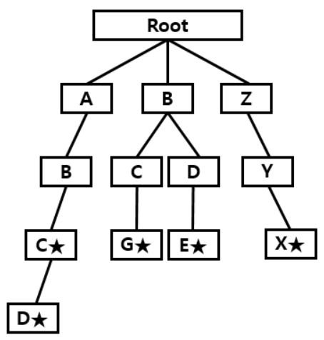

# Trie


&rarr; [ABC, ABCD, BCG, ZYX, BDE] 문자열에 대한 Trie 구조

---
## Trie에 단어 삽입하기
1. 루트 노드부터 시작해 삽입할 단어의 첫 글자부터 트라이 검색
2. 만약 현재 노드의 자식 중 현재 입력 중이 철자에 해당하는 자식이 있다면 해당하는 자식 노드로 이동, 없으면 새로운 자식 추가
3. 단어를 삽입한 후, 탐색된 마지막 노드에 현재 입력된 단어의 정보 추가

(트라이에 존재하는 가장 긴 문자열의 길이를 l, 총 문자열의 수를 m이라 가정)
&rarr; 처음 트라이 구축에는 m개에 대해 l만큼 걸리므로 수행시간은 0(l*m)
&rarr; 그 후 새로운 문자열 추가에는 0(l)만큼 걸림

---
## Trie를 이용해 검색하기
1. 루트 노드부터 시작해 검색할 단어의 첫 글자부터 트라이 탐색
2. 만약 현재 노드의 자식 중 현재 입력 중인 철자에 해당하는 자식이 있으면 해당 자식 노드로 이동, 없으면 검색한 단어는 트라이에 존재하지 않는 단어로 처리
3. 탐색이 완료되면, 탐색된 마지막 노드의 정보 이용

&rarr; 트리를 타고 들어가 l만큼 탐색하므로 수행시간은 0(l)

---
## Trie 구현
```c++
struct TRIE{
    bool Finish;
    TRIE *Node[26];
    TRIE(){
        Finish = false;
        for (int i = 0; i < 26; i++) Node[i] = Null;
    }
}

void Insert(char *Str){
    if (*Str == NULL){
        Finish = true;
        return;
    }
    int cur = *Str - 'A';
    if (Node[cur] == NULL) Node[cur] = new TRIE();
    Node[cur] -> Insert(Str + 1);
}

bool Find(char *Str){
    if (*Str == NULL){
        if (Finish == true) return true;
        return false;
    }
    int cur = *Str - 'A';
    if (Node[cur] == NULL) return false;
    return Node[cur] -> Find(Str + 1);
}
```