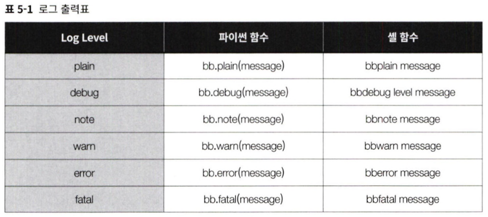
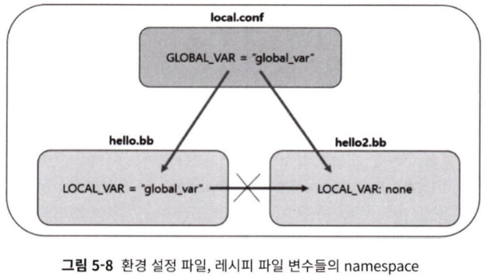
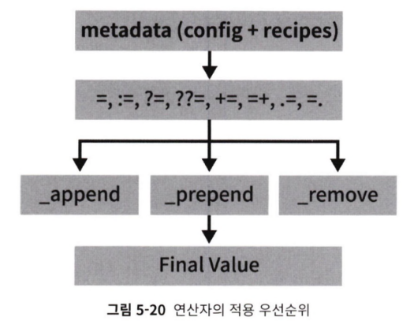
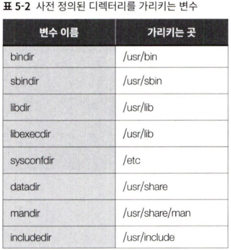
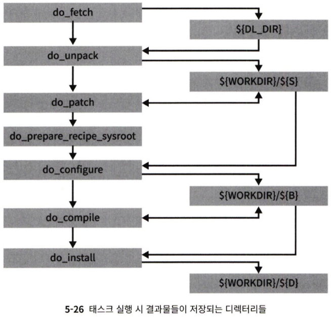
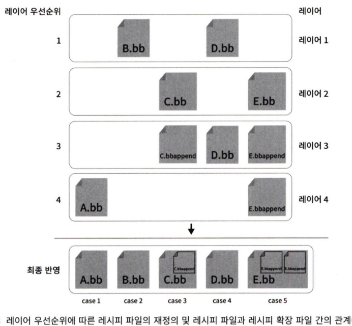
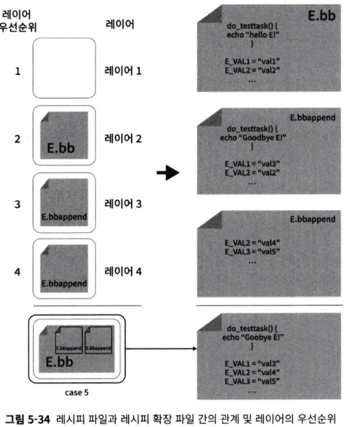
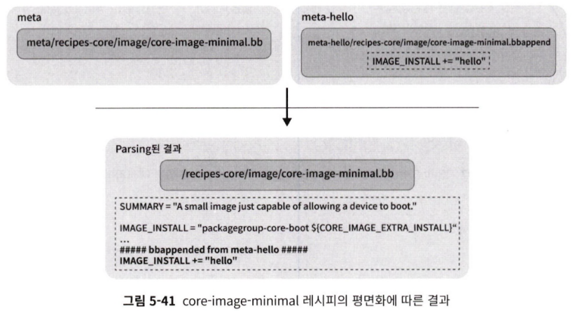
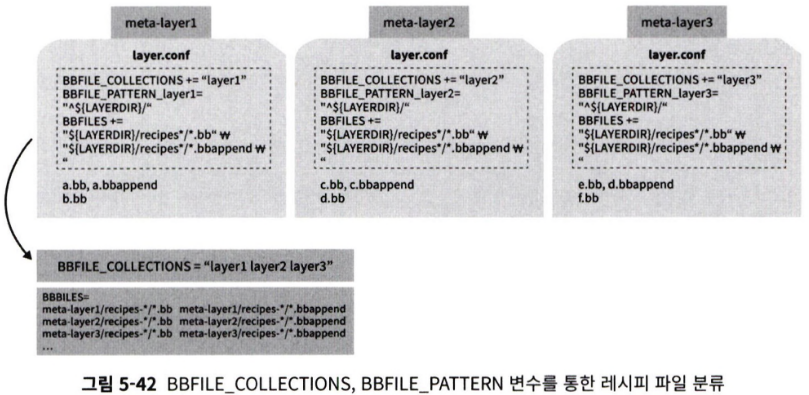
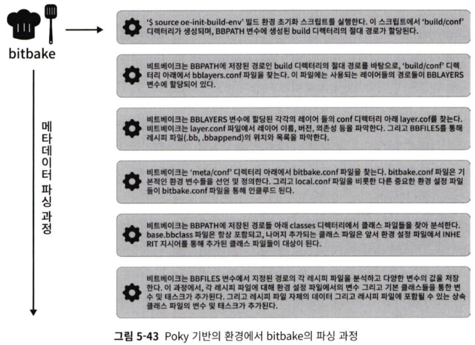

# 레이어 & 레시피 생성
- Poky 내에 레이어와 레시피 생성하기

<details>
<summary>Table of Contents</summary>

- [변수의 범위](#변수의-범위-namespace)
- [문법](#기본값-할당--)
- [레시피 파일에서 전여 변수의 범위](#레시피-파일에서-전역-변수의-범위)
- [오픈소스 라이선스](#오픈소스-라이선스)
- [레피시 확장 파일](#레시피-확장-파일)
- [BBFILE_COLLECTIONS, BBFILE_PATTERN](#bbfile_collections-bbfile_pattern-변수)

</details>

- 디렉토리 구조 예
    
    <aside>
      
      💡 meta
        |_ conf
        |     |_ layer.conf
        |_ recipes-hello
        |_ hello.bb 
        
    </aside>
    
1. **layer.conf**에 해당 내용 추가
    
    ```python
    BBPATH =."${LAYERDIR}:"
    BBFILES += "${LAYERDIR}/recipes*/*.bb"
    BBFILE_COLLECTIONS += "hello"
    BBFILE_PATTERN_hello = "^${LAYERDIR}/"
    BBFILE_PRIORITY_hello = "10"
    LAYERSERIES_COMPAT__hello ="${LAYERSERIES_COMPAT_core}"
    ```
    
    - bitbake는 레시피 파일 인식을 위해 BBFILES 변수 경로 참고
    
2. **hello.bb 레시피 파일**에 해당 내용 추가
    
    ```python
    DESCRIPTION = "Simple hello example"
    LICENSE = "CLOSED"
    
    do_printhello(){
    				bbwarn "hello world!"
    }
    addtask do_printhello after do_compile before do_install
    ```
    
    - recipes-xxx : 레시피를 위한 작업 디렉토리
    - bbwarn : 로그 출력 함수



3. **새로 추가한 레이어**[meta-hello]를 bblayer.conf의 **BBLAYES 변수에 추가**
    
    ```python
    # POKY_BBLAYERS_CONF_VERSION is increased each time build/conf/bblayers.conf
    # changes incompatibly
    POKY_BBLAYERS_CONF_VERSION = "2"
    
    BBPATH = "${TOPDIR}"
    BBFILES ?= ""
    
    BBLAYERS ?= " \
      /home/seame/poky/meta \
      /home/seame/poky/meta-poky \
      /home/seame/poky/meta-yocto-bsp \
      /home/seame/poky/meta-hello \
      "
    ```
    
    - bitbake는 빌드 시 bblayers.conf의 BBLAYERS 변수로 레이어들을 파악함

4. **실행**

```python
$ bitbake <recipe-name> # 예제 상으로는 bitbake hello
```

- bitbake 명령어를 발견할 수 없다는 경고가 뜨는 경우 아래 스크립트는 최상위 디렉토리에서 실행
    
    ```python
    ~poky_src$ source poky/oe-init-build-env
    ```
    
- **레이어 정상 추가 확인**
    
    ```python
    bitbake-layers show-layers
    ```
    
#### **레시피 & 빌드할 소프트웨어 패키지에 대한 정보 제공을 위한 변수들**

- SUMMARY : 패키지 소개 - 한 줄 작서 & 최대 80자 제한
- DESCRIPTION : 패키지 & 제공하는 바에 대한 설명
- AUTHOR : 소프트웨어 패키지 저자 이름 & 이메일
- HOMEPAGE : 소프트웨어 패키지 제공 URL
- BUGTRACKER : 프로젝트 버그 추적 시스템 URL

---
## 변수의 범위 (namespace)
- **.conf**에서 정의된 변수 = **전역 변수** ⇒ 모든 레시피 파일(**.bb, .bbappend**)에서 사용 가능
- **레시피 내**에 선언된 변수 = **로컬 변수**

- layer.conf
    
    ```python
    BBPATH =. "${LAYERDIR):"
    BBFILES += "${LAYERDIR}/recipes*/*.bb"
    BBFILE_COLLECTIONS += "hello"
    BBFILE_PATTERN_hello = "^${LAYERDIR)/"
    BBFILE_PRIORITY_hello = "10"
    LAYERSERIES_COMPAT_hello = "${LAYERSERIES_COMPAT_core)"
    **GLOBAL_VAR = "global var"**
    ```
    
- hello.bb
    
    ```python
    DESCRIPTION = "Simple hello example"
    LICENSE = "CLOSED"
    **LOCAL_VAR = "local var"**
    do_printhello(){
    				bbwarn "hello world!"
    				bbwarn "${GLOBAL_VAR}"
    }
    addtask do_printhello after do_compile before do_install
    ```
    
- hello2.bb
    
    ```python
    DESCRIPTION = "Simple hello2 example"
    LICENSE = "CLOSED"
    do_printhello2(){
    			bbwarn "hello world second"
    			bbwarn "LOCAL_VAR is ${LOCAL_VAR}"
    }
    addtask do_printhello2 after do_compile before do_install
    DEPENDS = "hello"
    ```
    
    - DEPENDS : 레시피 파일 간의 의존성 설정 → hello2.bb 빌드 전 hello.bb가 우선 빌드 되어 함



- 기존 빌드 결과물 삭제 & 재빌드
    
    ```python
    bitbake hello -c cleanall && bitbake hello
    ```

---
### 기본값 할당 → ?=

- hello.bb
    
    ```python
    DESCRIPTION = "Simple hello example"
    LICENSE = "CLOSED"
    A_VAR ?= "yoctol"
    B_VAR ?= "yocto2"
    
    B_VAR ?= "yocto3"
    C_VAR ?= "yocto4"
    C_VAR = "yocto5"
    
    do_printhello(){
    	bbwarn "hello world!"
    	bbwarn "A_VAR: ${A_VAR}"
    	bbwarn "B_VAR: ${B_VAR}"
    	bbwarn "C_VAR: ${C_VAR}"
    )
    addtask do_printhello after do_compile before do_install
    ```
    
    → A_VAR은 초기 설정 값으로 설정
    
    → B_VAR은 기본값 연산이 두 번 이상 사용되어 첫번째 기본값 연산자에 할당한 값으로 설정
    
    → C_VAR은 기본값 할당과 상관없이 ‘=’ 연산자에 넣은 값으로 설정
    

### 약한 기본값 할당 → ??=

- hello.bb
    
    ```python
    DESCRIPTION = "Simple hello example"
    LICENSE = "CLOSED"
    
    A_VAR ??= "yoctol"
    B_VAR ??= "yocto2"
    B_VAR ??= "yocto3"
    C_VAR ?= "yocto4"
    C_VAR ??= "yocto5"
    D_VAR = "yocto6"
    D_VAR ??= "yocto7"
    
    do_printhello(){
    	bbwarn "hello world!"
    	bbwarn "A_VAR: ${A_VARJ"
    	bbwarn "B_VAR: ${B_VAR}"
    	bbwarn "C_VAR: ${C_VARJ"
    	bbwarn "D_VAR: ${D_VAR}"
    }
    addtask do_printhello after do_compile before do_install
    ```
    
    - 값 할당은 parsing이 끝날 때까지 이뤄지지 않음 = **나중에 실행된 ??= 연산자에 할당된 값이 최종 반영됨 [기본값 할당과 반대]**
    
    → B_VAR : 두번째로 넣은 값 할당
    
    → C_VAR, D_VAR : **??=은 = or ?= 보다 우선순위 낮으므로** yocto4, yocto6 값 할당
    

### 변수 확장

- hello.bb
    
    ```python
    DESCRIPTION = "Simple hello example"
    LICENSE = "CLOSED"
    VAR1 = "hello!"
    VAR2 = "${VAR1} my name is yocto"
    
    do_printhello(){
    	bbwarn "hello world!"
    	bbwarn "VAR2: ${VAR2}"
    }
    addtask do_printhello after do_compile before do_install
    ```
    
    - bitbake에서 변수는 다른 변수 내에서 참조함
    
    → VAR2가 VAR1 변수를 포함하고, 출력 시 VAR2에 VAR1 변수가 적용됨 = 확장
    
    - **데이터 파싱 절차의 제일 마지막**
    - **조건부 할당이 이뤄질 때**
    - **선입과 후입 직전**
    - **해당 변수가 실제 사용되기 전에는 발생 X**

### 즉시 변수 확장 → :=

- hello.b
    
    ```python
    DESCRIPTION = "Simple hello example"
    LICENSE = "CLOSED"
    
    VAR1 = "jumps over"
    VAR2 = "${VAR1} the lazy dog."
    VAR1 = "tails on"
    VAR3 = "The rain in spain ${VAR1} the plain"
    VAR4 := "The quick brown for ${VAR2}"
    
    do_printhello(){
    	bbwarn "hello world!"
    	bbwarn "VAR4: ${VAR4}"
    }
    addtask do_printhello after do_compile before do_install
    ```
    
    - VAR1 변수 값이 실제 VAR2 변수가 사용되는 시점 (:= 연산자 사용 시점)에 할당됨
    - VAR4 : talls on the lazy dog

### 변수의 후입과 선입(공백 추가) → **+= : 후입 / =+ : 선입**

### 공백 없는 후입 선입 → .=, _append : 후입 / =., _prepend : 선입

- **_append, _prepend 연산자는 모든 레시피와 환경 설정 파일이 처리된 후 처리됨**
    - Yocto honister 버전 이상부터는 :**append**로 표기

### _remove를 이용한 삭제

- 변수에 할당된 문자열에서 일치하는 문자열 삭제
- **공백으로 구분된 일치하는 문자열만 삭제**
- Yocto honister 버전 이상부터는 **.remove**로 표기

### 함수의 선입과 후입

- 변수와 동일하게 취급됨 / _append, _prepend 연산자 사용

---
## 레시피 파일에서 전역 변수의 범위

- 레시피 파일 내에서 정의한 전역 변수는 태스크 내에서 읽기 쓰기 가능
- 태스 내에 변수의 쓰기는 태스크 내에만 변경된 값이 유효함 = 지역변수
- 태스크 내 코드는 셸 스크립트이므로 bitbake 문법 적용 X
- bitbake는 **셸 함수 실행 시 인터프리터인 /bin/sh 호출**
- bitbake는 메타데이터를 바탕으로 레시피의 특정 태스크를 다시 구성함, 변수가 특정 태스크 내에 변경되어도 다른 태스크의 변수값에 영향 X

### 연산자의 적용 우선순위 (bitbake의 파싱 및 확장 시 발생하는 우선순위)



- **_append, _prepend, _remove 연산자는 최종 사용 시점에 파싱됨**

- 레시피 파일 생성 시 **라이선스 및 설명 파일에 대한 checksum 지정**이 필수임
    - 보통 checksum 값은 **md5sum** or **sha256sum** 중 하나만 있으면 됨
    - 라이선스 파일 경로에 가서 $ md5sum 명령어 실행
    - 계산된 값을 레시피 파일에 추가함 (예제의 경우 hello.bb에 추가)
- bitbake는 **upstream 레포지토리를 지원하기 위한 fetcher를 제공**함
    - remote = upstream : 네트워크 서버에 있는 저장소
- **THISDIR** : bitbake가 현재 파싱하는 파일이 위치하고 있는 디렉토리 (절대 경로)
- **FILESEXTRAPATHS** : FILEPATH 확장 / 오픈임베디드 빌드 시스템이 패치 및 파일 검색 시 사용하는 디렉토리 리스트

- install 태스크
    
    ```python
    do_install() {
    	install -d ${D}${bindir}
    	install -m 0755 hello ${D}${bindir}
    }
    ```
    
    - install -d xxx : xxx 디렉토리 생성
    - install -m 0755 hello ${D}${bindir} : hello 실행 파일 권한을 0755로 주고 파일을 해당 디렉토리로 복사
    - D : 빌드 결과물로 생성된 바이너리가 위치하는 경로
    - bindi : 사전에 정의된 디렉토리 이름



- install 태스크는 바이너리, 라이브러리, 헤더 파일, 문서들을 D 변수가 가리키는 경로에 복사함

- 프로그램 파일들의 설치 경로
    - 사용자 프로그램 : /usr/bin
    - 시스템 관리 프로그램 : /usr/sbin
    - 라이브러리 : /usr/lib
    - 환경 설정 파일 : /etc    

- bitbake는 기본 태스크를 갖고 있음, 태스크 지정이 없으면 그대로 수행함
    - BB_DEFAULT_TASK : 기본 태스크 변수, 이를 수정하여 지정

- **빌드한 애플리케이션 동작을 위해 애플리케이션 바이너리를 타깃의 루트 파일 시스템에 포함**
- 각 태스크 실행 시 결과물을 저장하는 디렉토리



---
## 오픈소스 라이선스

- GPL (General public license)
    - copyleft 라이센스 : 지식 재산 보호 대신 널리 유통시켜 이익을 얻음
    - 소프트웨 패키지를 빌드하는데 사용한 소스코드를 공개해야함
- BSD (Berkeley software distribution)
    - 아파치 재단 등에서 나온 보다 허용적인 라이센스
    - 라이센스 조건을 변경하지 않는 한 소스 코드를 수정하고 사용하는 것을 허용함

⇒ 대부부의 라이브러리는 LGPL 라이센스 됨 (GPL 보다 완화된 조건)

### Yocto의 라이센스 관리 방법

- 라이센스 변수
    - **LICENSE** : 모든 레시피는 빌드 소프트웨 패키지에 적용된 라이센스 목록을 LICENSE 변수에 할당해야함
        - LICENSE 사용하지 않는 경우 값을 **‘CLOSED’**로 지정
    - **LIC_FILES_CHKSUM** : **라이센스 파일**과 **checksum**을 가지는 변수
        - 보통 checksum으로 **md5, sha256**을 사용

→ 리눅스 소프트웨어 스택은 수많은 오픈 소스 소프트웨어 패키지로 이뤄져 있음 

→ 특히 GPL 라이센스는 사용한 모든 소스 코드를 공개해야 하므로 이를 관리하기 까다로움 

⇒ **Yocto는 오픈 소스 라이센스 정보 및 소스 코드 관리를 쉽게 처리하는 방법을 제공함**

- 라이센스 제공 방법
    1. **오픈임베디드 코어에서 기본적으로 제공하는 라이센스**
        - 오픈임베디드 코어 레이어 하위 meta/files/common-licenses에는 공통으로 사용할 수 있는 라이센스 텍스트가 모여있음
        - **COMMON_LICENSE_DIR** : common-licenses 디렉토리를 가리키는 변수
    2. **라이센스를 가진 오픈소스 사용 & 자체적으로 라이센스 부여**
        - LICENSE, LIC_FILES_CHKSUM 변수의 값 조정
        - 보통 오픈소스의 경우 소스 최상위 디렉토리 COPYING이나 LICENSE 파일이 존재함

- 빌드된 레시피의 라이센스 정보 확인
    - **build/tmp/deploy/licenses**에 레시피마다 각각 따로 정보가 보관됨

---
## 레시피 확장 파일

- 타깃에서 실행 파일이 실행되려면 **생성된 실행 파일이 루트 파일 시스템에 포함**돼야 함
    - **IMAGE_INSTALL** 변수에 실행 파일을 생성하는 **레시피 이름(패키지 이름) 추가**
    - IMAGE_INSTALL 변수는 **루트 파일 시스템 이미지를 생성하는 레시피**인 **core-image-minimal.bb** 내에서만 사용해야 함
        - but 오픈 임베디드 코어 디렉터리인 meta에 존재하는 core-image-minimal.bb를 수정하는 것은 바람직하지 않음
        
        ⇒ **레시피 확장 파일을 만들어 사용**
        
- 레시피 확장 파일은 특정 레이어의 레시피 내용을 수정할 때 사용 / **.bbappend**
- **레이어 = meta로 시작하는 디렉터리**
    - 내부에 메타데이터를 가지며, 각 레이어들은 우선순위를 지님
    - 특정 레이어의 레시피 파일과 다른 레이어에 같은 이름을 가진 레시피 파일이 있는 경우 **우선순위에 따라 높은 레시피 파일의 내용이 반영됨 = 재정의 override**
- 우선순위 : 레시피 확장 파일을 갖고 있는 레이어 > 원본 레시피 파일을 갖고 있는 레이어





- 최종 루트파일 시스템에 설치될 패키지들의 목록 : **IMAGE_INSTALL 변수 + IMAGE_FEATURES 변수**에 나열된 패키지들을 합친 결과물
- ~/poky_src/poky/meta-hello/conf/layer.conf의 **BBFILES** 변수에 core-image-minimal.bbappend **레시피 확장 파일의 경로를 추가함**

- **루트 파일 시스템 새로 생성 태스크 = rootfs**
    
    ```python
    $ bitbake hello -c cleanall && bitbake hello
    
    $ bitbake core-image-minimal -C rootfs
    ```
    
    - -C : 스탬프 무효화, 지정 태스크를 무조건 다시 실행

- 실행 파일이 실제 루트 파일 시스템에 잘 들어갔는지 확인
    
    <aside>
    💡 poky_src/buiId/tmp/work/qemux86_64 - poky-linux/core -image -minimal/1.0-rO/rootfs/usr/bin
    </aside>
    
    - 예제의 경우 QEMU에서 실행

- **레시피 확장 목록 확인**
    
    ```python
    $ **bitbake-layers show-appends | grep "core-image-minimal”**
    ```

- 실제 빌드 진행 시 bitbake는 **파싱 과정을 통해 레시피 확장 파일 수정 사항을 원본 레시피 파일에 반영**, 하나의 파일로 인식함
    
    ```python
    $ bitbake-layers flatten <result_recipes>
    ```
    
    - result_recipes에 작성한 값대로 명령에 따른 결과 추출됨
    - **여러 레이어에 사용된 메타데이터들을 단일 계층 디렉터리로 만듦 = 레이어 계층 평면화**



---
## BBFILE_COLLECTIONS, BBFILE_PATTERN 변수

- **BBFILE_COLLECTIONS : 현재 레이어의 이름 할당**
- **BBFILE_PATTERN : bitbake가 특정 레이어에 포함된 레시피 파일들을 검색하는데 사용되는 정규 표현식으로 레이어 최상위 디렉토리 이름 할당**



- bitbake는 파싱 단계에서 각 레이어에 위치하는 레시피 및 레시피 확장 파일을 따로 모아둠
    - 각 레이어가 우선순위를 갖기 때문
1. bitbake는 우선 **BBFILE_COLLECTIONS 변수에서 특정 레이어 이름을 가져옴**
2. **BBFILES 변수를 참조**해 특정 레이어에 해당하는 레시피 파일을 찾아내고 경로를 필터링함
    - 이때 **BBFILE_PATTERN**을 사용함
    - 각 레이어 layer.conf에서 ^${LAYERDIR} 값을 가지며 **LAYERDIR 변수는 레이어의 최상위 디렉토리 이름**을 가짐

- Poky를 사용하는 경우의 bitbake 실행 과정



