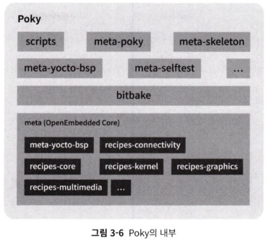
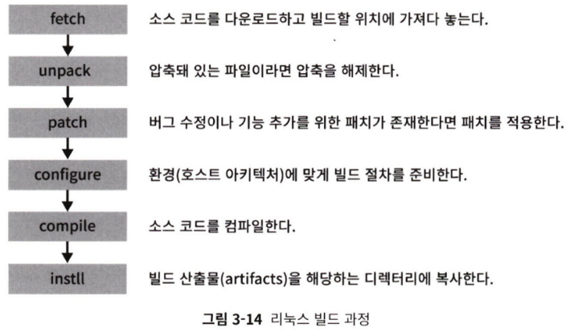
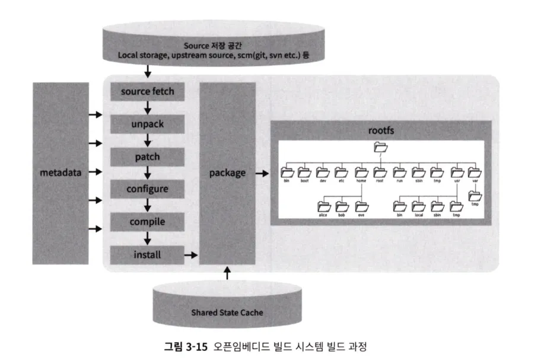

# Poky

- Poky = **OpenEmbedded Build System = bitbake & OpenEmbedded core**
- Poky는 커스텀 리눅스 빌드를 위해 많은 메타데이터를 가짐 → 이를 bitbake가 이용해 커스텀 리눅스 빌드

> Yocto 프로젝트에 대해 참조가 되는 배포판
⇒ **커스텀 리눅스 구축 및 빌드** : 이를 위한 메타데이터들이 존재

- ***Poky를 참고해 내 타깃 시스템에 맞는 커스텀 리눅스를 빌드하도록 구성해야 함***
- **meta layer**가 가장 핵심적인 역할을 함 = **OpenEmbedded-Core**


---
## Layer
- OpenEmbedded build system에 대상을 빌드하는 방법을 알려주는 메타데이터가 포함된 레포지토리
- 사용자 정의 및 재사용에 용이함
- 여러 하드웨어에 공통으로 사용할 수 있는 메타데이터를 분류해 레이어로 만들고 공유 가능

---
## OpenEmbedded
- **meta layer = OpenEmbedded-core**
- **OpenEmbedded** : 임베디드 장치용 리눅스 배포판을 만드는데 사용되는 빌드 자동화 프레임워크 및 크로스 컴파일러 환경
    - **OpenEmbedded layer = meta-openembedded directory**
- **bitbake**가 권장되는 빌드 시스템. 레시피를 기반으로 빌드 진행
- 레시피를 사용해 소스 코드를 저장소에서 가져오고 필요할 경우 패치를 적용, 소스 코드를 컴파일 및 링크하고 패키지 및 부팅이 가능한 이미지를 생성함
- **OpenEmbedded-Core :** 오픈임베디드의 현재 버전을 위한 코어 메타데이터를 포함하고 있는 레이어
    - **OpenEmbedded-Core layer = meta directory**
    - glibc, gcc compiler, system, bsp and some else…

&rarr; 기존에는 meta-openembedded 레이어 하나에 모든 레시피가 포함되었음

⇒ but 크기가 커지면서 유지 관리를 위해 분할하며 openembedded-core가 생김

⇒ OpenEmbedded Layer > OpenEmbedded-Core Layer




> **meta** : 오픈임베디드 코어 레이어
> 
> **meta-poky** : Yocto 배포 참조 레이어
>
> **meta-selftest** : oe-selftest 스크립트가 사용하는 bitbake 테스트 레이어
>
> **meta-skeleton** : 커스텀 레이어를 생성하는데 사용되는 템플릿 레이어
>
> **meta-yocto-bsp** : Yocto 프로젝트의 BSP 레이어

---
## QEMU emulator
- 가상화 소프트웨어 도구 / 실제 만들고자 하는 머신에 이미지를 올리기 전 테스트하는 역할

```python
$ runqemu <recipe name>   # 실행 명령어
```

- runqemu는 스크립트 파일로 ‘poky/scripts/runqemu’에 위치함

---
## bitbake 환경 변수 옵션을 통한 변숫값 확인
- 오픈임베디드 빌드 시스템은 추상화가 잘 돼 있기에 **inherit**을 통해 클래스 파일 상속 및 기능 구현이 쉬움

```python
$ bitbake core-image-minimal -e > env.txt # core-image-minimal.bb에서 사용하는 모든 환경 변수 출력 / env.txt로 저장
$ bitbake coe-image-minimal -e | grep ^DL_DIR # env.txt에서 DL_DI 변수에 최종 할당된 값들 출력
$ bitbake-getvar -r core-image-minimal DL_DIR # DL_DIR이 어떤 변화를 거쳐 최종 값을 할당받았는지 출력
```

## 리눅스 호스트를 위한 소프트웨어 빌드 과정과 오픈임베디드 빌드 시스템의 빌드 과정 비교

- **오픈임베디드**와 **리눅스** 호스트한 소프트웨어 **빌드 과정의 차이**
    - 빌드 진행 시 타깃 시스템이 아닌 리눅스 PC에서 진행 / 리눅스 빌드는 컴파일과 실행을 동일 기계에서 수행 가능
    - 호스트에서 빌드 진행을 위해 타킷 시스템에 맞는 **크로스 툴체인** 필요
    - 빌드 결과물인 이미지를 패키지로 만들어 루트 파일 시스템(타킷 시스템)에 설치
    - 사용 시 패키지 관리 시스템 사용
    - 최종 루트 파일 시스템 이미지는 커널, 부트로더 이미지와 함께 타깃 시스템에 프로그래밍 됨





