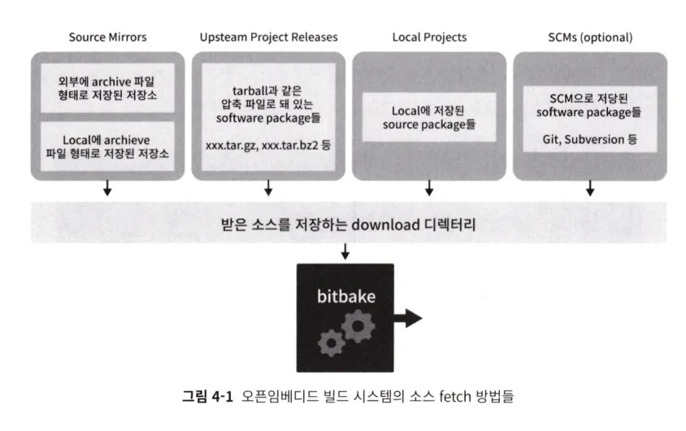
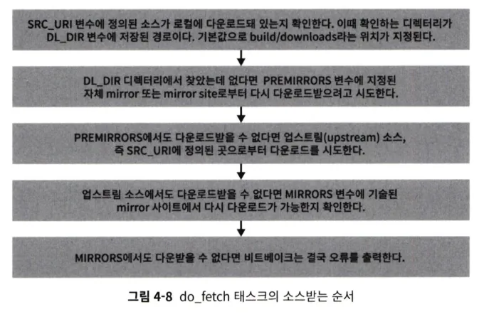
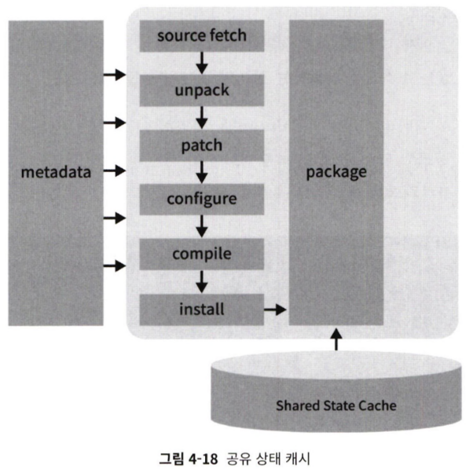

# 빌드 속도 개선을 위한 작업들

- 빌드에 가장 시간이 걸리는 부분 : 소스 fetch & 빌드 진행
    - 처음 빌드 시 소스를 외부 저장소에서 가져와야함
    - Yocto는 리눅스 커널 소스 뿐 만 아니라 리눅스 소프트웨어 스택을 구성하는 모든 패키지에 대해서도 빌드 진행
    
### ⇒ **로컬 소스 저장소(mirror) & Yocto의 Shared State Cache[캐시 저장소]를 구축해 빌드 시간을 획기적으로 줄이자 !**



- 레시피 파일(.bb, .bbappend)은 **SRC_URI** 변수로 소스를 받아올 위치 정의
- **bitbake.conf**의 **DL_DIR** 변수에 받아온 소스 저장됨 → **build/downloads : 기본**
- git을 통해 소스를 받으면 **git2** 디렉토리에 저장됨
    - **.git & uninative** directory
    - uninative = glibc : 호스트 라이브러리로부터 빌드 시스템 격리
        - 호스트가 아닌 **Yocto에서 배포하는 glibc 버전으로 컴파일 됨 ⇒ 호스트 환경에 따른 차이 X**
- 소스 다운이 완료되면 **‘.done’**으로 생성됨 → 레시피에서 지정한 ‘S’ 변수가 가리키는 위치로 소스 복사
- **bitbake.conf**의 **DL_DIR** 변수에 받아온 소스 저장됨 → **build/downloads : 기본**
- git을 통해 소스를 받으면 **git2** 디렉토리에 저장됨
    - **.git & uninative** directory
    - uninative = glibc : 호스트 라이브러리로부터 빌드 시스템 격리
        - 호스트가 아닌 **Yocto에서 배포하는 glibc 버전으로 컴파일 됨 ⇒ 호스트 환경에 따른 차이 X**
- 소스 다운이 완료되면 **‘.done’**으로 생성됨 → 레시피에서 지정한 ‘S’ 변수가 가리키는 위치로 소스 복사


- DL_DIR or Mirror에서 지정한 경로에서 소스 다운로드에 성공하면 S 변수 위치로 소스 다운로드
- 깃에서 소스를 받은 경우, task **checkout** 발생

---
## 1. PREMIRRORS 구성 = fetch 시간 줄이기!

- 로컬에 나만의 소스 미러 구성하는 방법

1. 빌드 안 하고 필요한 소스만 DL_DIR에 받기

```python
**bitbake core-image-minimal --runall=<task>**
```

**→ bitbake가 core-image-minimal 레시피를 수행하면서 연관된 레시피를 do_fetch 태스크까지만 수행**

+) -f 옵션 추가 시 강제 수행

2. 깃에서 받은 파일들을 **tarball**로 생성 : 통일성 및 디스크에서 차지하는 크기 감소
    
    ```python
    **BB_GENERATE_MIRROR_TARBALLS = "1"**
    ```
    
    - **poky_src/build/conf/ 경로의 local.conf 수정**
    - 추가 후에는 **git2 디렉토리에 더이상 소스가 저장되지 않음**

3. build/downloads 하위의 .done 파일 & git2 디렉토리 삭제
4. 프로젝트 최상위 디렉토리에 **source-mirrors 디렉토리 생성 ⇒** 자체 저장소인 PEMIRRORS로 사용
5. **build/downloads 하위의 소스들을 source-mirrors 디렉토리로 복사**
    
    ```python
    mkdir source-mirrors
    cp -r ../build/downloads/*. 
    ```
    
6. **local.conf에 own-mirrors 클래스 파일을 INHERIT 변수에 할당 & SOURCE_MIRROR_URL 변수 사용**
    - **poky/meta/classes/own-mirrors.bbclass**에 SOURCE_MIRROR_URL 선언
    - 자체 PEMIRRORS 디렉토리 경로를 할당받음
    - COREBASE : meta 디렉토리의 부모 디렉토리 = poky 디렉토리
    
    ```python
    INHERIT += "own-mirrors"
    SOURCE_MIRROR_URL="file://${COREBASE}/../source-mirrors" # 절대 경로
    ```
    

* PREMIRRORS의 정상 동작 확인을 위해 build/downloads 삭제 후 소스 fetch 

<aside>
  
💡 **PREMIRRORS를 구축하고 팀원들과 공유 시 소스를 외부로부터 받을 필요가 없어 빌드 시간을 절감함**

</aside>

- PREMIRRORS 동작 확인 - poky_src/build/conf/local.conf 수정
    
    ```python
    **BB_NO_NETWORK** = "1"
    ```
    
    - fetch를 수행하는 bitbake fetcher가 network에 접근 불가
    - **BB_ALLOWED_NETWORKS** : 특정 호스트로만 소스 얻기
    - PEMIRRORS에 의해 downloads의 소스들은 PEMIRRORS 하위 소스들을 참조하는 심볼릭 링크 파일임
 
--- 
## 2. Shared State Cache 생성 = 빌드 시간 단축 !



- bitbake는 레시피의 **각 태스크 수행 시 signature 값을 생성**
    - **signature = checksum** : task code, 변수 등 입력 메타데이터로부터 생성
- **signature와** 빌드 결과를 **object** 형태인 **공유 상태 캐시**를 만들어 특정 디렉토리에 저장

**⇒ 태스크 재수행 시 bitbake는 signature 값끼리 비교해 값이 동일하면 해당 태스크를 건너뜀**

- **setscene 태스크** : signature 값이 동일하다 = 공유 상태 캐시에 저장된 태스크의 결과를 그대로 사용해도됨
- bitbake가 특정 레시피 빌드 전 공유상태캐시를 우선 확인한 후 재활용 가능하면 setscene 태스크를 실행


- **build/sstate-cache** : 공유 상태 캐시가 저장되는 위치
- **SSTATE_DIR** : sstate-cache 경로 지정 변수
    - 기본값 = bitbake.conf에 정의된 build/sstate-cache 디렉토리
    - 레시피 각 태스크 수행마다 **signature와 빌드 결과에 대한 object가 해당 경로에 저장**
- **SSTATE_MIRRORS** : 공유 상태 캐시의 저장소로 사용되는 디렉토리의 경로
    - 빌드 시 수행된 태스크인지 식별하고 **해당 저장소를 제일 먼저 확인**

- **tmp** : 오픈임베디드 빌드 시스템이 결과물을 저장하는 디렉토리 : TMPDIR에 경로 저장

### 공유 상태 캐시 저장소 구축

1. 최상위 디렉토리에 sstate-cache 디렉토리 생성
2. build/sstate-cache 하위의 모든 파일들을 1에서 생성한 디렉토리로 복사
    
    ```python
    ~poky/sstate-cache $cp -r ../build/sstate-cache/*.
    ```
    
3. poky_src/build/conf/local.conf에 SSTATE_MIRRORS 추가
    
    ```python
    SSTATE_MIRRORS="file://.*file://${COREBASE}/../sstate-cache/PATH"
    
    SSTATE_MIRRORS ?= "\
    file://.*http://<server>/share/ssate/PATH;downloadfilename=PATH \n \
    file://.*file://<local directory>/local/dir/sstate/PATH"
    # 로컬 호스트와 외부 서버에 공유 상태 캐시 지정
    # kirkstone은 \n을 삭제하고 사용
    ```
    
    - 경로 마지막에 **‘PATH’를 반드시 지정 :**  빌드 시스템에 의해 자동으로 hash의 처음 두 문자로 이름 지어진 디렉토리로 대체됨

- 자체 공유 상태 캐시 저장소 동작 확인 : build 디렉토리 삭제
    - local.conf 파일도 삭제되므로 build 삭제 후 **최상위 디렉토리에서 ‘$ oe-init-build-env’ 실행으로 빌드 환경 초기화**
    - poky/meta-poky/conf/**local.conf.sample** : ‘$ oe-init-build-env’ 실행 시 build/conf/local.conf로 복사됨
    
    ```python
    # Specify own PREMIRRORS location
    INHERIT += "own-mirrors"
    SOURCE_MIRROR_URL = "file://${COREBASE}/source-mirrors"
    
    #compress tarballs for mirrors
    BB_GENERATE_MIRROR_TARBALLS = "1"
    
    #make shared state cache mirror
    SSTATE_MIRRORS = "file://.* file://${COREBASE}/sstate-cache/PATH"
    SSTATE_DIR = "${TOPDIR}/sstate-cache"
    ```
    
**⇒ local.conf.sample 수정**

    - build/sstate-cache가 이전에 빌드한 cache를 저장하고 있으므로 이를 삭제해서 테스트
    - bitbake가 빌드 수행 전 sstate-cache를 확인하여 레시피들의 태스크 시그니처 값을 비교
    - setscene은 자체 공유 상태 캐시 저장소에 결과를 가져오는 태스크

### 하나의 PREMIRRORS와 자체 공유 상태 캐시를 프로젝트들이 공유하는 방법

```python
export BB_ENV_EXTRAWHITE="${BB_ENV_EXTRAWHITE} SOURCE_MIRROR_URL SSTATE_MIRRORS"
export SOURCE_MIRROR_URL="file://${HOME}/data/source-mirrors"
export SSTATE_MIRRORS="file://.*file://${HOME}/data/sstate-cache/PATH"
```

1. ⇒ **~/.bashrc에 추가**
    - **BB_ENV_EXTRAWHITE** : 셸 환경 변수를 bitbake 전역 환경 변수 만듦 (참고)
    - **SOURCE_MIRROR_URL & SSTATE_MIRRORS :** 셸 환경 변수
2. local.conf.sample에서 SOURCE_MIRROR_URL & SSTATE_MIRRORS 변수 주석 처리
3. 기존 PREMIRRORS를 /home/data/source-mirrors로, 자체 공유 상태 캐시를 /home/data/sstate-cache로 복사
    - Yocto **kirkstone** 버전의 경우 **BB_ENV_EXTRAWHITE → BB_ENV_PASSTHROUGH_ADDITIONS**로 변경

⇒ 해당 방법은 .bashrc를 수정해야하므로 같은 호스트에서 다른 프로젝트 빌드 시 문제 발생 가능


