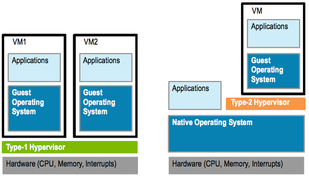

# Embedded System
- 특정한 기능을 수행하도록 설계된 **내장형 컴퓨팅 시스템**
- 제품이 출시될 때 하드웨어 장치에 sw가 이미 내재되어 있음 &rarr; HW와 SW 중간에 있다는 의미로 ***Firmware***라 함
- ***HW 환경을 고려한 개발 필수!*** 

#### 임베디드 SW와 일반 응용 SW의 다른 점
- 임베디드 SW
     - HW와 밀접하게 결합되어 있으므로 해당 장치나 기계에서만 사용 가능
     - 데이터 처리보다 HW 제어가 주 목적
- 일반응용 SW
     - 운영체계가 같으면 어떤 PC에서도 사용 가능
     - 데이터 처리가 주 목적이므로 데이터를 저장하는 DB가 중요함

#### 왜 임베디드 개발에 C, C++이 용이한가?

---
## Yocto
- **하드웨어에 상관없이 작동하는 커스텀 리눅스 개발을 도와주는 오픈소스 프로젝트**
- tool chain, kernel, root file system등과 런타임에 설치할 수 있는 바이너리 패키지와 패키지 관리자까지 설치 가능한 강력한 빌드 시스템
- 여러 **레이어**로 구성돼 있으며 레이어들은 관습적으로 **meta-**라는 접두어를 가짐
     - meta : OpenEmbedded의 OE-Core
     - meta-poky : Poky의 배포판에 해당하는 메타 데이터
     - meta-yocto-bsp : Yocto project가 지원하는 머신에 대한 bsp 포함

[Yocto와 추상화 개념 / bitbake](./Yocto/About_Yocto_bitbake.md)

[Poky란 ?](./Yocto/Poky.md)

[빌드 속도 개선을 위한 작업들](./Yocto/Tasks_for_improve_build_speed.md)

[레이어 & 레시피 생성](./Yocto/Create_layer_recipe.md)

[초기화 관리자 추가 및 로그 파일을 통한 디버깅](./Yocto/Add_initial_manager_debugging_through_logfile.md)

[유용한 오픈임베디드 코어 클래스 기능을 사용한 빌드 최적화](./Yocto/Optimize_build_using_openembedded_core_class.md)

---
## Hypervisor
- 가상화 구현을 위한 기반이 되는 기술 = 가상화 계층을 구현하는 SW
- 하드웨어 위에 가상 머신 생성, 자원할당, 요청 처리 등 매니저 역할을 수행함 ⇒ Virtual Machine Manager

### Hypervisor 종류
- Guest OS = 가상화 대상이 되는 시스템
- Host OS = 가상화 프로그램을 실행하는, 가상화 되지 않은 실제 운영체제

#### Type 1 Hypervisor &rarr; Host OS가 존재하지 않음 (대표적으로 Xen)
- native or Bare-metal hypervisor라 부름
- 하드웨어 전원이 들어오면 하이퍼바이저가 가장 먼저 부팅 시작 &rarr; 부팅 완료 후 관리자가 가상머신을 생성해 여러 가상 머신이 동작함
- 하드웨어에서 직접 구동해 Guest OS 관리 &rarr; 오버헤드가 적다는 장점을 가짐
- VM들에 대한 관리 기능이 없어 이를 관리하기 위한 컴퓨터나 콘솔이 별개로 필요함
     - 종류 (구현 방식에 따라 나뉨)
         - 전가상화 (full virtualization) : VMware ESX Server, MS Hyper-v
         - 반가상화 (half virtualization) : Ctrix XenServer
              - Guest OS가 Hypervisor와 Hypercall을 사용해 직접 통신
         - HAV (Hardware assisted virtualization)
      
#### Type 2 Hypervisor &rarr; Host OS에서 가상화 프로그램을 실행해 게스트를 동작 (대표적으로 VirtualBox)
 - hosted hypervisor라 부름
 - 하드웨어에 이미 Host OS가 설치되어 있고, 하이퍼바이저는 OS 위에서 소프트웨어로서 동작
 - 기존 시스템 위에서 쉽게 사용 가능하지만 오버헤드가 크고, Host OS 문제가 전체 Guest OS에 영향을 미칠 수 있음
     - 종류
         - VMware Server / QEMU / Oracle의 Virtual Box 등

⇒ 차이 예 ) Xen을 사용해 우분투를 가상화 하면 바로 우분투가 실행되지만 VirtualBox를 사용하면 프로그램을 통해 우분투가 실행됨

### 가상화를 왜 사용해야하는가?
- 하드웨어 성능이 급격히 증가했던 196-70년대에 소프트웨어 요구 성능보다 서버 성능이 좋아 자원이 남아 돌았음
- 비효율 문제를 해결하기 위해 서버를 머신 하나에 통합 관리하자는 요구가 생김 &rarr; 가상화 개념이 도입됨
- 기존에는 하나의 OS, 1개의 태스크 실행을 위해 각각 물리적 서버가 필요했지만 서버를 가상화하면 보다 효율적으로 사용 가능
- 비용 절감 : migration이 쉬워 빈 서버 재사용 또는 유지 관리가 수월함
- 유연성 : 동일 하드웨어에서 여러 운영체제 동시 실행 가능
- 민첩성 : 한 물리서버에서 다른 물리 서버로 OS 이동 가능
&rarr; Hypervisor SW의 주 역할을 CPU, Memory, 기타 물리적 리소스를 가상 인스턴스와 분리하는 가상화 계층을 생성하는 것

[Xen Hypervisor](./Xen_Hypervisor.md)

---
## Graphic Rendering & Display System
- Embedded system에서 그래픽 렌더링 및 디스플레이 파이프라인 구성 시 핵심이 되는 기술 요소들
- 리눅스 기반 임베디드 환경(ex : Raspberry Pi, NXP i.MX, NVIDIA Jetson 등)에서 많이 쓰임

|사용 목적|사용 기술|설명|
|---|---|---|
|GUI 기반 디스플레이|Wayland / Weston|Qt / QML 앱 실행, GPU 가속 UI|
|영상 디코딩 / 스트리밍|GStreamer + waylandsink|비디오 스트리밍 앱|
|카메라 입력 처리|libcamera / v4l2src|USB / RPi 카메라 프레임 캡처|
|저수준 디스플레이 제어|libdrm|Weston 없이 직접 렌더링|
|3D UI 렌더링|OpenGL ES|Qt Quick, HUD 구현|
|레거시 지원|X11|구형 리눅스 시스템 유지보수|

[Graphic Rendering & Display System](./Graphic_rendering&Display/Graphic_Rendering_Display_System.md)

---
## OTA (Over the Air)
- 무선 네트워크(wi-fi, 셀룰러, V2X 등)를 통해 소프트웨어 or 펌웨어 등을 원격으로 업데이트하는 기술
    - **FOTA (Firmware Over-The-Air)**: 펌웨어 업데이트
    - **SOTA (Software Over-The-Air)**: 소프트웨어 업데이트
    - **DOTA (Data Over-The-Air)**: 데이터 전송을 통한 학습 및 설정 변경
 
#### OTA의 핵심 요소
> 1. **서버** : 클라우드 또는 원격 서버에서 소프트웨어 업데이트 파일을 관리하고 배포함
> 2. **네트워크 연결** : Wi-Fi, LTE, 5G 등 무선 네트워크를 이용하여 업데이트를 전송함
> 3. **디바이스(클라이언트)** : 업데이트를 적용할 대상 장치(스마트폰, 자동차, IoT 디바이스 등)
> 4. **보안 및 인증** :업데이트 파일이 위변조되지 않도록 보안 인증을 수행하고, 신뢰할 수 있는 소스에서만 다운로드 되도록 보장
>     - 업데이트 과정에서 보안 위협 (예: 중간자 공격, 펌웨어 위-변조, 비인가 접근)이 발생할 수 있으므로 이를 방어하는 보안 메커니즘이 필요함
>       1. 암호화 기술 적용 : 데이터 전송 보안
>       2. 디지털 서명 사용 : 펌웨어 인증
>       3. 보안 부트로더 적용 : 비인가 접근 방어
>       4. 접근 제어 시스템 강화 : 비인가 접근 방어

[OTA_RAUC](./OTA/RAUC.md)

[OTA detail _ secure](./OTA/OTA.md)

---