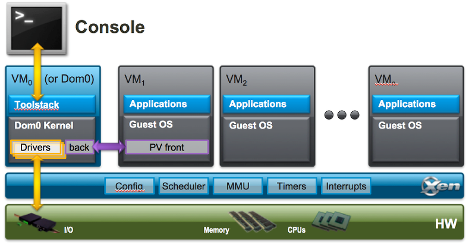

# Xen Hypervisor

- 오픈소스 **Type 1 (bare-metal) Hypervisor**
- 하이퍼바이저 : 하나의 하드웨어 (예: RPi) 위에 여러개의 가상 머신(Guest OS)을 동작시킬 수 있게 해주는 소프트웨어
- Xen은 cpu, memory, interrupt 등을 직접 다루고 물리 자원을 추상화 / 가상화된 자원을 가상 머신(VM)에 제공함
- Xen hypervisor는 장치에 대한 처리를 직접 수행하지 않고 대신에 장치를 관리하는 특권이 있는 가상 머신인 도메인 0에 역할을 맡김

&rarr; 사용자 모드에 있는 애플리케이션이 커널의 기능을 이용할 수 있도록 커널이 시스템콜(systemcall)을 제공하는 것처럼 **도메인 0이 hypervisor의 기능을 요청하기 위해 Hypercall을 사용하고, hypervisor가 도메인 요청을 위해 Upcall을 수행**
- 결국 hypervisor를 통해 ***1. 반가상화 / 2. 하드웨어 지원 가상화가 가능***

---
## Xen의 주요 개념
- Domain = Xen 환경에서 동작하는 가상머신
     - Dom 0 (Domain 0)
         - Xen이 부팅되면 가장 먼저 실행되는 **특권 영역 (privileged domain)**
         - **하드웨어 접근** 및 가상 머신 관리 기능을 담당 & 다른 도메인 간에 장치를 공유하는 역할을 함
         - 일반적으로 Linux 배포판이 사용됨 but NetBSD나 FreeBSD 등의 운영체제도 사용 가능
         - 다른 도메인을 관리하기 위해 도메인 생성, 파기 및 설정을 위한 인터페이스를 제공하는 **ToolStack**을 가지고 있음

     - Dom U (User Domain)
         - 실제 사용자가 운용하는 **가상 머신들** &rarr; 특권이 없는 나머지 도메인 의미
         - Dom 0가 생성 및 제어함
         - Guest VM은 하드웨어에서 완전히 격리되어 액세스 할 수 있는 권한이 없음
         - 각기 다른 OS를 구동 가능 (예 : Linux 기반 instrument cluster, Android 기반 head unit 등)

     - Hypervisor Layer
         - 하드웨어 바로 위에 위치
         - CPU, Memory, I/O 자원 등을 가상화하여 여러 가상 머신에 분배

     - Toolsttack
         - Xen Hypervisor를 제어하거나 VM 관리를 위해 사용하는 도구들의 집합 &rarr; 각각 API 제공
---
### Hypervisor 기반 가상화를 사용하면 시스템 적으로 어떤 이점이 있을까?
- 자동차용 임베디드 시스템, IVI 분야에서 많이 채택되는 구조 &rarr; **시스템, 보안, 유지보수 측면의 이점 존재**

1. **하드웨어 자원 분리 및 안정성 확보**
     - 차량 시스템은 센서 / 제어 로직과 GUI / Infotainment를 분리해야함
     - Xen은 하드웨어 레벨(type 1)가상화로 서로 다른 도메인 간 충돌 없이 실행이 가능해짐
2. **보안**
     - 각 도메인이 격리되어 버그 등의 문제가 시스템 전체에 영향을 주지 않음
     - 차량에서는 ISO 26262 같은 기능 안전성 확보가 중요한데 해당 구조가 요구사항 충족에 도움이 됨
3. **실시간성 / 비실시간 처리 분리**
     - 제어의 경우 실시간 성능이 중요 / GUI 처리는 상대적으로 덜 중요하며 복잡한 처리가 많음
     - Xen을 통해 도메인들을 독립 실행하여 최적화된 성능을 제공할 수 있음
4. **시스템 유연성과 확장성 & 다중 OS 지원**
     - 도메인 단위로 업데이트, 유지보수, 디버깅 가능
     - 추후 차량에 새로운 기능 추가 시 전체 시스템 재설계 없이 도메인 추가만으로 확장 가능
     - 다양한 OS 및 커널 버전 사용 가능
