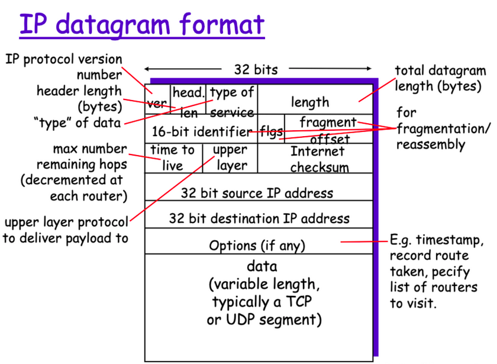

# OSI 7 Layer

---

## Physical Layer
- 컴퓨터 또는 시스템 간의 **물리적 연결**을 해주는 계층
    - 물리적 연결 = **전기 신호로 두 시스템을 연결** : 송신 컴퓨터가 보낸 데이터를 전기 신호로 변환해 수신 컴퓨터로 전송
    - **2진수 형태의 비트열을 '전기 신호'로 변화해야 컴퓨터가 이해 가능**

- 데이터 계층에서 전송한 0/1로 구성된 bit열의 frame을 받아 물리적 매체를 통해 전기 신호로 변환 후 전송 매체를 통해 다른 시스템에 보냄
- 단지 데이터를 전달하기만 하고 상태에 대해 확인하지 않음 (알고리즘, 오류 제어 기능이 없음)
- 대역폭과 전송 효율이 중요하게 작용

### 비트열에서 전기신호로의 변환은 어떻게 이루어지는가?
- ***LAN (Local Area Network)가 0/1의 전기신호로 변환***만 해줌

    &rarr; 컴퓨터 메인보드에 내장형 LAN 카드가 기본적으로 존재

- ***Repeater가 변환된 전기신호를 다른 곳으로 전송함*** &rarr; 전기신호를 주기적으로 증폭시켜 전송되도록 함
    - 하지만 두 통신하려는 두 컴퓨터 간 물리적 거리가 멀어지면 통신이 어려움 (리피터는 1:1 관계만 통신이 가능)
    - 리피터의 한계를 보완하기 위해 등장한 것이 **Hub**
- ***Hub는 n:n 관계에 있는 컴퓨터들 간에 통신이 가능함***
    - but **허브에 연결된 모든 컴퓨터에 무조건 데이터가 다 전송된다**는 단점 존재

---
## Data-Link Layer
- **데이터를 송/수신 하는 규칙을 정하는** 계층
- 대표적인 예가 **Ethernet** &rarr; LAN에 적용되는 규칙

- 이더넷은 **CSMA/CD**를 활용해 물리게층 허브장치의 단점(연결된 모든 컴퓨터에 데이터 전송)을 보완함
    - ***데이터의 충돌 문제를 해결하기 위해, 하나의 컴퓨터 외에 다른 컴퓨터들은 데이터 송/수신이 끝날 때까지 대기***

### Ethernet이 LAN에 어떤 규칙을 적용하는가? 
- **LAN 카드 안의 MAC(Multiple access control) 주소를 이용**
    &rarr; MAC = 각 LAN 카드마다 유니크하게 부여되는 주소 (**네트워크를 식별하는 주소**)
- 데이터링크 계층을 거치며 붙는 헤더의 정보 중 하나로 MAC 주소가 담겨 있음
- **Point-To-Point**를 통해 신뢰성 있는 정보 전송을 담당함 / **Broadcast**는 충돌을 방지하기 위한 분산 알고리즘 및 프로토콜 사용

> - 목적지 MAC 주소 : 데이터를 수신하는 컴퓨터가 소속된 네트워크 주소
>
> - 출발지 MAC 주소 : 데이터를 송신하는 컴퓨터가 속한 네트워크 주소
>
> - 유형 : 프로토콜(통신규칙) 종류 = IPv4, IPv6...
>
> - 데이터 : 데이터 정보 그 자체
>
> - FCS (Frame Check Sequence) : 트레일러 = 데이터 전송 중 오류가 발생하는지 여부 확인

&rarr; ***데이터링크 계층에 붙는 헤더 + 데이터 = (Ethernet) Frame이라 부름***

### 허브 장치의 역할을 데이터링크 계층에서 수행하는 Switch

- 스위치 내부에는 **MAC 주소 테이블**이 존재하는데, 이 테이블에 **스위치의 포트 번호와 그 포트에 연결되어 있는 컴퓨터의 MAC 주소가 등록됨**
- 목적지 MAC 주소를 모르는 경우 **모든 컴퓨터에 프레임이 전송됨 = 플러딩(Flooding)**
- 목적지 MAC 주소를 아는 경우, 허브와 달리 **데이터를 원하는 곳으로만 보낼 수 있음**

### 목적지 MAC 주소는 어떻게 알아내는가?
- ***ARP (Address resolution protocol) = 목적지 컴퓨터의 IP 주소를 활용해 MAC 주소를 알아냄***
    - APR를 활용하면 스위치의 MAC 주소 테이블에 목적지 MAC 주소 기록이 가능

> ### Data-link layer까지 활용하면 같은 스위치, 즉 같은 네트워크에 연결된 컴퓨터들간의 통신이 가능하며 특정 컴퓨터에게만 데이터 전송 가능

---
## Network Layer
- **다른 네트워크에 있는 컴퓨터와도 통신이 가능하게 하는 역할**
- ***Router***를 통해 데이터 통신
    - 1. **데이터를 보낼 곳 = 상대방 IP 주소**를 알아야 함
      2. **데이터를 어떤 경로로 보낼지 = 라우팅** 결정
    - 라우터의 특성 및 라우팅 테이블(라우팅 정보를 등록하고 관리함)을 활용하므로 ***거리에 상관없이 통신이 가능***
- IP를 통신 프로토콜로 사용

### IP 주소는 어떻게 부여되는가?
- IP 주소는 ISP(Internet Service Provider) 업체로부터 부여받음
- IP 버전 : **IPv4** &rarr; 32bit로 구성, **IPv6** &rarr; 128bit로 구성
    - IPv4가 먼저 사용되었는데, 인터넷 사용자가 늘어남에 따라 부여할 수 있는 주소 개수가 부족해 IPv6가 등장함
- ISP로부터 직접 부여받는 **공인 IP 주소를 라우터에만 할당** / **LAN에 속하는 호스트들은 사설 IP주소를 받음**

### IP 주소는 어떤 구조로 구성되는가?
- **네트워크 ID와 호스트 ID를 사용하는 부분의 크기에 따라 세부적으로 나눌 수 있음** = **클래스**
- IP의 특수 주소
    - **네트워크 주소** = 호스트ID 부분이 10진수로 모두 0인 주소 : 네트워크를 대표함
    - **브로드캐스트 주소** = 호스트ID 부분이 10진수로 모두 255인 주소 : 컴퓨터 또는 라우터의 IP주소로 할당 불가
        - Why? 브로드캐스트 주소는 해당 네트워크에 소속된 모든 컴퓨터에게 데이터를 전송할 때 사용하는 IP 주소이므로

### Subnet
- 라우터를 연결하고 IP 주소라는 프로토콜을 통해 서로 다른 네트워크에 존재하는 컴퓨터 간에 통신 가능
- But 대규모 네트워크 & 브로드캐스팅(모든 컴퓨터에 데이터 전송)을 하는 경우 작업이 복잡해짐

&rarr; 이를 해결하기 위해 ***대규모 네트워크를 쪼개서 통신하자 = 서브넷팅***

&rarr; 서브넷팅을 활용함으로써 IP 주소를 구성하는 요소가 더 세분화됨 ⇒ 네트워크ID, 호스트ID, 서브넷ID

- 서브넷ID가 IP 주소의 몇 번재 비트부터 시작하는지 알아야 함 (서브넷팅을 위해) ⇒ ***서브넷 마스크 사용***
- 결국 서브넷 마스크를 알면 몇번 비트부터 서브넷ID가 시작되는지 알 수 있음

### 라우터를 이용한 서로 다른 네트워크 컴퓨터 간의 통신 

- 네트워크1의 A컴퓨터가 네트워크2에 있는 C컴퓨터로 데이터 송/수신 (가정)
- A컴퓨터는 다른 네트워크에 있는 C컴퓨터의 위치를 정확이 모르므로 기본 게이트웨이 라우터의 주소 r1으로 데이터 전송
- 라우터는 r2 주소로부터 네트워크2의 C컴퓨터로 송신

&rarr; 라우터가 목적지 컴퓨터의 위치를 찾기 위해 **라우팅 테이블** 활용

---
## Transport Layer
- **컴퓨터 간에 데이터가 잘 전송되었는지 확인하는 계층**
- 서로 다른 호스트의 프로세스들 간의 논리적 통신 제공 &rarr; end system에서만 구현이 되어있고 중간의 라우터들은 구현할 필요X
- 네트워크 계층에서 IP주소를 보고 목적지 호스트에 도착하면 수 많은 프로세스가 존재하는데 PORT를 통해 이를 찾고 연결
- 1. **데이터가 제대로 도착했는지 여부 확인**
  2. **데이터가 최종적으로 도착할 애플리케이션이 무엇인지 식별**
    - 애플리케이션 중 전송받은 데이터를 필요로 하는 애플리케이션이 어떤것인지 찾는 역할

### Network Layer VS Transport Layer
- 네트워크 계층 &rarr; 호스트 간의 논리적 통신 (IP 주소)
- 전송 계층 &rarr; 프로세스 간의 논리적 통신 (Port 번호)

### 전송 계층에서의 통신 방법
- **연결형 통신 : TCP(Transmission Control Protocol) 전송** &rarr; 신뢰성 있는 통신 가능 (통
    - HTTP 통신이나 이메일 등 파일 전송 시 사용

- **비연결형 통신 - UDP(User Datagram Protocol)** &rarr; 데이터가 유실되어도 상관없는 분야에 사용 (효율적 통신)
    - 동일한 LAN 내의 모든 컴퓨터에게 데이터를 전송하는 Broadcasting 시 사용

## Session Layer

## Presentation Layer

## Application Layer

