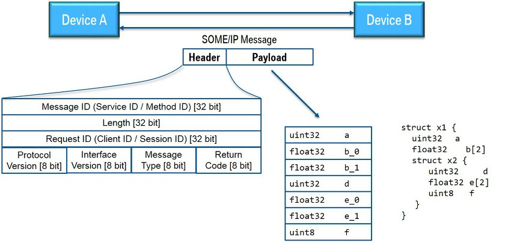
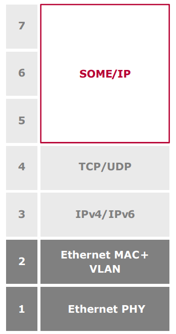
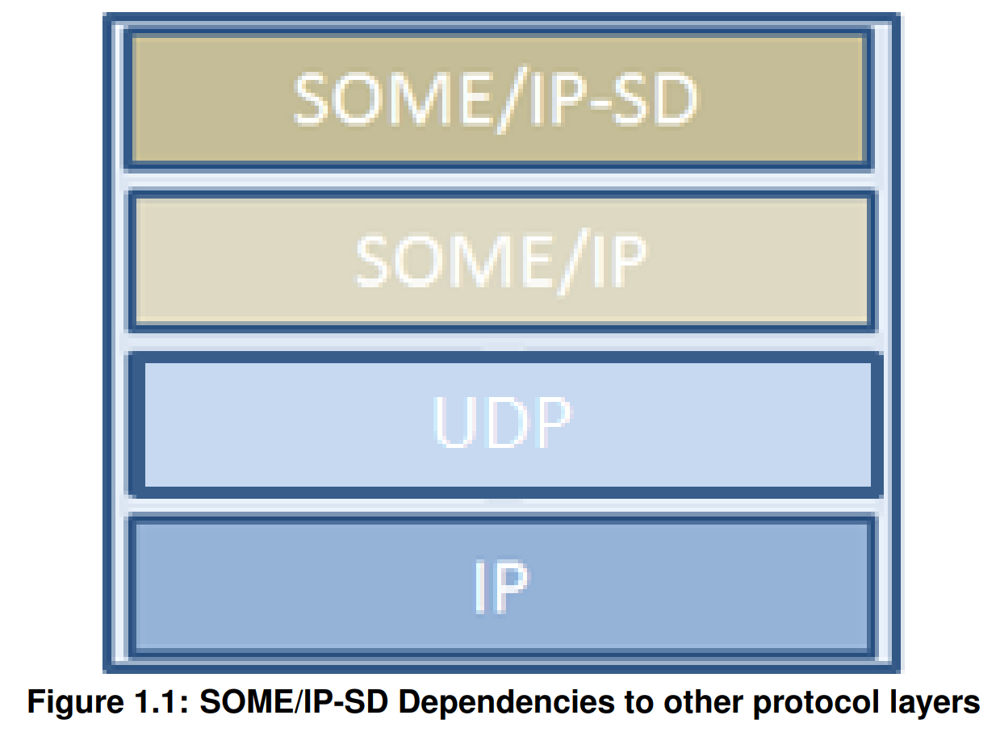
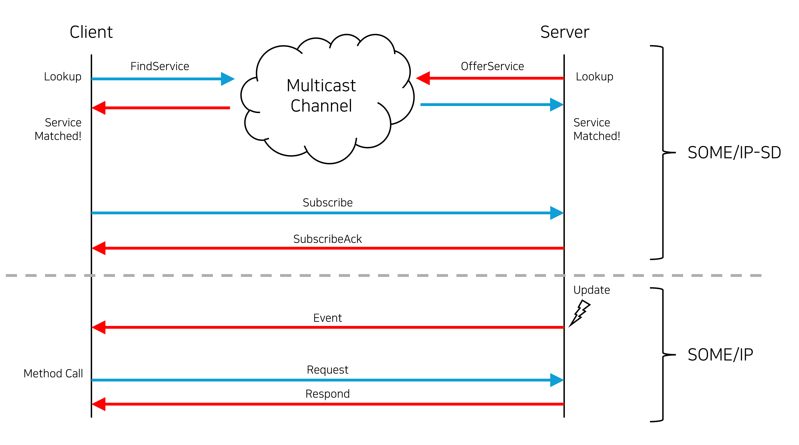
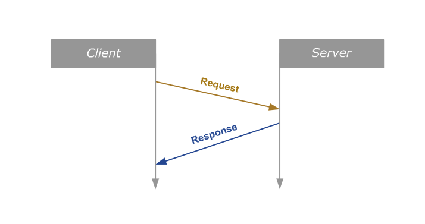
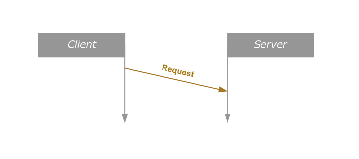
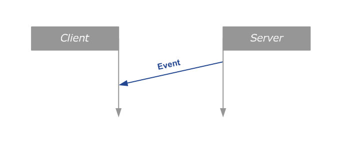
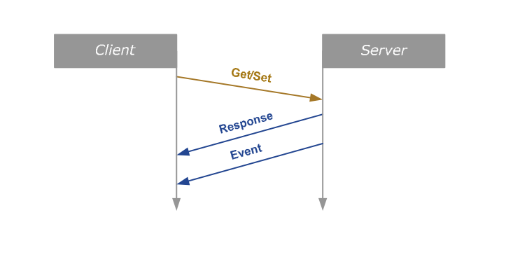

# SOME/IP

- BMW 주도하에 AUtomotive 영역에서 ECU 간 Ethernet 기반 데이터 통신을 지원하기 위해 만들어진 protocol
- 자동차 네트워크에서 기존의 **신호 지향 통신** 방식과 비교해 **서비스 지향 통신 (SOA)** 방식이 도입되었고 이에 따라 SOME/IP가 사용됨

- IP를 통해 devices of subscribers 간에 전송되는 메시지로 구성됨
- 기본 전송 프로토콜은 TCP Or UDP 활용

Format

- Service ID : 각 서비스의 고유 식별자
- Method ID : 0-32767(방법), 이벤트의 경우 32768-65535
- Length : 페이로드 길이(바이트)(다음 ID도 포함, 8바이트 추가)
- Client ID : ECU 내의 호출 클라이언트에 대한 고유 식별자로, 전체 차량에서 고유해야 함
- Session ID : 세션 처리를 위한 식별자. 각 통화에 대해 증가시켜야함
- Protocol Version : 0x01
- Interface Version : 주요 서비스 인터페이스 버전
- Message Type
    - REQUEST (0x00) 응답을 기다리는 요청(공백도) 
    - REQUEST_NO_RETURN (0x01) A fire&forget 요청 
    - NOTIFICATION (0x02) 응답이 없을 것으로 예상되는 알림/이벤트 콜백 요청 
    - RESPONSE (0x80) response message

- Return Code
    - E_OK (0x00) 오류 발생이 없을 시
    - E_NOT_OK (0x01) 지저오디지 않은 오류 발생  
    - E_WRONG_INTERFACE_VERSION (0x08) Interface version 불 일치
    - E_MALFORMED_MESSAGE (0x09) 페이로드의 크기를 줄일 수 없도록 감도화 오류
    - E_WRONG_MESSAGE_TYPE (0x0A) 예상치 못한 메시지 유형 수신 (예를 들어 RE-QUEST_NO_RETURN)

---
## 신호 지향 통신 VS 서비스 지향 통신 (SOA)

#### 신호 지향 통신 (Signal-Oriented Communication)
- 데이터를 네트워크 상에서 개별적인 메시지 형태로 주고 받는 방식
- 특정 ECU가 생성한 데이터를 **모든 노드가 수신하고** 필요한 노드만 해당 신호를 읽는 구조
- **CAN, LIN, FlexRay** 등의 기존 차량 네트워크에서 사용

> 1. 브로드캐스트 방식
>     - 데이터가 특정 수신 대상 없이 모든 네트워크 노드에 전송
> 2. 고정된 데이터 구종
>     - 데이터 길이가 짧고 정형화됨
> 3. 저속 네트워크에서 효율적
>     - 센서 데이터, 엔진 제어 등 실시간성이 중요한 경우에 적합함
>   
>  유연성이 부족하며 확장성이 낮아 자율주행, IVI (차량 인포테인먼트) 등의 작업에 적합하지 않음

#### 서비스 지향 통신 (Service-Oriented Communication, SOA)
- 서비스 기반으로 동작하는 네트워크 통신 방식
- 데이터를 단순한 신호로 전달하는 것이 아닌 **클라이언트-서버** 모델을 기반으로 서비스 형태로 제공
- **SOME/IP, DDS** 등에서 사용

> 1. 서비스 기반 구조
>     - ECU 간 특정 서비스를 요청하고 응답을 받는 방식
> 2. 동적 서비스 관리 &rarr; SOME/IP-SD
>     - ECU 간 필요한 서비스만 동적으로 탐색하고 연결
> 3. 확장성과 유연성 증가
> 4. 고속 데이터 전송 가능
>     - 자동차 이더넷 기반으로 다량의 데이터 처리 가능

---
## Middleware
- 애플리케이션과 하드웨어(운영체제, 네트워크 등) 사이에서 동작하는 소프트웨어 계층

> 1. 이종 시스템 간 통신 연결
> 2. 서비스 중심 통신 지원
> 3. 실시간 데이터 관리
> 4. 표준화된 인터페이스 제공

- SOME/IP는 위 그림과 같이 OSI 7Layer의 5~7 계층에 해당하며 Ethernet IP, TCP/UDP 프로토콜 상위에 구성됨
- CAN 등과 비교하였을 때 대용량의 데이터를 더 빠른 속도로 전송할 수 있는 능력을 확보함

---
## SOME/IP - SD (Service Discovery)

- 네트워크 내에서 사용 가능한 서비스를 자동으로 찾고 등록하는 프로토콜
- 개발자 입장에서 서비스가 어디 쓰이는지 신경쓰지 않아도 동적으로 인스턴스를 탐색하고 연결 가능
- **SOME/IP-SD는 SOME/IP 프로토콜보다 상위계층에 정의되어 SOME/IP 메시지의 payload에 실림**
- **SOMEIP-SD는 UDP 멀티캐스트를 이용해, 같은 그룹 내에 있는 모든 노드에 메시지 전달**
- 각 provider와 consumer는 서로의 정보를 알지 못함 sd를 통해 정보를 교환하게 됨
- SOME/IP SD messages는 이벤트 그룹을 Publish/Subscribe 하는데 사용할 수 있음

---
## SOME/IP 동작 방식

1. 네트워크 Server와 Client가 서로의 존재를 인식해야함
    - SOME/IP-SD의 FindService & OfferService 메시지로 이루어짐
2. UDP 멀티캐스트에 SOME/IP-SD 프로토콜을 이용해 FindService, OfferService 메시지 송신
    - 서비스 ID, 송신자의 IPv4 주소 등의 정보가 담김
3. Client 측에서 서비스 ID과 같은 ID를 가진 OfferService를 수신하면 클라이언트가 해당 서비스 정보와 Server 주소 등의 정보를 저장
4. FindService와 OfferService가 매칭되면, client에서 service가 제공하는 여러 event 중 어떤 것을 받아올지 결정
    - Eventgroup Subscribe 과정
5. Server 측에서 Subscribe 메시지를 수신하면 server는 해당 Eventgroup의 개체들이 유효한지 확인
6. 확인이 완료되면 Server는 client에 SubscribeAck로 응답

---
## Service & Method & Event & Field

#### Service
- 0개 혹은 그 이상의 Method, Event, Field의 논리적 조합

#### Method

- 호출(call / invoke)되는 메소드, 프로시저, 함수 또는 서브루틴
- 호출이 로컬이 아닌 네트워크를 이용해 이루어짐
- client가 server가 가지고 있는 method를 사용하려면 먼저 서버에 request 메시지 전송
    - 네트워크를 이용해 원격으로 메소드를 호출하는 것을 RPC(Remote Procedure Call)이라함
- 서버는 request를 받은 후 method를 실행하고 그 결과를 response 메시지에 담아 client에 전송
- RPC call 중 client가 request를 보낸 후 server의 response를 기다리지 않는 경우 = ***Fire & Forget***

#### Event

- 주기적으로 혹은 값의 변화가 있을 때에만 이루어지는 단방향 데이터 전송
- server로부터 client에게로 진행되는 수동적인 데이터 전송

#### Field

- 상태를 나타내는 값. notifier, getter, setter가 동작하는 동안 항상 유효한 값을 가짐
- client와 server가 공유하며, getter, setter, notifier에 의해 정의되는 service의 상태 등을 나타내는 변수
- getter는 client가 현재 field의 값을 얻으려고 할 때 쓰임
    - server에서는 client의 request가 들어오면 field의 값을 담은 respond 메시지를 client에 전송
- setter는 client가 현재 field의 값을 바꾸려 할 때 쓰임
    - client가 새로 바꾸려는 field 값을 request 메시지에 담아 전송하면 server는 field의 값을 client의 요청에 맞게 변경
    - 변경된 값을 respond 메시지에 담아 client에 전송
- notifier는 field의 값이 바뀌거나, 미리 설정한 주기에 따라 주기적으로 client에 현재 field 값 전송

***Getter, Setter는 Request/Respond Call의 형식을 따르고, Notifier는 Event의 형식을 따름***
***SOME/IP는 이 3요소 (Event, Method, Fied)의 조합으로 Service라는 추상적 개념을 구체화함)***
  