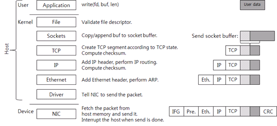
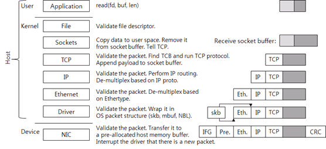
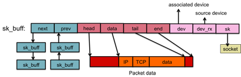
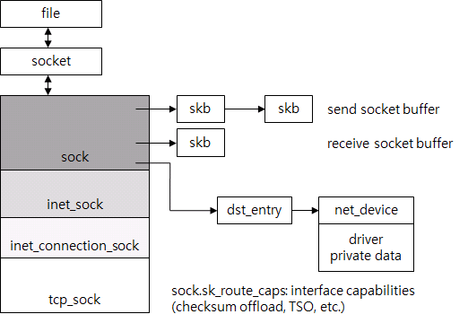

# Socket

#### 장점
- Full duplex(전이중) : handshake 이후에 연결이 유지됨. polling을 안 해도 되므로 서버와 클라이언트 간에 최소한의 overhead로 정보를 주고받을 수 있음
- HTTP Compatible(호환성) : upgrade 헤더가 websocket을 HTTP 확장적이게 만듦. 프록시 세팅이 가능하고 인프라가 Websocket을 이해하게 됨
- Firewall friendly(방화벽) : HTTP or HTTPS와 같은 Port를 사용하므로 보안 유지 가능

#### 단점
- Proxing : websocket 특히 L7프록시 설정 시 복잡하므로 매우 힘듦
- Load Balancing : timeout을 갖지 않으므로 강제로 종료하면 안됨
- Scalability : Stateful이 있으므로 scale out할 때 상태를 유지시키며 확장하기 어려움이 있음

---
## TCP Socket API

#### 데이터 전송

1. Appliction: 전송할 데이터 생성(User Data), write 시스템 호출로 데이터 전송, Write 시스템 콜을 호출하면 유저 영역의 데이터가 커널 메모리로 복사함
2. File: 단순한 검사만 하고 파일 구조체에 연결된 소켓 구조체를 사용해서 소켓 함수를 호출함
3. Sockets: 순서대로 전송하기 위해 send socket buffer의 뒷부분에 추가
    - TCB(TCP Control Block): 소켓과 연결된 구조체로 TCB에는 TCP 연결 처리에 필요한 정보 포함(connection state(LISTEN, ESTABLISHED, TIME_WAIT 등), receive window, congestion window, sequence 번호, 재전송 타이머 등)
4. TCP: 현재 TCP 상태가 데이터 전송을 허용하면 새로운 TCP segment, 즉 패킷을 생성함

 #### 데이터 수신
 

1. TCP: TCP checksum 등 패킷이 올바른지 검사
2. TCB: 패킷의 <소스 IP, 소스 port, 타깃 IP, 타깃 port>를 식별자로 사용하여 패킷이 속한 연결 찾기
3. Socket: 새로운 데이터를 받았다면, 데이터를 receive socket buffer에 추가
    - Receive socket buffer 크기가 결국은 TCP의 receive window
4. Application: Read 시스템 콜을 호출하면 커널 영역으로 전환되고, socket buffer에 있는 데이터를 유저 공간의 메모리로 복사해가며 복사한 데이터는 socket buffer에서 제거

---
## Socket Buffer (sk_buff)

- 응용 프로그램과 장치 간의 패킷 흐름을 관리하는 역할
- 리눅스 커널의 include/linux/skbuff.h에 정의됨
- 소켓 버퍼는 커널이 네트워크 스택의 각 계층에서 파라미터와 패킷 데이터를 복사하는데 시간을 낭비할 필요가 없도록 메시지와 관련된 모든 데이터를 저장하는 고정된 장소임

- transport_header : 전송계층(TCP or UDP) 정보
- network_header : 네트워크 계층(IP)
- mac_header : 링크 계층(ethernet)

---
## TCP Control Block
- 구조체로 Linux에서는 tcp_sock을 사용함
- file만 찾으면 TCP 연결을 처리하는데 필요한 모든 구조체를 포인터로 쉽게 찾을 수 있음

- 시스템 콜이 발생하면 시스템 콜을 호출한 애플리케이션이 사용하는 file descriptor에 있는 file을 찾음
- socket의 경우 별도 구조체가 소켓 관련 정보를 저장하고, file은 socket을 포인터로 참조
- socket은 다시 tcp_sock을 참조, TCP와의 다양한 프로토콜을 지원하기 위해 tcp_sock은 sock, inet_sock 등으로 세분화
- send socket buffer와 receive socket buffer는 sk_buff 리스트이고, tcp_sock을 포함함
