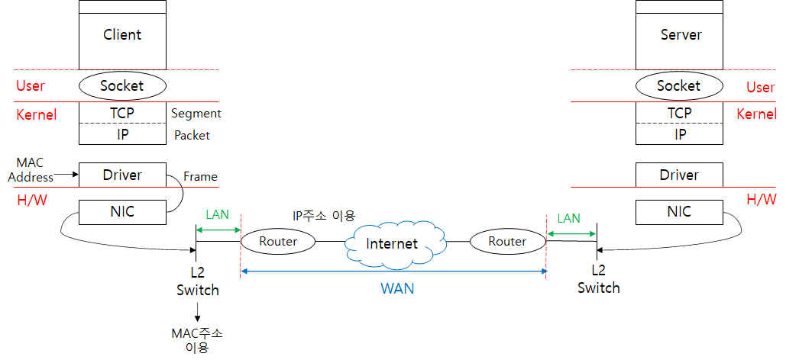

# TCP/IP Flow

## 송신 측 (Client → Server)
1. 애플리케이션 계층
    - 사용자가 웹사이트 접속을 요청하면, 애플리케이션 계층의 HTTP 프로토콜이 동작해 HTTP Request 데이터 생성

2. 전송 계층
    - 애플리케이션 계층에서 받은 HTTP 데이터에 TCP 헤더를 추가
    - TCP Segment 생성
    - TCP 헤더 정보
        - 출발지/목적지 포트 번호
        - 시퀀스 번호 (데이터 순서 식별)
        - ACK 번호 (수신 확인 응답)
        - 오류 검출을 위한 체크섬

3. 인터넷 계층
    - TCP 계층에서 받은 TCP 세그먼트에 IP 헤더를 추가해 IP Packet 생성
    - IP 헤더 정보
        - 출발지/목적지 IP 주소
        - 패킷 ID 및 TTL 정보 포함

4. 데이터 링크 계층
    - IP 계층에서 받은 IP 패킷에 Ethernet 헤더를 추가해 Frame 생성
    - Ethernet 헤더 정보
        - 출발지/목적지 MAC 주소
        - FCS (데이터 무결성 검사)
     
5. 네트워크 전송 (LAN / WAN)
    - 완성된 Ethernet 프레임은 NIC(Network Interface Card)를 통해 전기 or 무선 신호로 변환
    - L2 Switch (MAC 주소 이용) &rarr; 라우터 (IP 주소 이용) &rarr; 인터넷 (WAN) &rarr; 상대방 라우터 &rarr; L2 Switch &rarr; 서버 NIC 과정을 통해 목적지로 전달
  
---
## 수신 측 (Server ← Client)
1. 데이터 링크 계층
    - NIC가 LAN을 통해 수신한 Ethernet 프레임을 읽고, MAC 주소 확인 후 해당 호스트의 패킷이 맞으면 Ethernet 헤더를 제거
    - 결과물 : IP 패킷

2. 인터넷 계층
    - IP 헤더를 분석해 목적지 IP 주소가 서버와 일치하면 IP 헤더를 제거하고 TCP 세그먼트 전달
    - 결과물 : TCP 세그먼트

3. 전송 게층
    - TCP 헤더를 분석해 포트 번호를 확인하고, 올바른 애플리케이션에 전달
    - TCP 재조립 과정
        - 패킷이 분할된 경우, 시퀀스 번호를 기반으로 원래 순서대로 조립
        - 데이터가 유실된 경우, 클라이언트에게 재전송 요청 (ACK) 수행
    - 결과물 : HTTP 데이터

4. 애플리케이션 계층
    - 서버의 HTTP 프로토콜이 HTTP Request를 확인하고, 적절한 응답을 생성해 다시 클라이언트로 전송  

