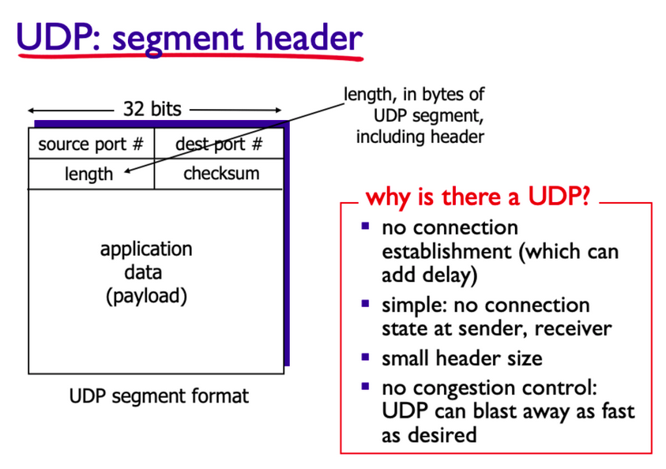
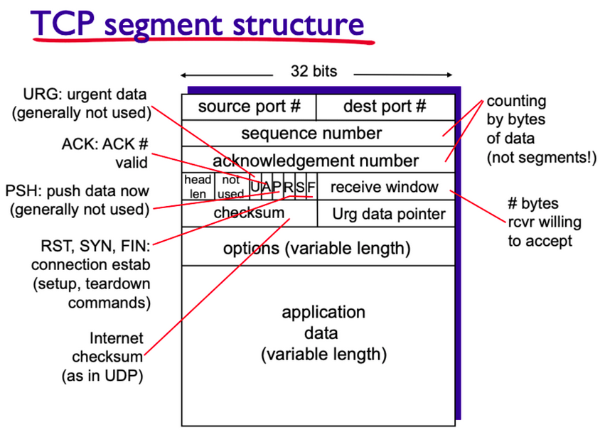

# TCP VS UDP

***TCP UDP가 속한 전송 계층은 네트워크 계층에서 IP 주소를 보고 목적지 호스트에 도착한 후에, 존재하는 수많은 프로세스 중 Port를 통해 원하는 프로세스까지 찾아가는 역할***

---
## TCP / UDP의 특징
- **TCP**
    - 신뢰적이고 순차적인 전달 (에러 없이 전달)
    - 혼잡 제어
    - 흐름 제어
    - 연결 설정

- **UDP**
    - 비신뢰적이고 비순차적 전달 (에러가 없는 것을 보장하지 않음)
    - 'Best effort' : 데이터를 목적지에 전송하는 것을 최우선으로 함 / IP에 약간의 기능만 추가
    - 비연결형 : 송/수신 측 사이의 handshaking이 없고 segment는 목적지 주소만 가지고 독립적으로 다뤄짐
 
---
## 다중화 VS 역다중화
- **Multiplexing**
    - 여러 채널이 하나의 네트워크 라인을 공유해 사용할 수 있는 것

- **Demultiplexing**
    - 공유된 채널에서 나온 데이터가 목적지를 향해 찾아가는 것
    - 프로세스를 구분하고 목적지를 결정함 &rarr; 어느 프로세스로 갈지는 포트 번호로 결정

- **송신자의 다중화**
    - 여러 소켓에서 나온 데이터를 처리하고 트랜스포트 헤더를 추가
 
- **수신자의 역다중화**
    - 다중화에서 사용했던 헤더 정보를 이용해 수신한 세그먼트를 알맞은 소켓에 전달
 
---
## UDP

- application data(payload) : 애플리케이션 계층의 원본 데이터
- source, dest port # : 출발지와 목적지의 각각 16비트의 포트넘버
- length : udp segment가 몇 바이트인지
- checksum : 16비트의 에러 검출 코드

- streaing multimedia apps / DNS (Domain name system) / SNMP (Simple network management protocol)

- 연결 설립이 없어 **지연 유발 X**
- 단순해 **송/수신자 간 연결 상태를 유지하지 않음**
- 헤더 사이즈가 작아 **빠르게 데이터 전달 가능**
- 혼잡 제어가 없어 **빠르게 데이터 전달 가능**

---
## TCP

- source, dst port # : 각각 16비트의 송신지 수신지 포트넘버
- sequence number : TCP 데이터 순서를 위한 순서 번호
- acknowledgement number : 데이터를 잘 받았는지 응답을 위한 데이터
- head len : 헤더 길이
- A (ACK) : acknowlodge 정보를 포함하고 있는지 나타내는 데이터
- receive window : 한번에 얼마나 많은 데이터를 받을 수 있는지 나타내는 데이터 / 데이터 전송 속도 조절에 사용
- checksum : 데이터 오류 검출을 위해 사용
- options : 다양한 옵션들을 segment 데이터에 추가할 때 사용
- application data : 애플리케이션 계층 데이터의 payload

- TCP는 연결형 프로토콜이므로 데이터 전송 전 연결을 설립하는 **Handshake** 과정을 수행함
    - TCP에서 데이터 교환 전 송/수신 측이 연결 조건에 합의 하는 과정
    - 2-WAY에 과정에서 서버에 대한 클라이언트의 응답과정을 추가해 Connection 설립을 확인할 수 있는 **3-way handshake**를 많이 사용함
 

