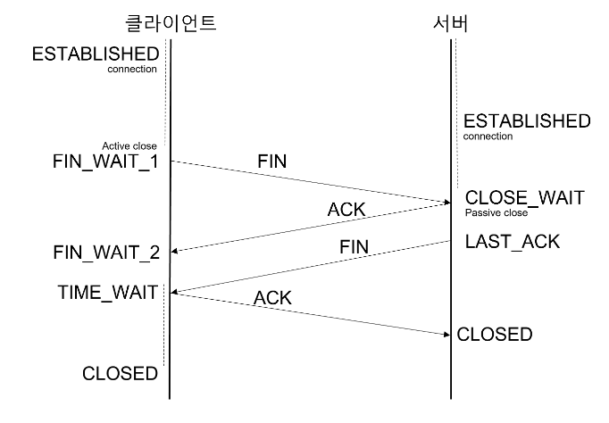

# Network

Table of Contents

- [OSI 7 Layer](#osi-7-layer)
- [TCP/IP](#tcpip-transmission-control-protocol--internet-protocol)
- [TCP VS UDP](#tcp-vs-udp)
- [SOME/IP](#someip)
- [VSOME/IP](#vsomeip)

---
## OSI 7 Layer
- 서로 다른 컴퓨터간의 통신 불가능 문제를 해결하기 위해 만든 **표준 규격**
- 이 7개의 계층을 **4개의 계층 버전으로 간소화한 것이 TCP/IP !**
- 각 계층이 서로 독립적이므로 네트워크 통신에 대한 유지관리가 용이함

&rarr; 송신 컴퓨터에서 데이터가 출발해 수신 컴퓨터에 도착할 때까지 OSI 7계층을 위&rarr;아래, 아래&rarr;위로 지나게 됨

&rarr; 계층 이동마다 헤더가 붙는 과정을 ***캡슐화***, 헤더가 제거되는 과정을 ***역캡슐화***라 부름

### 작동원리
> 1. OSI 7계층은 응용, 표현, 세션, 전송, 네트워크, 데이터링크, 물리계층으로 나뉨
> 
> 2. 전송 시 7계층에서 1계층으로 각 층마다 인식할 수 있어야 하는 헤더를 붙임 (캡슐화)
>
> 3. 수신 시 1계층에서 7계층으로 헤더를 떼어냄 (역캡슐화)
>
> 4. 출발지에서 데이터가 전송될 때 헤더가 추가되는데 2계층에서만 오류 제어를 위때 꼬리 부분에 추가됨
>
> 5. 물리계층에서 1,0의 신호가 되어 전송매체 (동축케이블, 광섬유 등)을 통해 전송

### 각 계층의 역할
[OSI 7Layer detail](./OSI_7layer.md)

---
## TCP/IP (Transmission Control Protocol / Internet Protocol)
- 장치들이 인터넷 상에서 데이터를 주고받을 때 쓰는 독립적인 프로토콜의 집합
- 데이터를 송수신하는 방식과 규칙을 정의함
- 연결지향 (connection-oriented) 프로토콜

- TCP/IP는 4개의 계층을 가지며 OSI 7Layer와 비교됨
- 위 계층들은 특정 계층이 변경됐을 때 다른 계층이 영향을 받지 않도록 설계됨

> **특성**
> - 패킷 순서 보장 &rarr; 송신 순서대로 수신할 것을 보장
>
> - 패킷 무결성 보장 &rarr; 송신 패킷과 수신 패킷의 내용은 동일함을 보장
>
> - 패킷 도착 보장 &rarr; 송신한 패킷은 꼭 수신할 것을 보장 (재전송 등을 통해)
>
> - 흐름 제어 (flow control) / 혼잡 제어 (congestion control) : 버려지는 패킷 잠지 시 스스로 통신량을 줄임

### IP (Internet Protocol) 
- 호스트간에 서로 통신할 수 있도록 해주는 프로토콜
- TCP/IP 모델의 Internet Layer에서 목적지로의 경로를 정확히 라우티앟기 위해 해당 프로토콜 이용
- 32비트 형식의 address (IPv4)를 활용해 호스트에 대한 식별자로 이용
- **TCP와 다르게 데이터의 완벽한 전달 보장 X** &rarr; TCP와 같이 사용됨

### TCP/IP 동작 흐름
[TCP/IP detail](./TCP_IP.md)

### TCP/IP 4 Layer Model
|계층|프로토콜|기능|
|---|---|---|
|응용계층|HTTP, FTP, SMTP, DNS 등|사용자와 직접 상호작용하는 프로토콜|
|전송계층|TCP, UDP|데이터의 신뢰성 있는 전송(TCP) or 빠른 전송 (UDP)|
|인터넷 계층|IP, ICMP, ARP|패킷 라우팅 및 주소 지정(IP)|
|네트워크 액세스 계층|이더넷, WI-FI|물리적인 데이터 전송|

## TCP 3-Way & 4-Way Handshake

- ***신뢰성 있는 연결을 위해 3-Way Handshake 과정을 통해 연결 설정***
- ***3 Way Handshake 과정***
    1. **SYN (Synchronize)**
        - 클라이언트가 서버에 연결 요청(SYN 패킷) 전송
        - SYN 플래그와 함께 초기 시퀀스 번호 (SEQ) 포함
    2. **SYN-ACK (Synchronize-Acknowledge)**
        - 서버가 요청을 수락하고 응답 (SYN-ACK 패킷) 전송
        - 클라이언트의 SEQ + 1을 ACK 값으로 설정하고, 서버 자신의 SEQ도 포함
    3. **ACK (Acknowledge)**
        - 클라이언트가 응답을 확인하고 ACK 패킷 전송
        - 서버의 SEQ + 1 값을 ACK로 설정
        - TCP 연결 확립

- ***연결 종료를 위해 4-Way Handshake 과정을 거침***
- ***4-Way Handshake 과정***
    1. **FIN (Finish)**
        - 클라이언트가 서버에게 연결 종료 요청 (FIN 패킷) 전송
    2. **ACK (Acknowledge)**
        - 서버가 FIN을 받고 확인 응답 (ACK 패킷) 전송 &rarr; 이 시점에서 서버는 아직 데이터를 전송할 수 있음
    3. **FIN (Finish)**
        - 서버도 연결 종료 요청 (FIN 패킷) 전송
    4. **ACK (Acknowledge)**
        - 클라이언트가 FIN을 확인하고 ACK 패킷 전송 후 연결 종료
      
&rarr; **TIME_WAIT 상태** : 클라이언트는 마지막 ACK를 보낸 후 일정 시간 동안 TIME_WAIT 상태에 머무르며, 서버가 FIN 패킷을 재전송할 경우를 대비함

***왜 TIME_WAIT으로 시간을 둬서 닫는가?***
- 지연 패킷이 발생할 경우를 대비함 / 패킷이 뒤늦게 도달하고 처리하지 못한다면 데이터 무결성 문제가 발생
- 두 장치의 연결 여부 확인 / LASK_ACK 상태에서 닫히면, 새로운 연결 시도 시 장치는 LASK_ACK로 되어있으므로 접속 오류 발생

---
## TCP VS UDP 
|비교 항목|TCP (Transmission Control Protocol)|UDP (User Datagram Protocol)|
|---|---|---|
|연결 방식|연결 지향(Connection-oriented)|비연결형(Connectionless)|
|신뢰성|신뢰성 보장 (패킷 손실 시 재전송)|신뢰성 없음 (패킷 손실 가능)|
|속도|느림 (오버헤드 존재)|빠름 (오버헤드 적음)|
|패킷 순서|순서 보장 (시퀀스 번호 사용)|순서 보장 안 됨|
|혼잡 제어|혼잡 제어 및 흐름 제어|지원	없음|
|대표적인 사용처|HTTP, HTTPS, FTP, SMTP, SSH|DNS, DHCP, VoIP, 온라인 게임, 스트리밍|

&rarr; ***TCP는 신뢰성이 중요한 경우(웹 브라우징, 파일 전송 등)에 사용 / UDP는 속도가 중요한 경우(실시간 스트리밍, 게임 등)에 사용***

[TCP VS UDP detail](./TCP_UDP.md)

---
## SOME/IP
- SOME/IP (Scalable service-Oriented Middleware over IP)

- **자동차 이더넷 (AUTOSAT Ethernet stack) 기반** 통신 프로토콜
- SOA (Service-Oriented Architecture)를 사용해 **ECU 간의 통신을 지원**
- 차량 기술이 발전함에 따라 CAN 통신과 같은 방식으로는 통신량을 감당하기 어려워 제안된 프로토콜임
    - **대용량 데이터의 고속 송수신에 적합한 Ethernet과 IP를 이용**
- AUTOSAT Adaptive Platform의 애플리케이션 간 통신을 담당하는 **미들웨어인 ara::com이 기본적으로 SOME/IP를 사용하는 것으로 정의되어 있음**

- 서비스 기반 설계 : 네트워크 상에서 장치들은 특정 데이터나 기능을 서비스로 제공하거나 요청
- 고속 데이터 전송 : Ethernet 기반 통신 사용
- 확장성 : 새로운 장치나 서비스 추가시에도 시스템이 쉽게 탐지 및 동작함
- AUTOSAR 표준 준수 : 제조사간 호환성이 뛰어남

[SOME/IP detail](./SOMEIP.md)

---
## VSOME/IP

- AUTOSAR 기반의 SOME/IP 프로토콜을 Vector 사의 솔루션으로 최적화하여 제공 &rarr; 다양한 자동차 OEM과 협력하여 사용됨
- vsomeip는 기기 간 SOME/IP communication 뿐만 아니라 내부 프로세스 간 communication도 포함함
- 두 device는 사용된 전송 프로토콜(TCP Or UDP)과 해당 매개변수를 포트 번호로 결정하는 통신 Endpoints를 통해 통신함
- 매개변수는 vsomeip 구성파일에 설정할 수 있음 (json 파일)
- 내부 통신은 로컬 endpoint를 통해 이루어짐 &rarr; D-BUS 데몬과 같은 중앙 구성 요소를 통해 라우팅되지 않으므로 매우 빠름
- 중앙 vsomeip 라우팅 관리자는 외부 디바이스로 전송해야 하는 경우에만 messages를 수신하고 외부에서 들어오는 msssages를 배포함
- device당 라우팅 관리자는 하나만 존재함
- vsomeip는 SOME/IP와 SOME/IP-SD 프로토콜만 관여하지 데이터 구조의 직렬화에는 관여하지 않음

