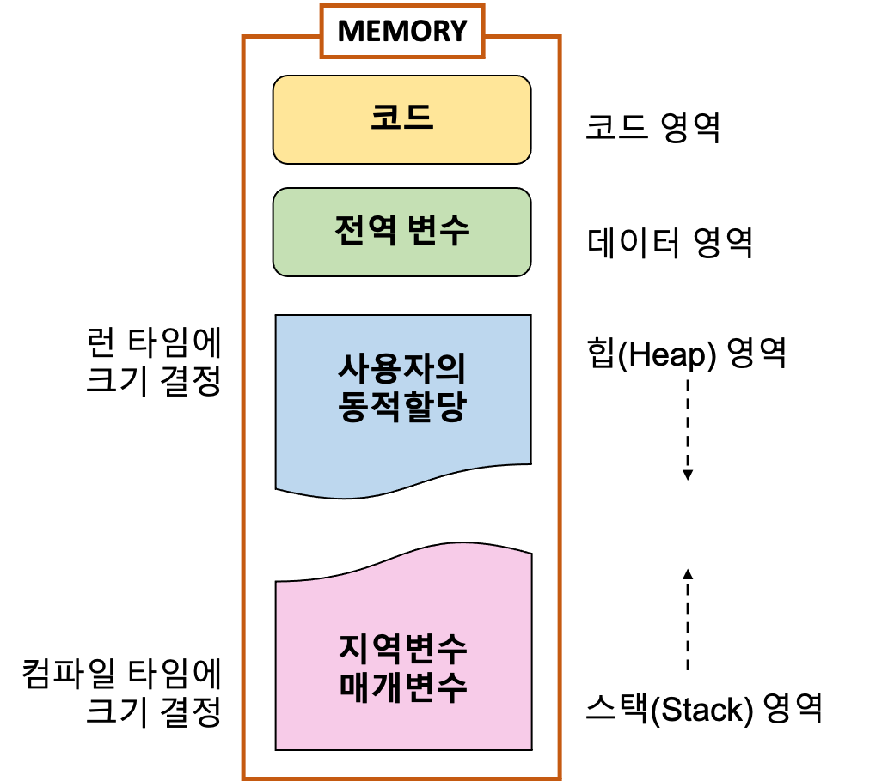
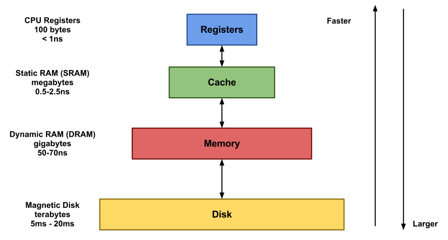

# Memory


### Code 영역
- 작성한 **소스코드가 저장**되는 영역 = 텍스트 영역
- 기계여 형태 (0,1)로 저장
- **함수, 제어문, 상수 등**이 여기에 지정됨
- CPU는 코드 영역에 저장된 명령어들을 하나씩 가져가 실행함

### Data 영역
- **전역 변수와 정적 변수**가 할당되는 영역
- 메인 함수 전에 선언, 프로그램의 **시작과 동시에 할당되며 프로그램이 종료돼야 메모리 소멸**

### Heap 영역
- 해당 공간에 메모리를 할당하는 것을 **동적 할당**이라 함
- 사용자에 의해 메모리 공간이 동적으로 할당되고 해제됨
- 응용 프로그램이 종료될 때까지 메모리가 유지되므로 사용 후 반드시 메모리 해제 **(memory leak)발생**
- 영역 중 유일하게 **런타임 시 크기가 결정됨**
- **참조형 데이터 타입을 갖는 객체(인스턴스), 배열 등**이 저장되는 공간
- **메모리의 낮은 주소**부터 할당되는 **선입 선출(FIFO) 구조**
- 힙에서는 먼저 할당된 메모리가 먼저 해제될 수 있음 &rarr; 따라서 메모리 할당 상태가 흩어져 있을 수 있음

### Stack 영역
- 프로그램이 자동으로 사용하는 임시 메모리 영역
- **함수 호출과 관계**되는 **지역 변수**와 **매개 변수**, **return값**등이 저장되는 영역
- 함수 호출이 완료되면 저장된 메모리도 해제됨 &rarr; 메모리 해제는 할당된 순서의 **역순**으로 진행
- **stack frame** : stack 영역에 저장되는 함수의 호출 정보
- **메모리의 높은 주소**부터 할당되는 **후입 선출(LIFO) 구조**

&rarr; Heap과 Stack은 같은 공간을 공유함 : Heap은 메모리 위쪽 주소부터, Stack은 메모리 아래쪽 주소부터 할당
&rarr; 각 영역이 **상대 공간을 침범**하는 일이 발생하는데 이를 각각 **Heap overflow**, **Stack overflow**라 지칭

---
## 메모리 동적 할당
- 프로그램 동작 중 (런타임) 메모리를 할당받고 반납하는 것
- 운영체제에서는 흩어진 메모리를 최대한 효율적으로 수집해 요청받은 메모리 할당을 처리함
     - 이 과정에서 복잡한 알고리즘이 필요한데, **malloc**과 같은 할당자들에 구현되어있음

- 메모리의 **동적 할당은 malloc() 함수**를 통해, 메모리 **반납은 free() 함수**를 통해 사용 가능
```c++
#include <stdlib.h>

void *malloc (size_t size);
void free (void *ptr);
```
---
### 왜 메모리 영역을 스택과 힙으로 분리해서 설계했을까?
1. 메모리 구조 설계 시 스택은 없고 **힙만 존재**한다고 가정
       - 힙은 복잡한 알고리즘을 통해 할당과 해제를 진행함
       - 함수호출, 로컬변수 사용 등 메모리 할당 및 해제가 필연적인 상황에서는 힙 사용이 비효율적임
2. 메모리 구조 설계 시 힙은 없고 **스택만 존재**한다고 가정
       - 성능적 문제보다 사용성 측면에서 문제 발생
       - 예: 변수 a를 먼저 스택에 할당한 후 b 할당, 그 이후 a를 강제로 해제해야하는 경우 제거 불가능
---
## 메모리 계층 구조


- 여러 기억장치를 필요에 따라 속도, 용량, 성능에 따라 계층적으로 구분
- **하위 계층**일수록 용량이 늘어나고 가격이 저렴하지만 속도가 느림 / **상위 계층**은 빠른 대신 용량이 작고 가격이 비쌈
- **레지스터와 캐시**는 **CPU 내부**에 존재 &rarr; CPU에 빠른 접근 가능
- **메모리 = 주기억장치**는 **CPU 외부**에 존재
- **하드디스크 = 보조기억장치**는 CPU가 직접 접근할 방법이 없음 &rarr; 하드디스크의 데이터를 메모리로 이동하고, 메모리에서 접근해야하는 **느린 접근**만 가능

### 보조 기억 장치
- 주기억장치보다 느리지만 컴퓨터의 전원을 꺼도 데이터가 사라지지 않고 영구적 보관 가능
- **HDD(Hard disk driver) & SSD(Solid state driver : 반도체 기반)**

### 주 기억 장치
- 컴퓨터 내부에서 현재 CPU가 처리하는 내용 저장 &rarr; CPU 명령에 의해 기억된 장소에 직접 접근
- **ROM(Random access memory : 휘발성 메모리 / 읽고 쓰기 가능) & RAM(Read only memory : 비휘발성 메모리 / 읽기만 가능)**
