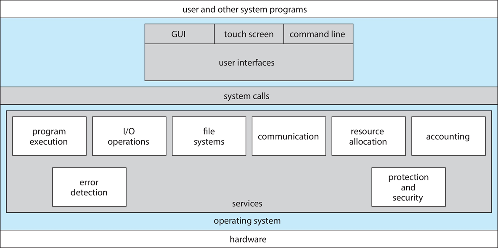

# Operating System
- OS는 좁은 의미에서 Kernel을 의미하며, 여기에 여러 가지 추가된 것이 운영체제임
- 운영체제와 유사하지만 소프트웨어를 추가로 설치할 수 없는 것 : Fireware

 

> ### 운영 체제의 역할
> 1. 메모리 관리 : 한정된 메모리를 어떤 프로세스에 얼마나 할당해야 하는가
> 2. CPU 스케줄링과 프로세스 관리 : CPU 소유권을 어떤 프로세스에 할당할지, 프로세스 생성 및 삭제 등 관리
> 3. 디스크 파일 관리 : 디스크 파일을 어떤 방법으로 보관할지
> 4. I/O 디바이스 관리 : 마우스, 키보드 등 장치와 컴퓨터 간에 데이터를 주고 받는 것을 관리

--- 
## Kernel
- 컴퓨터의 자원들을 관리하는 역할 &rarr; **사용자와 상호작용 지원 x**
- 하드웨어 자원을 프로세스에 할당하고 프로세스 제어, 메모리 관리, 시스템 콜 등을 수행
- **하드웨어와 가장 가까운 아래 계층에 위치함** &rarr; hardware에 접근하고 통신하기 위한 중간 다리 역할

> **컴퓨터 자원(system resource)
>     - H/W resource : CPU, Memory, I/O Device
>     - S/W resource : File, Network, semaphores**

> #### 커널의 5가지 관리자
> - task 관리자 : 물리적 자원인 cpu를 추상 자원인 task로 제공
> - memory 관리자 : 물리적 자원인 memory를 추상 자원인 page, segment로 제공
> - file system 관리자 : 물리적 자원인 disk를 추상 자원인 file로 제공
> - network 관리자 : 물리적 자원인 network device를 추상 자원인 socket으로 제공
> - device driver 관리자 : 각종 외부 장치에 대한 접근 제공 (마우스, 키보드 등)

---
## Shell
- 사용자가 운영체제의 기능을 조작할 수 있도록 인터페이스를 제공하는 응용 프로그램 &rarr; 대표적으로 **리눅스의 bash**
- 조작 방법에 따른 분류
     - CLI (Command-line-interface) : 터미널 환경으로 타이핑으로만 조작 가능
     - GUI (Graphic user interface) : 그래픽으로 구성된 쉘
---
## System Call
- **운영체제의 기능을 사용할 수 있도록 하는 명령 or 함수**
- kernel과 shell 사이 소통을 위한 인터페이스
- 프로세스나 스레드에서 운영체제로 어떤 요청을 할 때 system call과 kernel을 거쳐 운영체제에 전달
  &rarr; 운영체제가 직접 하드웨어 자원 제어 시, 여러 프로그램이 동시에 자원을 사용할 때 충돌이 발생함. 따라서 운영체제는 system call을 통해 프로그램들이 운영체제의 서비스를 공유받음 : 하드웨어 자원을 안전하게 관리하기 위함
- 하나의 추상화 계층으로 네트워크 통신이나 데이터 베이스 등의 낮은 단계 영역 처리에 많은 신경을 쓰지 않고 프로그램 구현 가능

**User Mode, Kernel Mode는 system call을 통해 전환됨**

  
---
## API (Application Programming Interface)
- 운영체제의 system call 호출시 API를 이용함 &rarr; **systeml call을 해석해 shell에 전달하는 역할**
- application에서 운영체제의 기능이 필요한 경우 API를 이용해 프로그램 작성
- 해당 API 호출 시 운영체제가 제공하는 system call 호출
- 운영체제는 **커널 모드**로 변환 후 해당 명령을 실행한 뒤 application으로 결과 반환