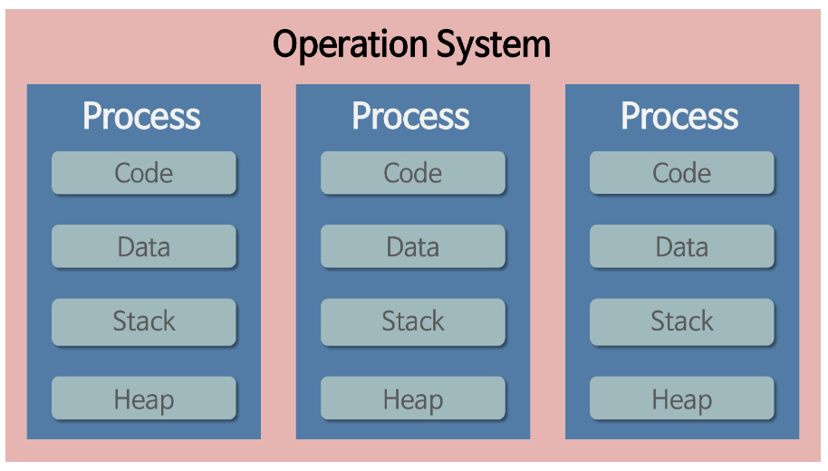
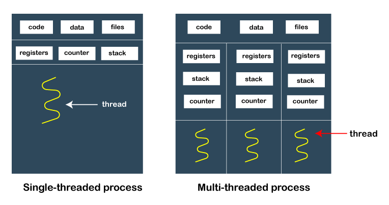
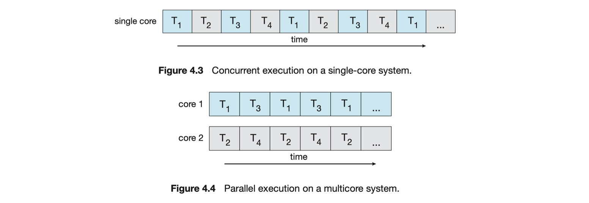

# Process & Thread
- 프로세스는 완벼히 독립적이므로 **메모리 영역을 다른 프로세스와 굥유를 하지 않음**
- 스레드는 해당 스레드를 위한 **스택을 생성할 뿐 프로세스 내의 메모리를 공유**해서 사용

***프로그램이 실행되면 운영체제는 프로세스를 메모의 적당한 위치로 가져오고, 프로세스의 정보들을 저장한 PCB(Process control block)을 생성***

---
## Process
- 메모리에 올라와 실행되는 프로그램
- 운영체제로부터 자원을 할당받은 작업의 단위 &rarr; **독립된 메모리 영역**
    - CPU 시간 (일반적으로 CPU는 한번에 하나의 프로세스만 관리)
    - 멀티태스킹은 한번에 다수의 프로세스를 실행하는 것이 아닌 사용자로 하여금 다수의 프로세스가 동시에 실행되는 것처럼 보이게 만듦
    - 운영되기 위해 필요한 **주소 공간**

#### Process 특징
- 각각 독립된 **메모리 영역(code, data, stack, heap)을 할당 받음**
- 기본적으로 **프로세스 당 최소 1개의 스레드**를 가짐
- 각 프로세스는 별도의 주소 공간에서 실행되며, 한 프로세스는 다른 프로세스의 변수나 자료구조에 접근할 수 없음
- 한 프로세스가 다른 프로세스의 자원에 접근하려면 프로세스간 통신(IPC : 파일, 소켓, 파이프 등)을 사용해야함

### Process에 할당되는 메모리 영역
> 코드(Code), 데이터(Data), 힙(Heap), 스택(stack) 영역

- **코드 영역** : 프로세스가 실행할 코드가 기계어의 형태로 저장된 공간 (컴파일 타임에 결정, Read-Only)
- **데이터 영역** : 전역 변수, static 변수 등이 저장된 공간

  &rarr; 전역 변수, static 변수를 참조한 코드는 컴파일하고 나면 데이터 영역의 주소값을 가르킴 (컴파일 타임에 결정, Read-Write : 실행 도중 변경 가능)
- **힙 영역** : 프로그래머가 관리하는 메모리 영역으로, 힙 영역에 메모리를 할당하는 것을 동적 할당 (런타임에 결정, 스택보다 할당할 수 있는 메모리 공간이 많으나 데이터 읽고 쓰기가 느림)
- **스택 영역** : 함수 안에서 선언된 지역변수, 매개변수, 리턴값, 복귀 주소 등 저장

  &rarr; 스택의 LIFO 방식에 따라 함수 호출 시 기록하고 종료되면 제거 (컴파일 타임에 결정, 정해진 크기가 있으므로 stack overflow 에러 발생 가능)

---
## Thread
- 프로세스가 할당받은 자원을 이용하는 **실행 흐름**의 단위

#### Thread 특징
- 스레드는 프로세스 내에서 각각 Stack만 따로 할당받고 Code, Data, Heap 영역은 공유
- 스레드는 한 프로세스 내에서 동작되는 여러 실행의 흐름으로, 프로세스 내의 주소 공간이나 자원들(힙 공간 등)을 같은 프로세스 내에 스레드끼리 공유하면서 실행
- 같은 프로세스 안에 있는 여러 스레드들은 같은 힙 공간을 공유 / but 프로세스는 다른 프로세스의 메모리에 직접 접근할 수 없음
- 각각의 스레드는 별도의 레지스터와 스택을 갖고 있지만, 힙 메모리는 서로 읽고 쓸 수 있음
    - 한 스레드가 프로세스 자원을 변경하면, 다른 이웃 스레드(sibling thread)도 그 변경 결과를 즉시 볼 수 있음

---
## Concurrency (동시성) VS Parallelism (병렬적) 
- 동시성
    - 적어도 두 개의 스레드가 진행 중일때 존재하는 조건, 가상 병렬 처리 형태의 시간분할을 포함함
    - 두 개 이상의 알고리즘이 하나의 코어에서 스레드간 빠르게 교차되며 실행되기 때문에 '동시'라고 느낌
    - ***어떤 job 여러개가 동시에 처리된다는 개념 (멀티)**
- 병렬적
    - 적어도 2개 이상의 코어가 있어야 함
    - 동시성과의 차이 : 각 코어 내의 스레드가 실제 동시에 명령어를 실행할 수 있음
    - 두 개의 알고리즘이 정확히 같은 시점에 실행됨
    - **어떤 하나의 job을 쪼개서 여러 sub-job으로 나누고 이를 물리적으로 분리된 구조에서 동시에 처리해 완성**
&rarr; **paallelism 없이 concurrency를 가지는 것이 가능**

#### 멀티 프로세서나 멀티 코어 구조가 발전하기 전에는 싱글 프로세서로 재빨리 프로세스를 전환해 concurent하게 동작하지만 parallel하게 동작하는 것처럼 보이게 만들었음

 