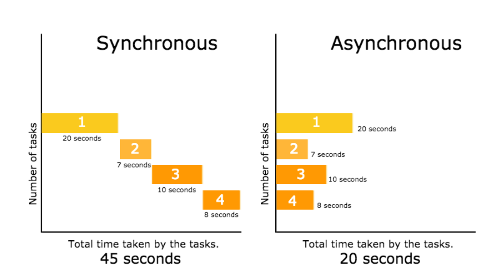
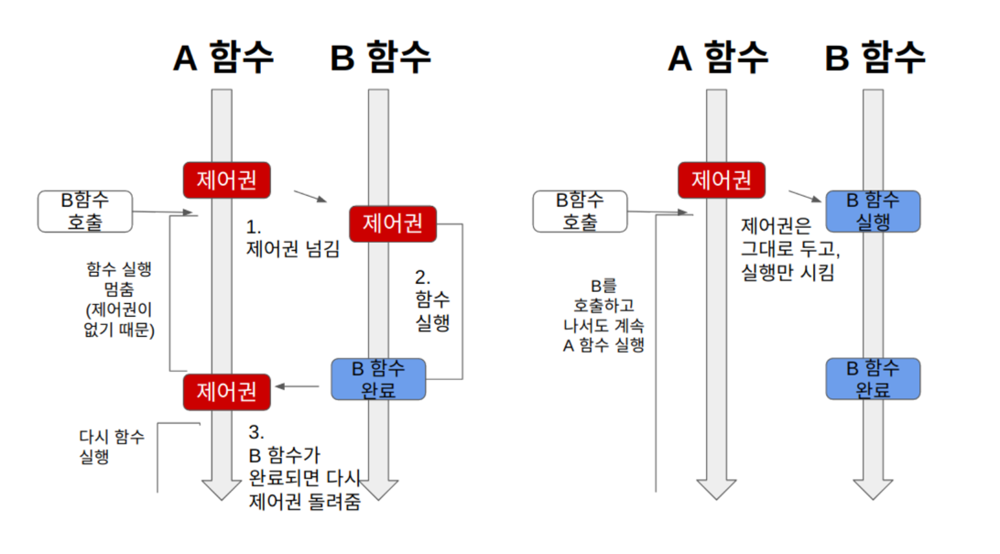
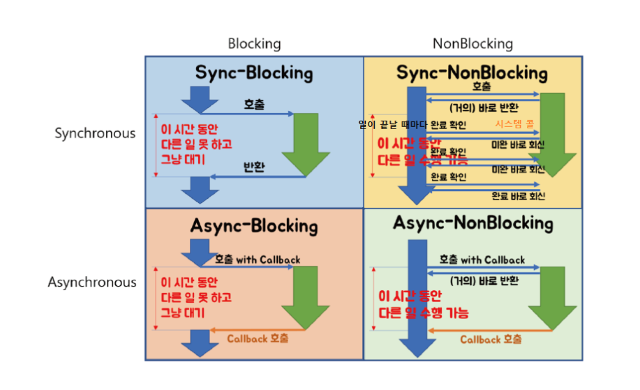

# Synchronous & Asynchronous

&rarr; **호출되는 함수의 작업 완료를 신경쓰는지의 여부 차이**

***Synchronous : 요청과 결과가 순차적으로 이루어지는 통신 방식***
- 코드가 실행되면, 해당 코드의 작업이 완료될 때까지 다음 코드로 넘어가지 않음
- 구현이 상대적으로 간단하고 직관적
- But 요청에 대한 처리가 완료될때까지 프로세스가 멈추는 **Blocking**이 발생해 효율성이 떨어짐

***Asynchronous : 요청과 그 결과가 동시에 이루어지지 않는 통신 방식***
- 해당 코드의 작업 완료 여부와 상관없이 즉시 다음 코드로 넘어감
- 요청을 보낸 후 응답을 기다리는 동안에도 다른 작업을 수행해 효율적 운용이 가능
- 네트워크 요청, 파일 I/O, 대용량 데이터 처리 등의 작업에 유용
- But 코드의 실행 순서가 보장되지 않아 로직의 복잡성이 증가하고 디버깅이 어려움

---
# Blocking & Non-Blocking

&rarr; **제어권을 어떻게 처리하는지에 대한 차이**

***Blocking***
- 호출된 함수 (callee)가 할 일을 마칠 때까지 제어권을 가지며 호출한 함수 (caller)에게 바로 돌려주지 않음

***Non-Blocking***
- 호출된 함수 (callee)가 할 일을 다 마치지 못했더라도 바로 제어권을 건네주어 호출한 함수 (caller)가 다른 일을 진행하도록 함

### → Sync는 출력 순서와 관련 / Blocking은 병렬 실행과 관련된 개념 !

---
## Sync + Blocking 

#### Non-Blocking & Sync
- 다른 작업이 진행되는 동안에도 **자신의 작업을 처리하고**, 다른 작업의 결과를 바로 처리하여 작업을 **순차대로 수행하는 방식**
- ***Blockint & Sync보다 효율적 → Non-Blocking & Sync는 호출 함수가 제어권을 갖고 있어 다른 작업의 병렬적 수행 가능***
- 함수가 완료되지 않아도 제어권은 넘겨주어 함수를 호출한 쪽에서 다음 동작 수행은 가능하지만 함수가 완료되는 것을 신경써야 하므로 주기적으로 함수가 완료되었는지 확인

#### Non-Blocking & Async
- 다른 작업이 진행되는 동안에도 **자신의 작업을 처리하고**, 다른 작업의 결과를 바로 처리하지 않아 **작업 순서가 지켜지지 않는 방식**
- 기본적인 Async. 함수 호출 시 제어권을 다시 호출한 쪽으로 넘겨 다음 동작을 이어 나가면서 호출 받은 쪽에서 알아서 콜백 함수의 결과를 리턴

#### Blocking & Sync
- 다른 작업이 진행되는 동안 **자신의 작업을 처리하지 않고**, 다른 작업의 완료 여부를 바로 받아 **순차적으로 처리하는 방식**
- 함수 호출 시 호출 받은 쪽에서 제어권을 가지므로 결과값이 반환 될 때까지 다음 동작을 시행하지 않음

#### Blocking & Async
- 다른 작업이 진행되는 동안 **자신의 작업을 멈추고 기다리고**, 다른 작업의 결과를 바로 처리하지 않아 **순서대로 작업을 수행하지 않는 방식**
- ***Blocking & Sync와 개념적 차이가 있을 뿐 성능 차이는 없음***

