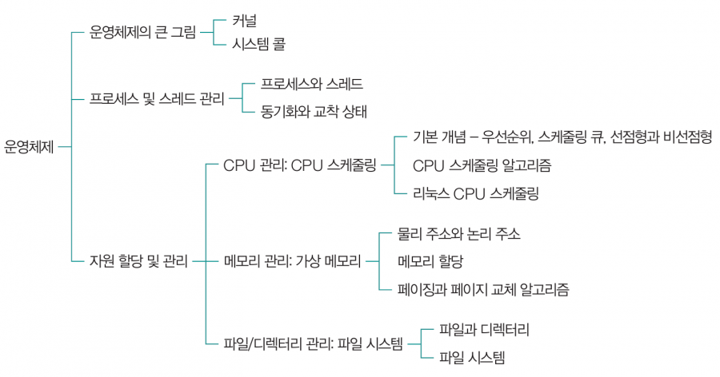

# Operating System
- user가 사용하는 **application과 hardware 사이**에서 동작하는 소프트웨어 계층
- 응용프로그램이 요청하는 **시스템 리소스를 효율적으로 분배하고, 지원하는 소프트웨어**

---
## Basic Concept of OS
[Operating System](./basic_concept/Operating_system.md)

[Memory](./basic_concept/Memory.md)

[Process VS Thread](./basic_concept/Process_Thread.md)

[Synchronous VS Asynchronous](./basic_concept/Sync_Block.md)

---
## Manage Process
[PCB & Context Switching](./manage_process/PCB_ContextSwitching.md)

[MultiProcess VS MultiThread](./manage_process/MultiProcess_MultiThread.md)

[Scheduler - Process & CPU](./manage_process/Scheduling_CPU.md)

[Critical Section - process synchronization](./manage_process/Critical_section.md)

[Mutual Exclusion](./manage_process/Spinlock_Mutex_Semaphore.md)

---
## Manage Memory

---
## File & I/O System

---
## Real Time OS & Embedded System

