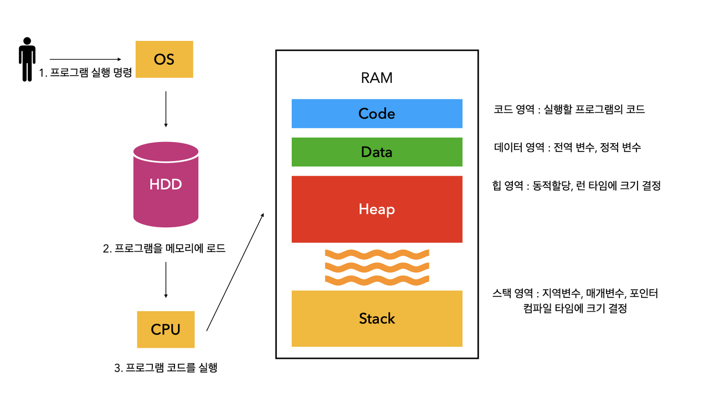
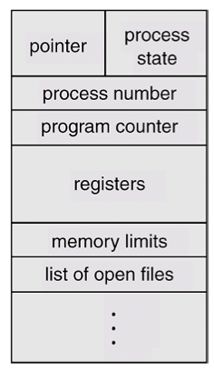
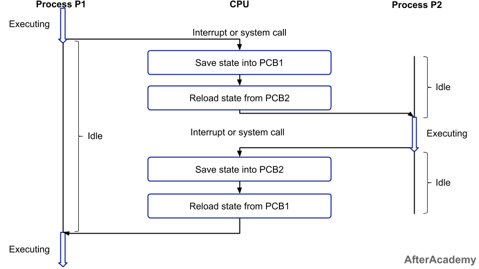
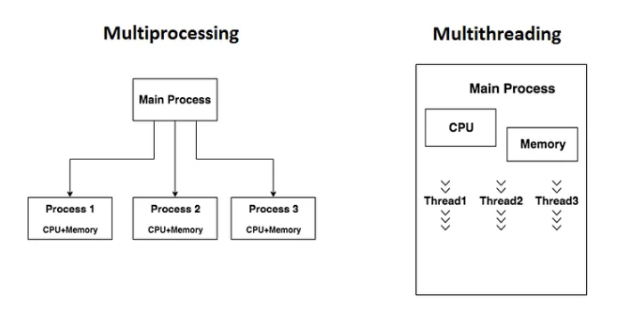
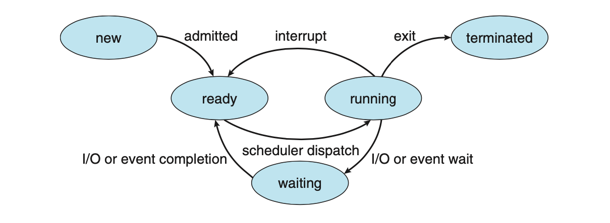
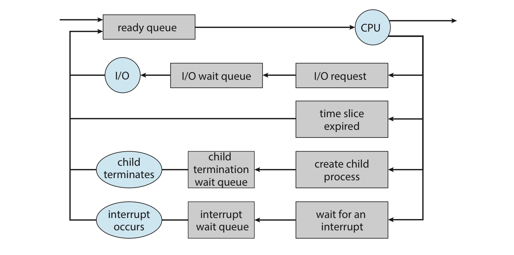
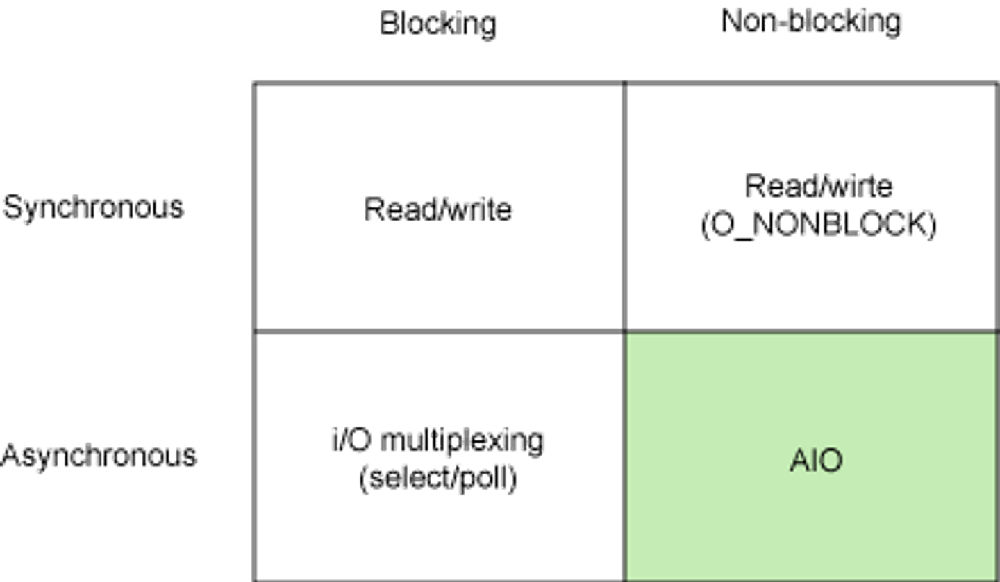

# Operating System
- user가 사용하는 **application과 hardware 사이**에서 동작하는 소프트웨어 계층
- 응용프로그램이 요청하는 **시스템 리소스를 효율적으로 분배하고, 지원하는 소프트웨어**

[Operating System detail](./Operating_system.md)

[operating_system_overview](./img/operating_system_overview.png)

Table of Contents

- [Memory](#memory)
- [Process VS Thread](#process-vs-thread)
- [PCB](#process-control-block-pcb)
- [Context Switching](#context-switching)
- [Multi Process VS Multi Thread](#multi-process-vs-multi-thread)
- [Critical Section](#critical-section-임계영역)
- [프로세스 동기화 메커니즘 : Spinlock & Mutex & Semaphore](#프로세스-동기화-메커니즘--spinlock--mutex--semaphore)
- [Process Scheduling](#process-scheduling)
- [CPU Scheduling](#cpu-scheduling)

---
## Memory
- RAM(Random access memory)의 다른 표현, CPU가 처리할 데이터나 명령어들을 임시로 저장하는 작업 공간 역할
- 프로그램 실행을 위해 먼저 프로그램이 메모리에 로드되어야 함
- 프로그램을 실행하게 되면 **OS는 메모리에 공간을 할당함**

#### 메모리 구조 

- Code : 실행할 프로그램의 코드
- Data : 전역 변수, 정적 변수
- Heap : 런타임 시 크기가 결정됨 (사용자의 동적 할당)
- Stack : 컴파일 타임에 크기가 결정됨
    - Compile time : 작성한 소스코드가 기계가 읽을 수 있는 형태로 변환되는 과정
    - Run time : 컴파일 과정을 마친 컴퓨터 프로그램이 실행되고 있는 환경 또는 동작 시간

[Memory detail](./Memory.md)

--- 
## Process VS Thread
- **프로세스는 서로 다른 메모리 공간에서 실행**되는 반면 동일한 프로세스의 **스레드는 공유 메모리 공간에서 실행**된다는 점에서 차이가 있음

&rarr; ***스레드는 하나에서 오류가 발생하면 같은 프로세스 내의 다른 스레드 모두가 강제 종료됨 but 프로세스는 한 프로세스가 강제 종료되어도 공유 자원을 손상시키는 경우가 아니라면 다른 프로세스에 영향을 주지 않음***

#### Program & Process
- **프로그램** : 특정 작업을 수행하기 위해 작성된 지침 &rarr; 디스크 or 다른 저장 매체에 저장되는 정적 entity
    - 프로그램을 실행하면 운영체제는 해당 프로그램을 디스크에서 시스템 메로리로 로드하고 실행
    - **프로그램의 실행 중인 인스턴스** = **프로세스** &rarr; 각 프로세스에는 자체 메모리 공간과 시스템 리소스가 있음
    - ***파일 단위로 저장 장치에 저장되며, 아직 실행되지 않은 상태의 코드 덩어리***
- **프로그램은 정적**이지만 **프로세스는 동적**
- 동일 프로그램의 여러 인스턴스를 동시에 실행해 여러 프로세스 생성 가능

    &rarr; 각 프로세스는 자체 메모리와 리소스를 가지며 독립적

⇒ **프로그램은 코드, 프로세스는 코드가 실행될 때 발생**

## Process & Thread
- 프로세스는 자체 메모리 공간이 있는 독립적인(애플리케이션에 대한 격리 : **isolation** 제공) entity로 **프로그램의 실행 중인 인스턴스**
- 스레드는 **프로세스 내의 더 가벼운 공유 메모리**로 병렬 실행을 가능하게 함
    - **프로세스의 하위 집합이며 경량 프로세스**라고도 함
    
        &rarr; 프로세스에는 둘 이상의 스레드가 존재할 수 있으며 **스케줄러에 의해 독립적으로 관리됨** = 동시성 : **concurrency**
    
    - ***프로세스의 실행 단위, 같은 프로세스 내에 있는 스레드끼리는 프로세스의 자원을 공유할 수 있음***
    - 스레드는 프로세스 메모리 영역을 공유하므로 어떤 스레드 하나에서 오류가 발생하면 같은 프로세스 내의 다른 스레드 모두가 강제로 종료됨
 
[Process & Thread detail](./Process_Thread.md)

---
## Process Control Block (PCB)
- 특정 프로세스에 대한 정보를 담고 있는 운영체제의 자료구조
- 프로세스는 운영체제의 스케줄링 알고리즘에 따라 CPU를 할당받음
- 작업 진행 중 프로세스 전환이 발생하면 하던 일을 저장하고 CPU를 반환해야 함

    &rarr; 나중에 스케줄링에 의해 재실행 되었을 때 이전에 어디까지 작업이 진행되었는지 정보를 알아야 함

    ⇒ ***이 정보가 담긴 공간이 PCB***

- 프로세스 생성과 동시에 그 프로세스의 고유한 PCB도 함께 생성됨, 프로세스 완료 시 PCB는 제거됨

#### PCB에 저장되는 정보

프로세스 제어 블록

- 프로세스 식별자 (Process ID, PID)
- 프로세스 상태 (Process state) : new, ready, running, waiting, terminated
- 프로그램 카운터 (Program counter) : 프로세스가 다음에 실행할 명령어의 주소를 가리킴
- CPU 레지스터 : Accumulator, Index Register, 범용 레지스터 등
- CPU 스케줄링 정보 : 프로세스 우선순위, 최종 실행 시각, CPU 점유 시간 등
- 메모리 관리 정보 : Page table, Segment table 등
- 계정 정보 : CPU 사용 시간, 제한 시간, 계정 번호 등
- 입출력 상태 정보 : 프로세스에 할당된 입출력 장치, 개방된 파일 목록 등

---
## Context-Switching
- **CPU 코어를 다른 프로세스로 전환하기 위해 현재 프로세스의 상태 저장 및 다른 프로세스의 상태 복원을 수행하는 작업**
    - Context = CPU가 프로세스를 실행하기 위한 정보, PCB에 저장되는 정보들이 해당됨
    - Context-Switching이 발생하면 커널이 이전 프로세스의 context를 그 프로세스의 PCB에 저장하고 새롭게 실행할 (스케줄링으로 예약) 프로세스의 저장된 context를 불러옴
    - **수행 중**에는 CPU의 자원이 어떤 프로세스에 할당된 상태가 아니므로 **CPU가 아무 작업도 할 수 없음**

    &rarr; **Context-Swtiching time(프로세스가 실행되기 전까지의 기다리는 시간) = pure overhead**
 
#### Context Switching 과정

과정

1. Process P1이 실행되는 도중 인터럽트나 시스템 콜이 발생

2. PCB1에 P1의 정보를 저장하고 PCB2의 상태를 불러옴

3. Process P2를 실행

4. P2가 실행되는 도중 인터럽트나 시스템 콜이 발생

5. PCB2에 P2의 정보를 저장하고 PCB1의 상태를 불러옴

6. Process P1을 실행

---
## Multi-Process VS Multi-Thread

&rarr; **Multi Processing과 Multi Threading은 효율성과 성능을 높이기 위해 컴퓨팅 작업을 병렬화하는 두 가지 접근 방식**

### Single Thread
- 하나의 프로세스에서 하나의 스레드 실행
- 하나의 레지스터와 스택으로 표현
- 요청에 대한 빠른 반응을 요구하는 네트워크 서버의 프로그램일 경우 단일 스레드 모델이 더 적합함

> 장점
> - 자원 접근에 대한 동기화를 신경쓰지 않아도 됨
> - context switching 작업을 요구하지 않음
>
> 단점
> - 한번에 하나의 일만 처리할 수 있으므로 작업에서 블로킹이 발생하면 다음 일을 처리하기까지 기다려야 하는 문제가 발생함

### Multi-Process
- 각각 자체 메모리 공간이 있는 여러 프로세스 사용
- 한 프로세스의 충돌이 다른 프로세스에 직접적인 영향을 미치지 않으므로 이러한 격리를 통해 안정성이 향상될 수 있음
- but **프로세스 간 통신은 스레드에 비해 더 복잡하고 느릴 수 있음**
- **많은 메모리와 CPU 점유시간을 가지며 Context Switching이 느림**

### Multi-Thread
- 단일 프로세스에 여러 스레드가 포함될 수 있음
- 프로세스 내의 모든 스레드는 동일한 메모리 공간을 공유하므로 스레드 간에 정보를 더 쉽고 빠르게 공유할 수 있음
- but **동일 메모리를 공유하므로 경쟁 조건 및 교착 상태**와 같은 문제를 방지하려면 관리가 필요함
- **적은 메모리와 적은 CPU 점유 시간을 가지며 Context Switching 비용이 낮음**

&rarr; ***메모리를 나누어 안정성을 높일 때는 Multi-process를 Context Switching이 많고 빠른 처리 속도를 요구할 경우 Multi-thread를 이용하는게 좋음***

[Multi-Process & Multi-Thread detail](./MultiProcess_MultiThread.md)

---
## Critical Section (임계영역)
- 여러 프로세스가 또는 스레드가 공유 데이터(shared resource)에 접근하는 프로그램 코드 블록

&rarr; ***여러 프로세스가 동일 자원을 동시에 참조하여 값이 오염될 위험 가능성이 있는 영역***

- 공유하는 자원에 동시에 접근하는 경우, 스레드는 데이터와 힙 영역을 공유하기에 어떤 스레드가 다른 스레드에서 사용 중인 변수나 자료구조에 접근해 값을 수정할 수 있음

&rarr; ***따라서 동기화가 필요하며 프로그래밍 시 임계 영역을 최소화하는 설계를 해야함***

⇒ 하나의 메서드에 하나의 스레드만이 진입해서 실행(= mutual exclusion) 하는 메서드 영역 = Critical Section
but 불필요한 부분까지 동기화 하는 경우, 과도한 lock으로 병목 현상을 발생시켜 성능이 저하될 가능성이 높으므로 주의해야함

#### 여러 프로세스가 동시 접근하면 1. 데이터 불일치, 2. Race Condition, 3. Deadlock 등의 문제가 발생할 수 있으므로 이를 상호 배제(Mutual exclusion)방식으로 해결해야함 !

### Critical Section Problem
- 임계 영역을 만족하기 위해서는 아래 3가지 문제 소지들을 해결해야함

***1. Mutual Exclusion (상호 배제)***
- 한 순간에 오직 하나의 스레드만이 임계 영역에 진입할 수 있음을 보장
- 여러 스레드 또는 프로세스가 shared resource에 동시 접근하지 못하도록 critical section에 대한 접근 조정

***2. Progress (진행)***
- 어떤 스레드가 임계 영역에 진입하기 위해 대기 중인 상태에서, 다른 스레드가 진입할 수 있음을 보장해야 함

***3. Bounded Waiting (제한된 대기)***
- 한 스레드가 임계 영역에 진입하기 위해 대기하는 시간은 제한되어야 함
- 특정 스레드가 계속해서 다른 스레드에게 우선권을 주며 무제한으로 대기하는 상황이 발생하지 않도록 해야 함

---
## 프로세스 동기화 메커니즘 : Spinlock & Mutex & Semaphore
- 동기화 메커니즘은 여러 개의 스레드가 **공유 자원에 동시 접근하는 것을 조절하고 조율하는데 사용되는 기술**
- 주로 운영체제의 **커널(Kernel)에서** 사용됨
- 동기화 메커니즘으로 사용되는 도구로는 **Spinlock, Mutex, Semaphore** 등이 있음

&rarr; ***다중 스레드 환경에서 공유 자원에 대한 접근을 조절하여 Critical section에서의 Race Condition과 같은 문제를 해결하기 위해 사용됨***

### Spinlock
- Critical section이 락이 걸려 진입이 불가능할 때, **임계영역이 unlock되어 진입이 가능해질 때까지 루프를 돌면서 재시도하여 스레드가 CPU를 점유하고 있는 상태**
- 무의미한 코드를 계속 수행하며 언락되길 기다리기 때문에 **Busy Waiting** 상태임

    &rarr; 오랜 시간 동안 언락되지 않으면 해당 시간동안 계속 CPU를 점유하고 있으므로 **오버헤드**가 존재함
  
- 운영체제의 스케줄링 지원을 받지 않기 때문에 해당 스레드에 대한 **Context switching이 일어나지 않음**

    &rarr; 멀티 프로세스 시스템에서만 사용 가능
- 상태가 오직 **Lock / Unlock**만 존재하므로 한번에 하나의 컴포넌트만 접근 가능 & 주체가 동일해야함

### Mutex
- 상태가 **Lock / Unlock**만 존재한다는 점은 spinlock과 동일
- Spinlock이 임계영역이 언락되어 권한을 획득하기까지 Busy Waiting 상태를 유지한다면, mutex는 **Sleep 상태로 들어갔다 Wakeup 되면 다시 권한 획득을 시도함**
- ***Locking 메커니즘으로 락을 걸은 스레드만이 임계영역을 나갈때 락을 해제할 수 있음***
- 시스템 전반의 성능에 영향을 주지 않고 길게 처리해야하는 작업에 주로 사용 &rarr; ex: 스레드 작업

### Semaphore
- spinlock & mutex와 달리 **표현형이 정수형** &rarr; 하나 이상의 컴포넌트가 공유자원에 접근할 수 있도록 허용
- 컴포넌트가 특정 자원에 접근할 때 **semWait이 먼저 호출되어 임계영역에 들어갈 수 있는지 먼저 확인**
- 임계영역에 접근이 가능하면 **semWait을 빠져나와 임계영역에 들어가고, 이후 semSignal이 호출되어 임계영역에서 빠져나옴**
- ***Signaling 메커니즘으로 락을 걸지 않은 스레드도 signal을 통해 락을 해제할 수 있음***

semWait & semSignal

- **semWait 연산**
    - 세마포어의 값을 감소
    - 만약 값이 음수가 되면 semWait을 호출한 스레드는 블록되지만 음수가 아니면 작업 수행
- **semSignal 연산**
    - 세마포어의 값을 증가
    - 만약 값이 양수가 아니면 semWait 연산에 의해 블록된 스레드를 다시 wake 시킴

사용할 수 있는 자원의 수(= 세마포어 값)에 따른 두가지 유형

- **Counting Semaphore (개수 세마포어)**
    - 도메인이 0이상인 임의의 정수값인 세마포어
    - 여러개의 자원을 가질 수 있으며 제한된 자원을 가지고 액세스 작업할 때 사용
- **Binary Semaphore (이진 세마포어)**
    - 0 또는 1값만 가질 수 있는 세마포어
    - 임계영역 문제를 해결하는데에 사용하며. 자원이 하나이므로 뮤텍스로도 사용 가능

[Spinlock & Mutex & Semaphore detail](./Spinlock_Mutex_Semaphore.md)

---
## Process Scheduling
- 프로세스 스케줄러는 **멀티 프로그래밍**과 **time sharing**의 목적을 달성하기 위해 실행 가능한 여러 프로세스 중 하나의 프로세스를 선택해 실행
- 각 CPU 코어는 한번에 한 프로세스 실행 &rarr; 단일 CPU 코어 시스템에 반해 멀티 코어 시스템은 한번에 여러 프로세스 실행 가능

- 멀티 프로그래밍
    - CPU 사용률을 최대화하기 위해 항상 프로세스를 실행하도록 함
    - 특정 프로세스가 CPU를 사용하다가 필요로 하지 않는 순간이 오면 다른 프로세스가 사용할 수 있도록 함
 
- 시분할 (Time sharing)
    - 각 프로그램이 실행되는 동안 사용자들이 상호작용 하도록 프로세스 간 CPU 코어를 자주 전홚함
    - CPU가 하나의 프로그램을 수행하는 시간을 매우 짧은 시간(ms)으로 제한해 번갈아 수행하도록 하면 CPU가 하나인 환경에서도 여러 사용자가 동시에 사용하는 듯한 효과를 줌

### 프로세스의 생명 주기

- 프로세스 실행은 **CPU 실행(execution)과** **입/출력 대기(I/O wait)의** 사이클로 구성됨

&rarr; ***이를 CPU I/O Burst Cycle***이라 함

> New : 프로세스가 생성됨, 메모리에 올라간 상태
> 
> Ready : 프로세서에 할당되기를 기다림 (다른 프로세스가 CPU를 사용하고 있는 상황)
> 
> Running : 프로세스의 Instruction이 실행됨, 프로세스가 CPU를 점령하여 명령어가 실행되고 있는 상태
> 
> Waiting : (I/O requests나 신호 수신과 같은) 이벤트가 완료되기를 기다림, 해당 작업이 완료되면 Ready Queue로 이동
> 
> Terminated : 프로세스 명령어가 끝까지 진행되었거나 중간에 exit()이 발생하면 프로세스가 종료됨

---
## CPU Scheduling
- ***운영체제가 프로세스들에게 공정하고 합리적으로 CPU 자원을 배분하는 것***
- CPU 스케줄링 알고리즘에 따라 프로세스에서 해야 하는 일을 스레드 단위로 CPU에 할당

&rarr; CPU 이용률을 높게, 주어진 시간에 많은 일을 수행 / **ready queue에 있는 프로세스는 적게, 응답 시간을 짧게 설정하는 것이 목표**

#### CPU 스케줄링이 왜 필요할까?
- 프로세스가 CPU를 점유해 작업을 수행하는 도중 I/O or Interrupt가 발생하면 일시적으로 프로세스는 CPU를 사용하지 않는데도 점유하고 있음

&rarr; 이러한 상황을 줄여서 CPU를 최대한 활용하면 프로세스들이 효율적으로 CPU를 사용할 수 있지 않을까?에서 시작됨

#### Process Priority
- 프로세스의 중요도에 따라 운영체제가 우선순위를 부여함
- 우선순위가 높은 프로세스는 대표적으로 입출력이 많은 프로세스

&rarr; 입출력 작업 완료 전끼지 입출력 집중 프로세스는 대기 상태이므로 다른 프로세스가 CPU를 사용할 수 있기 때문

### Schedulng Queue
- 각 프로세스의 PCB에 부여된 우선순위에 따라 CPU를 사용할 수 있도록 줄을 세우는 것
- Ready queue (CPU를 사용하고 싶은 프로세스들) / Waiting queue (입출력장치 이용을 위해 대기 상태에 접어든 프로세스들)

&rarr; 프로세스는 종료될 때까지 위의 주기를 반복, 종료되면 모든 큐에서 제거되고 PCB 및 자원 할당이 해제됨

#### CPU Scheduling 발생 상황
> 1. 프로세스가 running → waiting 상태로 전환 (ex. I/O 요청 또는 하위 프로세스 종료를 위한 wait() 호출)
> 
> 2. 프로세스가 running → ready 상태로 전환 (ex. interrupt 발생)
> 
> 3. 프로세스가 waiting → ready 상태로 전환 (ex. I/O 완료)
> 
> 4. 프로세스 종료

&rarr; 상황 1,4에서는 새 프로세스를 선택해야 함 but **상황 2,3에서는 Preemptive or Nonpreemptive 중에서 선택 가능**

***Preemptive = 선점형 : 강제로 CPU 회수***

&rarr; 비선점에 비해 context switching이 자주 발생해 오버헤드가 발생할 수 있지만 CPU 독점 현상 방지 가능

***Nonpreemptive = 비선점형 : 강제로 빼앗지 않고 자진해서 CPU 반납***

&rarr; 모든 프로세스가 골고루 자원을 사용할 수 없음 (자원 독점 가능)

### Preemptive / Nonpreemptive에 속하는 CPU Scheduling Algorithm 기법의 종류
- Preemptive
    - SRT (Shortest Remaining Time) : SJF + RR / 짧은 시간 순서대로 수행 
    - RR (Round-Robin) : 정해진 타임 슬라이스(CPU를 사용할 수 있는 정해진 시간)만큼동안 CPU 할당
    - Multi-level queue : ready queue를 여러 개 사용 / queue마다 RR or FCFS 등 다른 스케줄링 알고리즘 적용
    - Multi-level feedback queue : multi-level queue와 비슷하나 프로세스들이 큐를 이동할 수 있음 
        - 정해진 타임 슬라이스 동안 해당 큐에서 실행이 끝나지 않으면 다음 큐로 삽입되어 CPU를 오래 사용해야 하는 프로세스는 점차 우선순위가 낮아짐
- Nonpreemptive
    - FCFS (First Come First Served) : ready queue에 삽입된 순서대로 CPU 할당
    - SJF (Shortest Job First) : 예상 CPU 사용 시간이 짧은 프로세스 먼저 실행
    - Priority : 가장 높은 우선순위를 가진 프로세스부터 실행
        - 우선순위가 낮은 프로세스는 실행이 계속 연기돼 Starvation(기아) 상태에 빠질 수 있으며, Aging을 통해 시간 흐름에 따라 우선순위를 증가시켜 기아 현상을 방지함
    - HRN (Highest Response ration Next) : 수행시간의 길이와 대기 시간을 모두 고려해 우선순위 결정
    - Deadline : 작업을 명시된 시간이나 기한 내에 완료하도록 스케줄링

### CPU가 여러개인 경우의 Scheduling
**1. Multiple-Processor Scheduling**
- Homogeneous processor인 경우
    - queue에 한줄로 세워 각 프로세서가 알아서 꺼내가도록 but 특정 프로세서에서 수행돼야 하는 프로세스가 있는 경우 문제가 복잡해짐
- Load sharing
    - 별개의 큐 or 공동 큐를 사용해 일부 프로세서에 일이 몰리지 않도록 부하 조정
- Symmetric Multiprocessing (SMP) : 각 프로세서가 알아서 스케줄링 결정
- Asymmetric Multiprocessing : 하나의 프로세서가 시스템 데이터의 접근과 공유를 책임지고 나머지는 그에 따름

 **2. Real-Time Scheduling**
 - Hard real-time system : 정해진 시간 안에 반드시 끝내도록 (데드라인을 반드시 지킴)
 - Soft real-time computing : soft real-time task는 일반 프로세스에 비해 높은 우선순위를 부여 (데드라인을 반드시 지키지는 않음)

**3. Thread Scheduling**
- Local Scheduling
    - user 프로세스가 직접 어떤 thread에 CPU를 줄지 결정
- Global Scheduling
    - kernel level thread의 경우 커널의 단기 스케줄러가 결정
    - OS가 알고리즘에 의거해 어떤 thread에 CPU에 줄지 결정

---
## Synchronous & Asynchronous VS Block & Non-Block
- ***Sync & Async : 요청 작업에 대한 완료 여부를 확인해 작업을 순차적으로 수행할지 아닌지에 따라 결정되는 개념***
    - **호출되는 함수의 완료**를 호출한 쪽에서 신경을 쓰냐 호출 받은 쪽에서 신경을 쓰냐의 차이

- ***Block & Non-Block : 현재 진행중인 작업이 블락(대기)되느냐 안 되는냐에 따라 다른 작업을 수행할지가 결정되는 개념***
    - blocking은 호출받은 쪾이 호출한 쪽에 제어권을 넘겨주지 않음 / non-blocking은 다시 제어권을 넘겨줌

[Sync & Block detail](./Sync_Block.md)

