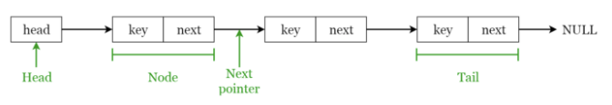
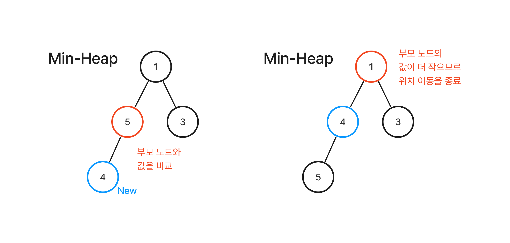

# Data Structure
- The memory resources of computers used for computation are limited, while there's a lot of data to be processed. So Data structures are needed to efficiently use this meemory space!

- **A method to organize and store data so that the data can be accessed and modified efficiently** 
- Selection of data structure &rarr; Selection of efficient algorithm ⇒ Data structure + Algorithm(+a) = Program
- Divided **Linear data strucre & Non-Linear data structure** accordiing to storage form
    - Linear data structure : Data is listed in a row (**array, linked list, stack, queue...**)
    - Non-Linear data structure : Data takes a specific form (**tree, graph...**)

Table of Contents

- [Array](#array-배열)
- [Linked List](#linked-list-연결-리스트)
- [Stack](#stack)
- [Queue](#queue)
- [Tree](#tree)
- [Binary Tree](#binary-tree)
- [Graph](#graph)
- [Deque](#deque)
- [Heap](#heap)
- [Hash Table](#hash-table)
- [Trie](#trie--prefix-tree-digital-search-tree-retrieval-tree)

---
## Array
- Array stores data of the same type and has fixed size
- Can access data by the index number (enable to random access)
- Difficult to insert/delete datas (needed to shift)
  
&rarr; Building blocks for constructing other data structures such as array list, heap, hash table, vector & matrix

&rarr; **Used in various sorting algorithms such as Insertion sort, Bubble sort, Merge sort and some else**

> #### Time complexity & Space complexity
> - Data lookup : 0(1)
> - Data insertion / deletion : 0(n)

---
## Linked List
- Sequential structure where each data sequence is connected in order / Each node has data and pointer
- Slow data aceess (need to find by following the link)
- Favorable for dynamic data addition / delition, but requires additional space for pointers
- Each element : Node &rarr; Node contains key & next pointer
- First element : Head / Last element : Tail

> #### Time complexity & Space complexity
> - Data lookup : 0(n)
> - **Front / Back** Data insertion / deletion : 0(1) &rarr; In the case of SinglyLinkedList, the operation to delete the last data is 0(n)
> - **In the middle desired location** Data insertion / deletion : 0(n) &rarr; because there's a process to lookup data up to the desired element, so 0(n) + 0(1)
    -
### Array vs LinkedList
- Data Access Rate
     - Array supports 'random access' through index &rarr; fast access with time complexity 0(1)
     - LinkedList uses sequential approach &rarr; time complexity 0(n)
- Data Insertion / Delete Rate
     - Array needs shift when inserting / deleting data in the middle or at the beginning, making it inefficient as there's more data
     - LinkedList has time complexity of 0(n) for inserting / deleting intermediate, but for front/back insertion it has time complexity of 0(1)
     - but LinkedList allows memory allocation and release for every data insertion/deletion, so it has fast time complexity but can occur the System call
     - Array is a static memory allocation (compile time)
     - LinkedList is dynamic momory allocation (runtime)
     - Array requires new memory space when all the space is full while insert data, but LinkedList is dynamically assigned

&rarr; **Recommend to use LinkedList if data insertion/deletion is frequent and Array if data access speed is critical**

---
## Stack
- Linear data structure where order is preserved
- Insertion / Deletion operations are performed in one direction
- LIFO(Last In First Out) method that process from the last(recent) element

#### Major Operation
- 'push' : insert element into the top of stack
- 'pop' : delete and return element at the top of stack
- 'peek' : return element in the stack's top

> #### Time complexity & Space complexity
> - top data lookup : 0(1)
> - specific data lookup : 0(n)
> - insert / delete data : 0(1)

### Stack Utilization
- system stack / runtime stack : Managing in order of execution following the program function call and return
- Handling interrupt routine
- Postfix notation of an expression
- Calculation check
- DFS Algorithm

> **Process of managing the order of execution accordiing to the program's function call and return**
> 1. In the event of a function call, the stack frame stores information such as local variables, parameters, and address to return after execution and inserts it into the system stack 
> 2. When the function execution ends, pop the stack frame element in the top of the system stack, and check the return address stored in the frame and return
> 3. Function call - repeat this process as it returns, and the system stack becomes blank stack when the entire program execution ends 

&rarr; Function call is a LIFO structure in which the last called function completes execution first and return, so manage it using the stack !

--- 
## Queue
- Linear data structures with insertion/deletion operations in one direction / deletion operations in one direction / deletion operations in the other direction
- **FIFO(First in first out) : The element that entered first comes out first**

#### Major Operation
- 'push' : add data
- 'pop' : delete the front data of queue
- 'front' : return the highest data
- 'back' : return the latest data
- 'size' : return the current size of queue
- 'empty' : check if queue is empty
- 'swap' : change the contents of two queues

> #### Time complexity & Space complexity
> - front data lookup : 0(1)
> - specific data query : 0(n)
> - insert/delete data : 0(1)

### Queue Utilization
- Process ready queue
- Scheduling
- Cache Implementation
- BFS

## Priority Queue
- Regardless of the entering order, higher priority data comes first  
- Don't allow null because values need to be compared
- Inside consists of binary tree heaps

#### Major Operations
- 'enqueue' : insert new element in the queue
- 'dequeue' : delete the highest priority element in the queue and return it
- 'peek' : return the highest priority element in the queue

> 1. All items has priority
> 2. High-priority elements are excluded from the queue before low-priority elements
> 3. If the two elements have the same priority, provide them in the order of queue

#### Priority Queue Implementation
- Can be implemented with array, linkedlist, heap
- **Heap guarantees 0(log n) even in the worst case**, so it's usually implemented as a heap
> **1. Implement with List**
> - Unaligned Array : Insertion 0(1), Delete root 0(n)
> - Aligned Array : Insertion 0(n), Delete root 0(1)
>
> **2. Implement with Heap**
> 1. Insert operation
> - Add new element at the last level, and adjust the position when the condition (greater or smaller than the parent node) is established compared to the parent node
> - Worst case of adjusting to root node &rarr; Time complexity 0(log n)
> 2. Delete operation
> - Move the last node to the root to maintain the properties of the heap as the root node is deleted
> - Adjustment proceeds until hip characteristics are satisfied again (=heapify)

## Stack ↔ Queue Implementation
- Since stack is LIFO and queue is FIFO, it can be implemented by reversing the stored order when entering and leaving

#### Stack &rarr; Queue
- Move it to another stack and take it out
- Enqueue : push to the A stack
- Dequeue : pop the one in stack b, pop all the ones in stack A and push to B, and then pop the one in stack b

[stack_to_queue](./code/Stack/stack_to_queue.cpp)

#### Queue &rarr; Stack
- Reverse the order and put it in
- push : If there's data in the main queue, make all of them dequeue and put it into sub queue. After that, put inser the data that you want to put into the main queue, and dequeue everything you move to the sub queue and put it into the main queue
- pop : Dequeue the datas in main queue

[queue_to_stack](./code/Queue/queue_to_stack.cpp)

---
## Tree
- 자료들 간의 계층적 관계를 나타내는데 사용하는 자료 구조 &rarr; 부모-자식 관계로 표현
- 비선형 자료 구조
> 루트 노드가 존재함 (트리는 반드시 1개 이상의 노드를 가짐)
> 트리의 부분 트리 또한 트리 구조를 따름

#### 용어
> - 루트 노드 : 최상위 노드, unique함
> - 부모 노드 : 부모-자식 관계에서 상위 계층
> - 자식 노드 : 부모-자식 관계에서 하위 계층
> - 형제 노드 : 부모가 동일한 노드
> - 조상 노드 : 해당 노드의 부모 노드 ~ 루트 노드까지의 경로에 존재하는 모드 노드
> - 후손 노드 : 해당 노드를 루트로 하는 부분 트리의 모든 노드
> - 내부 노드 : 자식이 있는 노드 / 외부 노드 : 자식이 없는 노드
> - 깊이 : 루트 노드에서 해당 노드까지 도달하는데 사용하는 간선 수 &rarr; 루트 노드 깊이는 0
> - 레벨 : 노드의 깊이 + 1
> - 높이 : 루트 노드에서 해당 노드까지 도달하는데 지나간 정점 수 &rarr; 트리의 높이 = 해당 트리 내 모든 노드의 높이 중 최댓값
> - 차수 : 노드의 자식 수 &rarr; 트리의 차수 = 해당 트리 내 모든 노드의 차수 중 최댓값

> #### 시간복잡도 & 공간복잡도
> - 노드 검색 : 0(n)
> - 노드 삽입/삭제 : 0(1)
>         - 노드 삭제의 경우 언어와 구현에 따라 시간복잡도가 달라짐

### Tree 활용
- 파일 시스템
- 검색 엔진
- 트라이 알고리즘

## Indexed Tree = Segment Tree
- 순서를 갖는 정보가 주어질 때, **구간의 대표 값이나 연산 결과**를 빠르게 얻는 자료구조
- **구간 합, 구간 내 최댓값, 구간 내 카운트** 등을 구할 때 사용
- segment tree는 indexed tree가 포함하고 있는 한 종류임

> #### Top-Down 방식 구현 (DFS 기반 : 재귀호출)
> - 왼쪽 자식 = 2*node, 오른쪽 자식 = 2*node + 1
> - 가지치기 가능 (더 이상 탐색하지 않아도 되는 곳은 가지 않음)
> - x번째로 빠른 숫자 등 카운팅 쿼리 가능

> #### Bottom-Up 방식 구현 (반복문 기반 트리 탐색)
> - 인덱스의 홀짝 특성 이용
> - 부모 노드 = node / 2
> - 코드가 더 단순하며, 수행 속도가 상대적으로 빠름

---
## Binary Tree
- 트리의 차수가 2 이하인 트리
- 비선형 자료구조
- 자식이 최대 2개이므로 왼쪽, 오른쪽 자식으로 구분함 / 일반 트리는 0개의 노드를 가질 수 없으나, 공백 이진 트리는 존재함
- **레벨 i에서의 최대 노드 수 : 2(i-1)**
- **깊이가 k**인 이진 트리의 최대 노드 수 :**2k-1**
- **n0= n2 + 1** (리프 노드의 수 = 자식 노드가 2개인 노드의 수 + 1)

#### 이진 트리의 표현
> 1. 배열 표현
> - i가 1이 아니면 parent(i)는 [i/2]에 위치. 만약 i가 1이면 루트이므로 부모가 없음
> - 2i <= n 이면 leftchild(i)는 2i에 위치. 만약 2i > n이면 i는 왼쪽 자식이 없음
> - 2i + 1 <= n 이면 rightchild(i)는 2i + 1에 위치. 만약 2i + 1 > n이면 i는 오른쪽 자식
> - **완전 이진트리일 때 이상적 표현이 가능하지만 편향된트리인 경우 공간 낭비가 발생, 중간에 노드 삽입/삭제 시 위치 변경이 일어남**
> - 이를 극복하기 위해 **연결 표현** 사용 가능
>
> 2. 연결 표현
> - 각 노드를 leftchild, rightchild를 가지는 구조체로 만들어 표현
> - **공간 낭비 최소화, 삽입/삭제 시 비용이 발생하는 순차 표현의 문제 해소**
> - but 부모 노드 파악이 어려움 &rarr; 이를 위해 data, leftchild, rightchild에 더해 4번째 필드 값으로 parent 추가 가능

### 이진 탐색 트리 (Binary Search Tree)
- 이진탐색 + 연결리스트를 결합한 이진트리
- 이진 탐색의 효율적인 탐색 능력은 유지하되 빈번한 자료 입려/삭제가 가능하게 고안됨
> 특징
> - 각 노드에 중복되지 않은 키가 있음
> - 루트 노드의 왼쪽 서브 트리는 해당 노드 키보다 작은 키를 갖는 노드로 이루어짐
> - 루트 노드의 오른쪽 서브 트리는 해당 노드 키보다 큰 키를 갖느 노드로 이루어짐
> - 좌우 서브트리도 모두 이진 탐색 트리어야 함
&rarr; **이진 탐색 트리는 모든 왼쪽 자식 값이 루트나 부모보다 작고, 모든 오른쪽 자식이 루트나 부모보다 큰 값을 가짐**

> #### 시간복잡도 & 공간복잡도
> - 연결리스트 : 삽입/삭제 &rarr; 0(1) / 탐색 &rarr; 0(n)
> - 이진 탐색 : 0(log n), but 삽입/삭제 불가능
> - 이진 탐색 트리 : 0(log n), 삽입/삭제 가능

[binary_tree_detail](./Binary_tree.md)

---
## Graph
- 현실 세계의 사물이나 개념 간의 연결 관계를 수학적 모델로 단순화하여 표현한 것
- 그래프는 네트워크 모델이며 2개 이상의 경로가 가능함 (즉, 노드들 사이에 양방향 경로를 가질 수 있음)
- 부모-자식 관계 개념이 없음
         - V : 정점 (Vertex/Node)
         - E : 간선 (Edge/Link/Arc)
         - 그래프 G = (V, E)

### 그래프 종류
1. 무향 그래프 (Undirected Graph) : 무방향 간선으로 이루어진 그래프
2. 유향 그래프 (Directed Graph) : 방향 간선으로 이루어진 그래프
3. 가중치 그래프 (Weighted Graph) : 가중치(비용)를 갖는 간선들로 이루어진 그래프
4. 정규 그래프 (Regular Graph) : 모든 정점이 동일한 차수를 가지는 그래프
5. 완전 그래프 (Complete Graph) : 모든 정점이 서로 인접해있는 그래프, 완전 그래프는 정규 그래프
6. 연결 그래프 (Connected Graph) : 모든 정점이 연결되어 있어서 모든 정점끼리 경로가 존재하는 그래프
7. 부분 그래프 : 어떤 그래프의 부분 부분
8. 트리 그래프 : 싸이클을 가지지 않는 연결 그래프, 모든 정점에 대해서 경로가 정확히 1개 존재함

### 그래프 표현 
- 3가지 방식이 존재함 (**간선 리스트, 인접 행렬, 인접 리스트**)

[graph_detail](./Graph.md)

---
## Graph VS Tree

||Graph|Tree|
|------|---|---|
|정의|노드와 노드를 연결하는 간선으로 구성된 자료 구조|그래프의 한 종류, 방향성이 있는 비순환 그래프|
|방향성|방향, 무방향|방향만|
|사이클|순환, 비순환, 자기순환|비순환만 = 사이클 x|
|루트노드|루트 개념 없음|하나의 루트 존재|
|부모-자식|부모-자식 개념 없음|1개의 부모노드(루트 제외)|
|모델|네트워크 모델|계층 모델|
|간선 수|자유|N - 1개|
|순회|DFS, BFS|DFS, BFS 방식의 전위, 중위, 후위 순회|
|경로||임의의 두 노드 간 경로는 유일|
|사용 예|지도, 지하철 노선의 최단 경로, 선수 과목, 전기 회로의 소자|이진트리, 이진탐색트리, 균형트리(AVL, Red-black, 이진힙|

---
# Advanced Data Structure

## Deque 
- 선형 자료구조
- Double-ended queue &rarr; 양방향에서 삽입, 삭제 연산이 모두 이루어지는 큐
- stack(LIFO), queue(FIFO)처럼 활용이되므로 대신 사용 가능 &rarr; stack + queue
- iteator와 index 접근이 모두 가능함
- 두개의 포인터를 사용해 양쪽에서 삽입 삭제 연산을 실행함

#### Deque의 기본 메서드
> - dq.begin() : dq의 첫번째 원소를 가리키는 iterator / dq.end() : dq의 마지막 원소를 가리키는 iterator
> - dq.front() : dq의 첫번째 원소 / dq.back() : dq의 마지막 원소
> - dq.at(n) : dq의 n번째 원소
> - dq.assign(n) : 원소 n개를 0으로 초기화 / dq.assign(n,1) : 원소 n개를 1로 초기화
> - dq.push_front(x) : dq의 첫번째 원소에 x추가 / dq.push_back(x) : dq의 마지막 원소에 x추가
> - dq.pop_front() : dq의 첫번째 원소 삭제 / dq.pop_back() : dq의 마지막 원소 삭제
> - dq.size() : dq의 원소 개수 리턴
> - dq.resize(m) : dq의 메모리 공간 크기를 m으로 변경하고 늘어난 부분은 0으로 초기화
> - dq.clear() : dq의 전체 원소 clear
> - dq.insert(iterator, x): iterator가 가리키는 위치에 원소 x삽입 (기존 원소들은 한칸씩 뒤로 밀림)
> - dq.erase(iterator) : iterator가 가리키는 위치의 dq원소 삭제

### Deque VS Vector
- deque는 시퀀스 끝 뿐만 아니라 앞 부분에서도 추가, 삭제가 효율적임
- vector는 배열처럼 연속된 메모리 공간을 차지 / deque는 모든 원소들이 연속된 공간에 저장되지 않음
- vector는 시퀀스 증가를 위해 배열 자체적으로 재할당해야하는 경우가 있음 / deque는 chunk 단위로 메모리가 흩어져있음
- 따라서 길이가 긴 시퀀스의 경우 deque가 더 효율적임

---
## Heap
- 최댓값 또는 최솟값을 빠르게 찾기 위해 고안된 자료구조이며 **완전이진트리**를 기반으로 함
- 완전 이진 트리 형태로 배열을 사용하며 최대 또는 최소값이 항상 루트에 존재
- **최대 힙** : 루트 노드의 값은 모든 하위 노드 중 가장 커야하며, 하위트리에도 동일하게 구성됨
- **최소 힙** : 루트 노드의 값은 모든 하위 노드 중 가장 작아야하며, 하위트리에도 동일하게 구성됨

#### 동작원리
- 힙은 특성상 최소 or 최대 값이 루트이며 부모 노드가 자식보다 작거나 큼
- 이를 유지하기 위해 새로운 값이 들어오는 경우 이진 트리 가장 마지막 노드에 추가되며, 부모 노드와 값을 비교해 조건을 만족할 때까지 위치 이동
> #### 삽입 (Insert)
> - 새로운 요소는 트리의 마지막 레벨에 추가
> - 이후 부모노드보다 값이 더 작을 경우 위치를 이동하며 순회
> - 완전 이진 트리의 특성상 값은 왼쪽 아래부터 채워짐
>
> #### 삭제 (Pop)
> - 최소 값을 담고 있는 루트 노드 삭제
> - 루트 노드가 삭제되면 마지막 레벨에 있는 노드를 루트 노드로 이동, 그후 자식노드와 값을 비교하며 이동 및 순회하며 재정렬
>
> 

**힙을 배열로 구현해야 하는 이유**
|자료구조|설명|
|---|---|
|배열|삽입 및 삭제에 따라 마지막 요소를 찾기가 쉬움|
|링크드 리스트|삽입 및 삭제에 따라 마지막 요소를 찾기 위해 리스트를 순회. 따라서 배열보다 비효율적|

[heap_detail](./Heap.md)

---
## Hash Table
- 데이터를 키와 값의 쌍으로 저장하는 자료구조 &rarr; Key-Value 테이블
- 키를 통해 얻고자 하는 데이터(key, value)는 bucket에 저장됨 &rarr; 이 버킷들은 배열의 형태로 구성
- 키는 해시 함수에 의해 배열의 인덱스로 변환 &rarr; 해당 인덱스가 버킷 배열의 인덱스임
- (key, value) 데이터 쌍 저장을 위해 해시 함수를 이용해 인데스로 저장
- key는 무조건 존재하되 중복되면 x (해쉬 함수는 일대일 대응 함수)
- 해시 테이블을 사용하면 평균적인 시간복잡도 0(1)로 데이터 검색, 삽입, 삭제 가능
- 직접 주소화 테이블의 단점을 보완함 &rarr; 직접 주소화 테이블은 메모리 공간 낭비, 제한적인 key 자료형을 가진다는 단점 존재

> #### 시간복잡도 & 공간복잡도
> - 데이터 저장, 검색, 삭제 : 0(1) / 충돌 발생의 경우 : 0(n)
> - bucket을 미리 확보해야하므로 공간 효율이 낮음

- 해시테이블을 딕셔너리 형태로 이용하여 코테에서 사용 &rarr; 무수히 많은 데이터 저장, 탐색이 필요할 때 시간복잡도를 줄일 수 있음

[hash_detail](./Hash.md)

---
## Trie = Prefix tree, Digital search tree, Retrieval tree
- **문자열을 빠르게 검색할 수 있는 자료 구조**로, 단어 사전과 같은 개념
- 비선형 자료구조 (tree 응용)
- k진 트리 구조, 트라이의 **root 노드는 항상 빈 문자열**
- 단어 사전을 트라이로 생성, 그 후 찾을 단어를 트라이를 사용해 검색
- 각 노드는 문자열 전체가 아닌, **하나의 문자**를 저장하며, 문자에 대한 **링크**를 가짐
- **DFS**를 이용해 각 노드의 키에 접근, 즉 트라이 구조 내에 저장되어 있는 문자열 탐색
- **문자열의 길이가 일정**한 경우 최적의 자료 구조

> #### 시간복잡도 & 공간복잡도
> - 최대 시간복잡도 : 0(최대 문자열의 길이)
> &rarr; 문자열을 구성하는 문자들의 수만큼 트리의 depth가 형성되므로
> &rarr; 각 노드에서 자식 노드 탐색을 위해서는 0(1)의 시간이 소요되고, 전체 문자열을 탐색하기 위해서는 문자열의 길이 l만큼 반복하므로 0(l) 시간 소요
>
> (제일 긴 단어 길이를 m, 총 단어들의 수를 n이라 가정)
> - **트라이 생성**시 시간복잡도 : 0(n * m)
> &rarr; 단어 하나 삽입 시 가장 긴 단어의 길이 m만큼 걸리므로 0(m), 이를 n개 넣으므로 0(n * m)
> - **단어 검색**시 시간복잡도 : 0(m)
> &rarr; 가장 긴 문자열의 길이만큼 걸리므로 0(m)
> 
> - 알파벳의 경우 공간복잡도 : 0(26*포인터 크기*총 노드 수)\
> &rarr; 알파벳의 경우 26개의 문자를 저장할 공간이 필요, 즉 각 노드는 26개의 자식노드를 가리키는 포인터를 저장해야함
&rarr; 메모리를 많이 필요로 하는 대신, 아주 빠른 속도로 문자열 탐색이 가능. 이를 보완하기 위해 Radix Tree가 존재함

### Trie VS Hash Table 
- 트라이의 경우 번거롭게 해쉬함수 작업을 할 필요가 없고 메모리 효율성이 비교적 뛰어남
- but 메모리 요구량이 비교적 많아질 수 있고, 삽입/삭제가 복잡함

### Tree 활용
- 문자열 탐색
- 검색어 자동 완성
- 사전 찾기

[trie_detail](./Trie.md)

